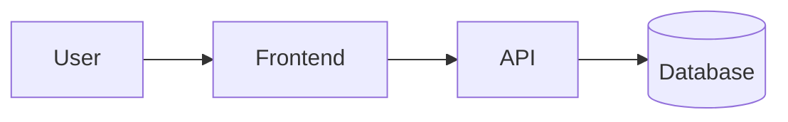
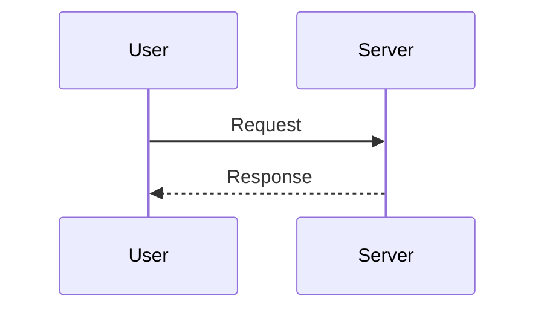

# Diagrams and Charts in Marp Presentations - Research Notes

**Date**: 2025-12-29
**Status**: Research Complete
**Branch**: feature/issue-22-theme-refinement

## Executive Summary

This document outlines approaches for adding diagram and chart support to our Marp-based CDL theme presentations. The key findings are:

1. **TikZ cannot be used directly with Marp** - TikZ is a LaTeX-based system that requires a TeX engine; it does not work in HTML/browser environments
2. **Mermaid.js has native issues with Marp** - Font sizing problems in SVG foreignObject elements cause broken text
3. **Recommended approach for diagrams**: Use Kroki.io service with pre-rendered SVGs
4. **Recommended approach for charts**: Use Chart.js with embedded JavaScript

---

## Part 1: Diagrams

### Why TikZ Does Not Work with Marp

TikZ is a TeX/LaTeX package that requires:
- A TeX engine (pdflatex, xelatex, etc.)
- The PGF graphics system
- Output to PDF (which can then be converted to SVG)

Marp compiles Markdown to HTML. TikZ cannot run natively in a browser environment.

**Alternatives to consider:**
- [TikZJax](https://tikzjax.com/) - Compiles TikZ in-browser using WebAssembly, but complex setup and potential performance issues
- [tikztosvg](https://ctan.org/pkg/tikztosvg) - Command-line tool to pre-render TikZ to SVG (requires TeX installation)

### Mermaid.js Challenges with Marp

Marp has **no built-in Mermaid integration**. Even with plugins, there are fundamental issues:

1. Mermaid.js misdetects font sizes inside Marp's SVG `<foreignObject>` elements
2. Marp slides are scaled to fit screen/parent elements, but Mermaid's initial rendering doesn't account for this scale
3. Text in diagrams appears broken or incorrectly sized

### Recommended Approach: Kroki.io

[Kroki](https://kroki.io/) provides a unified API for multiple diagram types:
- Mermaid
- GraphViz
- PlantUML
- D2
- BlockDiag, SeqDiag, ActDiag, NwDiag
- BPMN
- Excalidraw
- Vega, Vega-Lite
- And many more

**How Kroki Works:**
1. Encode diagram text using deflate + base64 (URL-safe)
2. Request image via URL: `https://kroki.io/{type}/{format}/{encoded}`
3. Kroki returns SVG/PNG image

**Example URL:**
```
https://kroki.io/mermaid/svg/eNpLy8lPSswpBgA=
```

**Advantages:**
- Pre-rendered SVG = no font sizing issues
- Works with standard Markdown image syntax
- No JavaScript dependencies in slides
- Multiple diagram formats supported

---

## Part 2: Charts and Plots

### D3.js Considerations

D3.js is powerful but complex:
- Requires significant JavaScript code for each chart
- Better for custom, complex visualizations
- Overkill for simple presentation charts

### Recommended Approach: Chart.js

[Chart.js](https://www.chartjs.org/) is ideal for Marp presentations:
- Simple API
- Works via CDN
- Responsive by default
- Easy color customization
- Supports: line, bar, pie, doughnut, radar, polar, scatter, bubble charts

**CDN Link:**
```html
<script src="https://cdn.jsdelivr.net/npm/chart.js"></script>
```

**Requirements for Marp:**
- Enable HTML in Marp: `marp --html` or add to frontmatter
- Use `<canvas>` elements for chart containers
- Add Chart.js initialization script

---

## Part 3: Implementation Details

### CDL Theme Colors for Charts

Based on `/Users/jmanning/llm-course/slides/template_deck/themes/cdl-theme.css`:

```javascript
// CDL Theme Color Palette for Charts
const CDL_COLORS = {
  primary: '#00693e',        // Dartmouth green
  primaryDark: '#0a2518',    // Dark green (almost black)
  primaryLight: '#0d5f2e',   // Light green
  accent1: '#2d6a4f',        // String green
  accent2: '#1b4332',        // Number green
  background: '#d8d8d8',     // Slide background

  // Chart-specific palette (CDL-themed)
  chartColors: [
    '#00693e',  // Primary green
    '#2d6a4f',  // Teal green
    '#1b4332',  // Dark forest
    '#0d5f2e',  // Deep green
    '#6b7c85',  // Gray (for contrast)
    '#1a5276', // Blue accent
  ]
};
```

### CSS Additions for cdl-theme.css

```css
/* ============================================
   DIAGRAM AND CHART STYLING
   ============================================ */

/* Kroki/Mermaid diagram containers */
.diagram-container {
    display: flex !important;
    justify-content: center !important;
    align-items: center !important;
    width: 100% !important;
    margin: 0.5em auto !important;
}

.diagram-container img {
    max-width: 90% !important;
    max-height: 60vh !important;
    object-fit: contain !important;
}

/* Chart.js canvas containers */
.chart-container {
    display: flex !important;
    justify-content: center !important;
    align-items: center !important;
    width: 80% !important;
    max-height: 55vh !important;
    margin: 0.5em auto !important;
}

.chart-container canvas {
    max-width: 100% !important;
    max-height: 100% !important;
}

/* Caption styling for diagrams and charts */
.diagram-caption,
.chart-caption {
    text-align: center !important;
    font-size: 0.7em !important;
    font-style: italic !important;
    color: #6b7c85 !important;
    margin-top: 0.3em !important;
}
```

### process_markdown.py Modifications

Add a new processing function for Kroki diagram encoding:

```python
import zlib
import base64

def encode_kroki(diagram_text: str) -> str:
    """
    Encode diagram text for Kroki URL.
    Uses deflate compression + URL-safe base64.
    """
    compressed = zlib.compress(diagram_text.encode('utf-8'), 9)
    encoded = base64.urlsafe_b64encode(compressed).decode('ascii')
    return encoded

def process_kroki_blocks(content: str) -> str:
    """
    Convert ```mermaid, ```graphviz, ```plantuml blocks to Kroki image URLs.

    Syntax in markdown:
    ```mermaid
    graph TD
        A --> B
    ```

    Becomes:
    
    """
    import re

    # Supported diagram types and their Kroki names
    DIAGRAM_TYPES = {
        'mermaid': 'mermaid',
        'graphviz': 'graphviz',
        'dot': 'graphviz',
        'plantuml': 'plantuml',
        'd2': 'd2',
        'blockdiag': 'blockdiag',
        'seqdiag': 'seqdiag',
        'actdiag': 'actdiag',
        'nwdiag': 'nwdiag',
        'vega': 'vega',
        'vegalite': 'vegalite',
    }

    def replace_diagram(match):
        diagram_type = match.group(1).lower()
        diagram_content = match.group(2).strip()

        if diagram_type not in DIAGRAM_TYPES:
            # Return original if not a diagram type we handle
            return match.group(0)

        kroki_type = DIAGRAM_TYPES[diagram_type]
        encoded = encode_kroki(diagram_content)
        url = f'https://kroki.io/{kroki_type}/svg/{encoded}'

        # Return as centered image with diagram class
        return f'<div class="diagram-container">\n\n\n\n</div>'

    # Match fenced code blocks with diagram type
    pattern = r'```(' + '|'.join(DIAGRAM_TYPES.keys()) + r')\n(.*?)```'
    return re.sub(pattern, replace_diagram, content, flags=re.DOTALL | re.IGNORECASE)
```

### Chart.js Integration in autoscale.js

Add Chart.js initialization and CDL theme configuration:

```javascript
// Chart.js CDL Theme Configuration
const CDL_CHART_DEFAULTS = {
  // CDL color palette
  colors: [
    '#00693e',  // Primary Dartmouth green
    '#2d6a4f',  // Teal green
    '#1a5276',  // Blue accent
    '#1b4332',  // Dark forest
    '#6b7c85',  // Gray
    '#0d5f2e',  // Deep green
  ],

  // Font configuration
  font: {
    family: "'Avenir LT Std', 'Avenir', 'Avenir Next', sans-serif",
    size: 14,
    color: '#0a2518'
  },

  // Grid styling
  grid: {
    color: 'rgba(0, 105, 62, 0.1)',
    borderColor: 'rgba(0, 105, 62, 0.2)'
  }
};

// Apply CDL defaults to Chart.js if loaded
if (typeof Chart !== 'undefined') {
  Chart.defaults.font.family = CDL_CHART_DEFAULTS.font.family;
  Chart.defaults.font.size = CDL_CHART_DEFAULTS.font.size;
  Chart.defaults.color = CDL_CHART_DEFAULTS.font.color;
  Chart.defaults.plugins.legend.labels.color = CDL_CHART_DEFAULTS.font.color;
  Chart.defaults.scale.grid.color = CDL_CHART_DEFAULTS.grid.color;
  Chart.defaults.scale.border.color = CDL_CHART_DEFAULTS.grid.borderColor;
}
```

### compile.sh Modifications

Add Chart.js CDN injection for HTML output:

```bash
# After Marp compilation, inject Chart.js CDN if charts are used
if [[ "$OUTPUT_FORMAT" == "html" && -f "$OUTPUT_FILE" ]]; then
    # Check if the presentation uses charts
    if grep -q "chart-container\|Chart(" "$OUTPUT_FILE"; then
        log_info "Injecting Chart.js CDN..."
        CHART_CDN='<script src="https://cdn.jsdelivr.net/npm/chart.js"></script>'
        python3 -c "
import sys
with open('$OUTPUT_FILE', 'r') as f:
    content = f.read()
if 'chart.js' not in content:
    content = content.replace('</head>', '$CHART_CDN\n</head>')
    with open('$OUTPUT_FILE', 'w') as f:
        f.write(content)
"
    fi
fi
```

---

## Part 4: Markdown Syntax for Users

### Diagrams with Kroki

Users write diagrams using fenced code blocks:

```markdown
# System Architecture



---

# Sequence Diagram


```

**Supported diagram types:**
- `mermaid` - Flowcharts, sequence diagrams, class diagrams, etc.
- `graphviz` or `dot` - DOT language graphs
- `plantuml` - UML diagrams
- `d2` - D2 declarative diagrams
- `vegalite` - Vega-Lite visualizations

### Charts with Chart.js

Users write charts using HTML with a special syntax:

```markdown
# Performance Comparison

<div class="chart-container">
  <canvas id="perfChart"></canvas>
</div>

<script>
new Chart(document.getElementById('perfChart'), {
  type: 'bar',
  data: {
    labels: ['GPT-2', 'GPT-3', 'GPT-4', 'Claude'],
    datasets: [{
      label: 'Parameters (B)',
      data: [1.5, 175, 1000, 52],
      backgroundColor: CDL_CHART_DEFAULTS.colors
    }]
  },
  options: {
    responsive: true,
    maintainAspectRatio: true
  }
});
</script>
```

### Simple Alternative: Pre-computed Images

For maximum compatibility, users can also:
1. Create charts in Python/R and export as PNG/SVG
2. Use mermaid.live to export SVG directly
3. Embed as standard Markdown images

```markdown
# My Diagram


```

---

## Part 5: Comparison of Approaches

| Feature | Kroki (Diagrams) | Chart.js (Charts) | Pre-rendered Images |
|---------|------------------|-------------------|---------------------|
| Interactivity | None | Full (hover, click) | None |
| Offline support | No (requires API) | Yes (CDN cached) | Yes |
| PDF export | Excellent | Requires rendering | Excellent |
| Styling control | Limited | Full | Full |
| Complexity | Low | Medium | Low |
| CDL theme match | Good (SVG styling) | Excellent | Manual |

---

## Part 6: Next Steps

1. **Implement Kroki processing** in `process_markdown.py`
2. **Add CSS classes** to `cdl-theme.css`
3. **Modify compile.sh** for Chart.js CDN injection
4. **Create example slides** demonstrating both approaches
5. **Document** syntax for users in theme showcase

## Sources

- [Marp Mermaid Discussion](https://github.com/orgs/marp-team/discussions/207)
- [Kroki Documentation](https://docs.kroki.io/kroki/)
- [Chart.js Getting Started](https://www.chartjs.org/docs/latest/getting-started/)
- [TikZJax](https://tikzjax.com/)
- [Marp CLI Custom Engine](https://github.com/marp-team/marp-cli)
