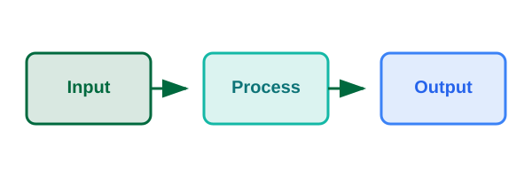

# Theme showcase
### PSYC 51.07: Models of language and conversation

Jeremy R. Manning
Dartmouth College
Winter 2026

---

# Simple bullet points

- First main point
- Second main point
- Third main point

---

# Text emphasis

- Use **bold** for strong emphasis
- Use *italics* for subtle emphasis
- Use `code` for inline code

---

# Code example

```python
def hello():
    """Simple function example."""
    print("Hello, Dartmouth!")
    return True
```

---

# Long code (auto-split demo)

```python
class MultiHeadAttention(nn.Module):
    """Multi-head attention mechanism for transformers."""

    def __init__(self, d_model, num_heads, dropout=0.1):
        super().__init__()
        self.num_heads = num_heads
        self.d_k = d_model // num_heads

        self.W_q = nn.Linear(d_model, d_model)
        self.W_k = nn.Linear(d_model, d_model)
        self.W_v = nn.Linear(d_model, d_model)
        self.W_o = nn.Linear(d_model, d_model)
        self.dropout = nn.Dropout(dropout)

    def forward(self, query, key, value, mask=None):
        batch_size = query.size(0)

        # Linear projections
        Q = self.W_q(query)
        K = self.W_k(key)
        V = self.W_v(value)

        # Reshape for multi-head attention
        Q = Q.view(batch_size, -1, self.num_heads, self.d_k)
        K = K.view(batch_size, -1, self.num_heads, self.d_k)
        V = V.view(batch_size, -1, self.num_heads, self.d_k)

        # Compute attention scores
        scores = torch.matmul(Q, K.transpose(-2, -1))
        scores = scores / math.sqrt(self.d_k)

        if mask is not None:
            scores = scores.masked_fill(mask == 0, -1e9)

        attention = F.softmax(scores, dim=-1)
        attention = self.dropout(attention)

        # Apply attention to values
        output = torch.matmul(attention, V)
        output = output.view(batch_size, -1, self.d_model)

        return self.W_o(output)
```

---

# Equation

The attention mechanism:

$$\text{Attention}(Q, K, V) = \text{softmax}\left(\frac{QK^T}{\sqrt{d_k}}\right)V$$

---

# Interleaved text and equations

The softmax function normalizes scores into probabilities:

$$\text{softmax}(x_i) = \frac{e^{x_i}}{\sum_j e^{x_j}}$$

We scale by the square root of dimension to prevent vanishing gradients:

$$\text{score} = \frac{QK^T}{\sqrt{d_k}}$$

This keeps variance stable during training.

---

# Equations in bullet lists

- The dot product measures similarity between vectors
- Attention scores: $\text{score}(q, k) = q \cdot k$
- Scaled version prevents large values:

$$\text{score}(q, k) = \frac{q \cdot k}{\sqrt{d_k}}$$

- Output is weighted sum of values

---

# Equations in numbered lists

1. Compute query, key, value projections
2. Calculate attention scores:

$$A = \text{softmax}\left(\frac{QK^T}{\sqrt{d_k}}\right)$$

3. Apply attention to values: $\text{output} = AV$
4. Project back to model dimension

---

# Simple table

| Model | Year | Params |
|-------|------|--------|
| GPT-2 | 2019 | 1.5B |
| GPT-3 | 2020 | 175B |
| GPT-4 | 2023 | Unknown |

---

# Detailed table

| Model | Architecture | Training data | Key capabilities |
|-------|--------------|---------------|------------------|
| BERT | Encoder-only transformer | BooksCorpus, Wikipedia | Bidirectional context understanding, masked language modeling |
| GPT-3 | Decoder-only transformer | Common Crawl, books, Wikipedia | Few-shot learning, text generation, code completion |
| T5 | Encoder-decoder transformer | C4 (Colossal Clean Crawled Corpus) | Text-to-text framework, translation, summarization |
| LLaMA | Decoder-only transformer | Publicly available data only | Open weights, efficient inference, fine-tuning friendly |
| Claude | Decoder-only transformer | Web, books, code, conversations | Constitutional AI, long context, instruction following |

---

# Long table (auto-split demo)

| Model | Architecture | Training data | Key capabilities |
|-------|--------------|---------------|------------------|
| BERT | Encoder-only transformer | BooksCorpus, Wikipedia | Bidirectional context, masked LM |
| GPT-2 | Decoder-only transformer | WebText | Text generation, zero-shot |
| GPT-3 | Decoder-only transformer | Common Crawl, books | Few-shot learning, code completion |
| T5 | Encoder-decoder transformer | C4 Corpus | Text-to-text, translation |
| XLNet | Transformer-XL | BooksCorpus, Wikipedia | Permutation LM, long context |
| RoBERTa | Encoder-only transformer | Extended pretraining | Robust optimization of BERT |
| ALBERT | Encoder-only transformer | Same as BERT | Parameter sharing, efficient |
| ELECTRA | Encoder-only transformer | Same as BERT | Replaced token detection |
| DeBERTa | Encoder-only transformer | Wikipedia, books | Disentangled attention |
| LLaMA | Decoder-only transformer | Public data only | Open weights, efficient |
| LLaMA 2 | Decoder-only transformer | 2T tokens | RLHF, chat-optimized |
| Mistral | Decoder-only transformer | Undisclosed | Sliding window attention |
| Claude | Decoder-only transformer | Web, books, code | Constitutional AI |
| Claude 2 | Decoder-only transformer | Extended training | Longer context, improved |
| GPT-4 | Decoder-only transformer | Undisclosed | Multimodal, reasoning |
| Gemini | Decoder-only transformer | Multimodal data | Native multimodal |
| PaLM | Decoder-only transformer | 780B tokens | Pathways, chain-of-thought |
| Falcon | Decoder-only transformer | RefinedWeb | Open source, efficient |

---

# Two-column layout

<div style="display: flex; gap: 2em;">
<div>

**Left column**
- Point A
- Point B

</div>
<div>

**Right column**
- Point X
- Point Y

</div>
</div>

---

# Quote

> This line is a quote that demonstrates the blockquote styling from the CDL theme.

&mdash; Anonymous

---

# Callout boxes

<div class="note-box">

Background information for context.

</div>

<div class="example-box">

`f(x) = x^2` means `f(3) = 9`.

</div>

<div class="warning-box">

LLM training requires significant resources.

</div>

---

# Note box

<div class="note-box">

The attention mechanism was first introduced in the context of machine translation (Bahdanau et al., 2014), allowing models to focus on relevant parts of the input sequence.

Key insight: Instead of compressing the entire input into a fixed-length vector, attention allows the decoder to "look back" at the encoder states.

</div>

---

# Example box

<div class="example-box">

Computing self-attention for a sequence:

- Input: "The cat sat"
- Query for "cat": looks for related words
- High attention to "The" (determiner) and "sat" (verb)
- Low attention to unrelated tokens

</div>

---

# Warning box

<div class="warning-box">

Common pitfalls when fine-tuning LLMs:

- Overfitting on small datasets
- Catastrophic forgetting of pre-trained knowledge
- Learning rate too high can destabilize training
- Always validate on held-out data!

</div>

---

# Multiple callouts

<div class="note-box">

Transformers process all tokens in parallel, unlike RNNs which process sequentially.

</div>

<div class="warning-box">

The quadratic memory complexity of attention limits context length.

</div>

---

# Emoji figures

<div class="emoji-figure">
  <div class="emoji-col">
    <span class="emoji emoji-xl emoji-bg emoji-bg-green">🎓</span>
    <span class="label">Students</span>
  </div>
  <span class="flow-arrow-lg"></span>
  <div class="emoji-col">
    <span class="emoji emoji-xl emoji-bg emoji-bg-teal">🤖</span>
    <span class="label">LLM</span>
  </div>
  <span class="flow-arrow-lg"></span>
  <div class="emoji-col">
    <span class="emoji emoji-xl emoji-bg emoji-bg-orange">💡</span>
    <span class="label">Insights</span>
  </div>
</div>

---

# Emoji sizes and states

<div class="emoji-row">
  <div class="emoji-col">
    <span class="emoji emoji-xs">🧠</span>
    <span class="label">xs (24px)</span>
  </div>
  <div class="emoji-col">
    <span class="emoji emoji-sm">🧠</span>
    <span class="label">sm (48px)</span>
  </div>
  <div class="emoji-col">
    <span class="emoji emoji-md">🧠</span>
    <span class="label">md (72px)</span>
  </div>
  <div class="emoji-col">
    <span class="emoji emoji-lg">🧠</span>
    <span class="label">lg (96px)</span>
  </div>
  <div class="emoji-col">
    <span class="emoji emoji-xl">🧠</span>
    <span class="label">xl (128px)</span>
  </div>
</div>

<div class="emoji-row" style="margin-top: 1em;">
  <div class="emoji-col">
    <span class="emoji emoji-lg">👤</span>
    <span class="label">Normal</span>
  </div>
  <div class="emoji-col">
    <span class="emoji emoji-lg emoji-faded">👤</span>
    <span class="label">Faded</span>
  </div>
  <div class="emoji-col">
    <span class="emoji emoji-lg emoji-gray">👤</span>
    <span class="label">Inactive</span>
  </div>
</div>

---

# Emoji xxl (hero) size

<div class="emoji-row">
  <div class="emoji-col">
    <span class="emoji emoji-xxl emoji-bg emoji-bg-green">🧠</span>
    <span class="label">xxl (192px) - Hero size</span>
  </div>
</div>

Perfect for title slides or featuring a single concept prominently.

---

# Emoji grid layout

<div class="emoji-grid" style="grid-template-columns: repeat(4, 1fr); width: 80%;">
  <div class="emoji-col">
    <span class="emoji emoji-lg emoji-bg emoji-bg-green">📝</span>
    <span class="label">Input</span>
  </div>
  <div class="emoji-col">
    <span class="emoji emoji-lg emoji-bg emoji-bg-teal">⚙️</span>
    <span class="label">Process</span>
  </div>
  <div class="emoji-col">
    <span class="emoji emoji-lg emoji-bg emoji-bg-blue">🔍</span>
    <span class="label">Analyze</span>
  </div>
  <div class="emoji-col">
    <span class="emoji emoji-lg emoji-bg emoji-bg-orange">📊</span>
    <span class="label">Output</span>
  </div>
</div>

---

# Emoji hierarchy structure

<div class="emoji-hierarchy">
  <div class="emoji-col">
    <span class="emoji emoji-lg emoji-bg emoji-bg-green">🏛️</span>
    <span class="label">Organization</span>
  </div>
  <div class="emoji-hierarchy-row with-connector">
    <div class="emoji-col">
      <span class="emoji emoji-md emoji-bg emoji-bg-teal">👥</span>
      <span class="label">Team A</span>
    </div>
    <div class="emoji-col">
      <span class="emoji emoji-md emoji-bg emoji-bg-teal">👥</span>
      <span class="label">Team B</span>
    </div>
    <div class="emoji-col">
      <span class="emoji emoji-md emoji-bg emoji-bg-teal">👥</span>
      <span class="label">Team C</span>
    </div>
  </div>
</div>

---

# Labeled emoji example

<div class="emoji-row">
  <div class="emoji-labeled">
    <span class="emoji emoji-xl emoji-bg emoji-bg-green">📚</span>
    <span class="label">Training data</span>
  </div>
  <span class="flow-arrow-lg"></span>
  <div class="emoji-labeled">
    <span class="emoji emoji-xl emoji-bg emoji-bg-teal">🤖</span>
    <span class="label">Language model</span>
  </div>
  <span class="flow-arrow-lg"></span>
  <div class="emoji-labeled">
    <span class="emoji emoji-xl emoji-bg emoji-bg-orange">💬</span>
    <span class="label">Generated text</span>
  </div>
</div>

---

# Diagram example (local SVG)

<div class="diagram-container">



</div>

<div class="diagram-caption">Local SVG diagram - works offline without external services</div>

Tip: Store diagrams as SVG files in the `images/` folder for reliable offline rendering.

---

# Bar chart example

<div class="chart-container">
  <canvas id="barChart"></canvas>
</div>

<div class="chart-caption">Model parameter comparison (billions)</div>

<script src="https://cdn.jsdelivr.net/npm/chart.js"></script>
<script>
new Chart(document.getElementById('barChart'), {
  type: 'bar',
  data: {
    labels: ['GPT-2', 'GPT-3', 'LLaMA', 'Mistral', 'Claude'],
    datasets: [{
      data: [1.5, 175, 70, 7, 52],
      backgroundColor: ['#00693e', '#14b8a6', '#0a2518', '#00693e', '#14b8a6'],
      borderColor: ['#00693e', '#14b8a6', '#0a2518', '#00693e', '#14b8a6'],
      borderWidth: 2
    }]
  },
  options: {
    responsive: true,
    maintainAspectRatio: false,
    plugins: {
      legend: { display: false }
    },
    scales: {
      x: {
        ticks: { font: { size: 18, family: 'Avenir LT Std, Avenir, sans-serif' }, color: '#0a2518' },
        grid: { display: false }
      },
      y: {
        ticks: { font: { size: 16, family: 'Avenir LT Std, Avenir, sans-serif' }, color: '#0a2518' },
        title: { display: true, text: 'Parameters (B)', font: { size: 18, family: 'Avenir LT Std, Avenir, sans-serif' }, color: '#0a2518' },
        grid: { color: 'rgba(0, 105, 62, 0.15)' }
      }
    }
  }
});
</script>

---

# Line chart example

<div class="chart-container">
  <canvas id="lineChart"></canvas>
</div>

<div class="chart-caption">Training loss over epochs</div>

<script>
new Chart(document.getElementById('lineChart'), {
  type: 'line',
  data: {
    labels: ['1', '2', '3', '4', '5', '6', '7', '8', '9', '10'],
    datasets: [{
      label: 'Training Loss',
      data: [2.8, 2.1, 1.6, 1.3, 1.1, 0.95, 0.85, 0.78, 0.73, 0.70],
      borderColor: '#00693e',
      backgroundColor: 'rgba(0, 105, 62, 0.1)',
      fill: true,
      tension: 0.3,
      pointRadius: 6,
      pointBackgroundColor: '#00693e',
      borderWidth: 3
    }, {
      label: 'Validation Loss',
      data: [2.9, 2.3, 1.9, 1.6, 1.45, 1.35, 1.30, 1.28, 1.27, 1.27],
      borderColor: '#14b8a6',
      backgroundColor: 'rgba(20, 184, 166, 0.1)',
      fill: true,
      tension: 0.3,
      pointRadius: 6,
      pointBackgroundColor: '#14b8a6',
      borderWidth: 3
    }]
  },
  options: {
    responsive: true,
    maintainAspectRatio: false,
    plugins: {
      legend: {
        display: true,
        position: 'top',
        labels: { font: { size: 16, family: 'Avenir LT Std, Avenir, sans-serif' }, color: '#0a2518', usePointStyle: true, padding: 20 }
      }
    },
    scales: {
      x: {
        title: { display: true, text: 'Epoch', font: { size: 18, family: 'Avenir LT Std, Avenir, sans-serif' }, color: '#0a2518' },
        ticks: { font: { size: 16, family: 'Avenir LT Std, Avenir, sans-serif' }, color: '#0a2518' },
        grid: { color: 'rgba(0, 105, 62, 0.1)' }
      },
      y: {
        title: { display: true, text: 'Loss', font: { size: 18, family: 'Avenir LT Std, Avenir, sans-serif' }, color: '#0a2518' },
        ticks: { font: { size: 16, family: 'Avenir LT Std, Avenir, sans-serif' }, color: '#0a2518' },
        grid: { color: 'rgba(0, 105, 62, 0.15)' }
      }
    }
  }
});
</script>

---

# Scatter plot example

<div class="chart-container">
  <canvas id="scatterChart"></canvas>
</div>

<div class="chart-caption">Model size vs. benchmark performance</div>

<script>
new Chart(document.getElementById('scatterChart'), {
  type: 'scatter',
  data: {
    datasets: [{
      label: 'Open Source',
      data: [
        {x: 7, y: 62}, {x: 13, y: 68}, {x: 34, y: 75}, {x: 70, y: 82}, {x: 8, y: 64}
      ],
      backgroundColor: '#00693e',
      borderColor: '#00693e',
      pointRadius: 12,
      pointHoverRadius: 15
    }, {
      label: 'Proprietary',
      data: [
        {x: 175, y: 86}, {x: 52, y: 84}, {x: 340, y: 90}, {x: 540, y: 92}
      ],
      backgroundColor: '#14b8a6',
      borderColor: '#14b8a6',
      pointRadius: 12,
      pointHoverRadius: 15
    }]
  },
  options: {
    responsive: true,
    maintainAspectRatio: false,
    plugins: {
      legend: {
        display: true,
        position: 'top',
        labels: { font: { size: 16, family: 'Avenir LT Std, Avenir, sans-serif' }, color: '#0a2518', usePointStyle: true, padding: 20 }
      }
    },
    scales: {
      x: {
        type: 'logarithmic',
        title: { display: true, text: 'Parameters (B)', font: { size: 18, family: 'Avenir LT Std, Avenir, sans-serif' }, color: '#0a2518' },
        ticks: { font: { size: 16, family: 'Avenir LT Std, Avenir, sans-serif' }, color: '#0a2518' },
        grid: { color: 'rgba(0, 105, 62, 0.1)' }
      },
      y: {
        title: { display: true, text: 'Benchmark Score', font: { size: 18, family: 'Avenir LT Std, Avenir, sans-serif' }, color: '#0a2518' },
        ticks: { font: { size: 16, family: 'Avenir LT Std, Avenir, sans-serif' }, color: '#0a2518' },
        grid: { color: 'rgba(0, 105, 62, 0.15)' },
        min: 50,
        max: 100
      }
    }
  }
});
</script>

---

# Grouped bar chart example

<div class="chart-container">
  <canvas id="groupedBarChart"></canvas>
</div>

<div class="chart-caption">Model performance across different tasks</div>

<script>
new Chart(document.getElementById('groupedBarChart'), {
  type: 'bar',
  data: {
    labels: ['Reasoning', 'Coding', 'Math', 'Writing'],
    datasets: [{
      label: 'GPT-4',
      data: [92, 88, 85, 90],
      backgroundColor: '#00693e',
      borderColor: '#00693e',
      borderWidth: 2
    }, {
      label: 'Claude',
      data: [90, 85, 82, 93],
      backgroundColor: '#14b8a6',
      borderColor: '#14b8a6',
      borderWidth: 2
    }, {
      label: 'LLaMA',
      data: [78, 72, 70, 76],
      backgroundColor: '#0a2518',
      borderColor: '#0a2518',
      borderWidth: 2
    }]
  },
  options: {
    responsive: true,
    maintainAspectRatio: false,
    plugins: {
      legend: {
        display: true,
        position: 'top',
        labels: { font: { size: 16, family: 'Avenir LT Std, Avenir, sans-serif' }, color: '#0a2518', padding: 20 }
      }
    },
    scales: {
      x: {
        ticks: { font: { size: 18, family: 'Avenir LT Std, Avenir, sans-serif' }, color: '#0a2518' },
        grid: { display: false }
      },
      y: {
        title: { display: true, text: 'Score (%)', font: { size: 18, family: 'Avenir LT Std, Avenir, sans-serif' }, color: '#0a2518' },
        ticks: { font: { size: 16, family: 'Avenir LT Std, Avenir, sans-serif' }, color: '#0a2518' },
        grid: { color: 'rgba(0, 105, 62, 0.15)' },
        min: 50,
        max: 100
      }
    }
  }
});
</script>

---

# Course information

<div class="emoji-row" style="margin-top: 0.5em;">
  <div class="emoji-col">
    <span class="emoji emoji-lg emoji-bg emoji-bg-green">📚</span>
    <span class="label"><strong>Resources</strong></span>
    <span class="label">Canvas &bull; GitHub</span>
  </div>
  <div class="emoji-col">
    <span class="emoji emoji-lg emoji-bg emoji-bg-teal">🕐</span>
    <span class="label"><strong>Office hours</strong></span>
    <span class="label">Tue 2-4pm, Moore 354</span>
  </div>
  <div class="emoji-col">
    <span class="emoji emoji-lg emoji-bg emoji-bg-blue">✉️</span>
    <span class="label"><strong>Contact</strong></span>
    <span class="label">jeremy@dartmouth.edu</span>
  </div>
</div>

<div class="note-box" style="margin-top: 1.5em;">

**This week:** Review Chapter 3 of *Speech and Language Processing* and explore the Hugging Face docs.

**Due soon:** Problem Set 2 (next Friday) &bull; Project proposal (2 weeks)

</div>
