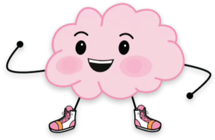

# Lecture 1: Course introduction
### PSYC 51.07: Models of language and communication

Jeremy R. Manning
Dartmouth College
Winter 2026

---

# About the instructor
<!-- _class: manual-layout -->

<div class="instructor-container">

<div class="instructor-header">
<div class="instructor-header-left">
<h3 style="color: #001c12 !important; margin: 0;">Jeremy R. Manning, Ph.D.</h3>
<p>
Associate Professor | Psychological &amp; Brain Sciences |  | Moore 349
</p>
</div>
<div class="instructor-header-right">
<div class="header-link-row">

<a href="https://www.context-lab.com" class="header-link">context-lab.com</a>
</div>
<div class="header-link-row">

<a href="https://github.com/ContextLab" class="header-link">ContextLab</a>
</div>
</div>
</div>

<div class="content-grid">

<div class="col-flex">

<div class="info-box-styled" style="text-align: left !important;">
<h4>Research focus</h4>
<p style="text-align: left !important; display: block; margin: 0;">How do our brains support our ongoing conscious thoughts, and how (and what) do we remember?</p>
</div>

<div class="info-box-styled" style="text-align: left !important;">
<h4>Key areas</h4>
<p style="text-align: left !important; display: block; margin: 0;">Learning and memory, education technology, brain network dynamics, data science, NLP</p>
</div>

<div class="info-box-styled" style="text-align: left !important;">
<h4>Approach</h4>
<p style="text-align: left !important; display: block; margin: 0;">Theory, models, experiments, neuroimaging</p>
</div>

</div>

<div class="col-flex">

<div class="info-box-styled" style="text-align: left !important;">
<h4>Training</h4>
<div class="training-grid">
<div class="training-logo-cell"></div>
<div class="training-text" style="text-align: left !important;">B.S., Neuroscience &amp; Computer Science</div>

<div class="training-logo-cell"></div>
<div class="training-text">Ph.D., Neuroscience</div>

<div class="training-logo-cell"></div>
<div class="training-text">Postdoc, Computer Science &amp; Neuroscience</div>
</div>
</div>

<div class="info-box-styled">
<h4>Funding &amp; collaborators</h4>
<div class="funding-logo-grid">



</div>
<div class="combined-card-spacer"></div>
<div class="logo-grid">


</div>
</div>

</div>

</div>

</div>

---

# What is this course about?

<div class="note-box" data-title="Course content">

We will explore how machines can understand and generate human language:
- Building conversational agents from scratch
- Understanding how language relates to thought
- Hands-on programming with real models
- Critical thinking about AI consciousness

</div>

<div class="warning-box" data-title="Course design">

**This course is experiential!** You will learn by doing: coding, experimenting, discussing, and researching.

</div>

---

# Course structure

```flow
[ELIZA:green] --> [SPAM:teal] --> [Wikipedia:blue] --> [Chatbot:orange] --> [GPT:violet]
```
<!-- caption: We'll build from pattern matching to transformer-based models through our 5 main projects -->

<style scoped>
.small-boxes ul { font-size: 0.65em !important; }
.small-boxes li { font-size: inherit !important; }
</style>

<div class="small-boxes" style="display: flex; gap: 1.5em; margin-top: 0.5em; width: 100%;">
<div class="note-box" data-title="Grading" style="flex: 1;">

- Bi-weekly short projects (5): 75%
- Final project: 25%
- Can work individually or in groups
- See [syllabus](../../syllabus.pdf) for additional details

</div>
<div class="tip-box" data-title="Tools" style="flex: 1;">

- Google Colaboratory
- HuggingFace
- GitHub / Discord
- GenAI (Claude, ChatGPT, Gemini)

</div>
</div>

---

# The big questions

1. Can machines truly *understand* language?
2. What is the relationship between **language** and **thought**?
3. Can statistical patterns capture **meaning**? How? Under which circumstances?
4. Can AI be conscious? If so, what are the implications?

<div class="note-box">

These are not just "fluff" questions: they are at the heart of cognitive science, philosophy, psychology, and neuroscience!

</div>

---

# Discussion: Is ChatGPT conscious?

- What does "conscious" even mean?
- How would we test for consciousness?
- Does it matter if ChatGPT *seems* conscious?

<div class="note-box" data-title="For further consideration">

What are the implications for

- Ourselves
- Other animals
- Other life forms in general (aliens? synthetic life?)
- Policy, ethics, and society more broadly

</div>

---

# What is consciousness?

<style scoped>
section { font-size: 24px !important; padding: 18px 40px 28px 40px !important; }
section > *:not(h1) { font-size: 24px !important; }
section > h1 { font-size: 1.8em !important; }
section ul, section ol { display: block !important; }
.consciousness-layout { display: flex; gap: 0.8em; margin-top: 0.15em; width: 100%; align-items: flex-start; }
.definitions-col { flex: 1; text-align: left !important; }
.definitions-col ul {
  text-align: left !important;
  margin: 0 !important;
  padding-left: 1.3em !important;
  list-style-type: disc !important;
  list-style-position: outside !important;
  display: block !important;
  font-size: 1em !important;
}
.definitions-col ul li {
  text-align: left !important;
  margin-bottom: 0.5em !important;
  display: list-item !important;
  list-style-type: disc !important;
}
.examples-col { flex: 1.2; }
.c-example {
  background-color: rgba(0, 105, 62, 0.10);
  border-left: 4px solid #00693e;
  border-radius: 4px;
  padding: 0.25em 0.4em;
  margin-bottom: 0.25em;
  text-align: left !important;
}
.c-example::before { display: none !important; content: none !important; }
.c-example .c-title { color: #00693e; font-weight: 600; font-size: 0.82em; display: block; margin-bottom: 0.05em; }
.c-example .c-text { font-size: 0.82em; display: block; }
section > .note-box { font-size: 0.95em !important; padding: 0.25em 0.5em !important; margin-top: 0.25em !important; width: 85% !important; }
</style>

<div class="consciousness-layout">
<div class="definitions-col">
<ul>
<li><strong>Phenomenal:</strong> Subjective experience--the "what it is like" quality of sensations and emotions</li>
<li><strong>Access:</strong> Information available for reasoning, reporting, and guiding voluntary behavior</li>
<li><strong>Self-awareness:</strong> Knowledge of one's own mental states, including recognizing oneself as a distinct entity</li>
</ul>
</div>
<div class="examples-col">
<div class="c-example">
<span class="c-title">Example of phenomenal consciousness</span>
<span class="c-text">The redness of red, pain, taste of coffee</span>
</div>
<div class="c-example">
<span class="c-title">Example of access consciousness</span>
<span class="c-text">Being able to report on and use information to guide behavior</span>
</div>
<div class="c-example">
<span class="c-title">Example of self-awareness</span>
<span class="c-text">Knowing that you are thinking, or recognizing your own emotions</span>
</div>
</div>
</div>

<div class="note-box" data-title="For further consideration">

If ChatGPT says "I feel happy," does it actually *feel* anything?

</div>

---

# The hard problem

<div style="display: flex; gap: 2em;">
<div>

**Humans**
- Share similar biology
- Have our own conscious experiences
- Behave consistently with having experiences (e.g., of being human, living in the world, etc.)

</div>
<div>

**AI**
- Completely different "biology" (silicon vs. neurons)
- No shared evolutionary history
- Can produce human-like behavior without themselves being human

</div>
</div>

<div class="note-box" data-title="Why is it difficult to know if AI is conscious?">

We cannot directly observe consciousness &mdash; even in other humans!

</div>

---

# The Chinese room argument

<div class="note-box" data-title="John Searle (1980)">

- [Thought experiment](https://doi.org/10.1017/S0140525X00005756) about understanding vs. simulation.
- **The setup:** Person in room with Chinese symbols and rule book
- Does following rules = understanding? Searle argues: **No!**

</div>

```flow
[Chinese question:blue] --> [Rule book:orange] --> [Chinese answer:green]
```
<!-- caption: Person follows rules but does not understand Chinese -->

---

# Volition

- Another critical aspect of the human conscious experience is the ability to **decide** (how to act, what to think, etc.)
- Modern LLMs are trained to **respond** to other inputs (i.e., produce statistically likely sequence completions), but they cannot themselves initiate new or unexpected actions

<div class="note-box" data-title="Think about it!">

LLMs are like a bellows that can only blow air if someone else is pumping it. When not in use, they are static. They can not sense the passage of time. They cease to exist between invocations.

</div>

---

# Current scientific consensus

<div class="warning-box" data-title="Survey says...">

Most cognitive scientists and AI researchers agree: **Current LLMs are not conscious.**

</div>

- No sensory-motor grounding in the world
- No persistent self-model or goals
- Pattern matching $\neq$ understanding

---

# Language and thought

<div class="note-box">

**Discussion:** Do you need language to think? Does language *shape* how you think?

</div>

<div style="display: flex; gap: 2em;">
<div>

**Language = Thought:**
All thinking happens in language

</div>
<div>

**Language $\neq$ Thought:**
Language is just a tool for communication

</div>
</div>

The truth is likely somewhere in between...

---

# The language-thought spectrum

```flow
[Strong Whorfian:green] --> [Weak Whorfian:teal] --> [Moderate:blue] --> [Language-of-Thought:violet]
```
<!-- caption: Language shapes thought (left) to language independent of thought (right) -->

Current evidence points toward the middle: language and thought interact in complex ways, but are not identical.

---

# Evidence: The language network

<div class="note-box">

**Fedorenko et al. (2024) - Nature:** *The language network as a natural kind*

</div>

**Key findings:**
- The brain has a **specialized language network**
- Distinct from: reasoning, math, social cognition, music

<div class="tip-box">

**Implication:** Language and thought are *separable* in the brain!

</div>

---

# Brain networks

<div class="emoji-figure">
  <div class="emoji-col">
    <span class="emoji emoji-xl emoji-bg emoji-bg-blue">&#x1F4AC;</span>
    <span class="label">Language</span>
  </div>
  <div class="emoji-col">
    <span class="emoji emoji-xl emoji-bg emoji-bg-green">&#x1F9E0;</span>
    <span class="label">Reasoning</span>
  </div>
  <div class="emoji-col">
    <span class="emoji emoji-xl emoji-bg emoji-bg-orange">&#x1F465;</span>
    <span class="label">Social</span>
  </div>
  <div class="emoji-col">
    <span class="emoji emoji-xl emoji-bg emoji-bg-violet">&#x1F4CA;</span>
    <span class="label">Math</span>
  </div>
</div>

<div class="note-box">

**Key insight:** Language is a specialized system, not the basis of all thought!

</div>

---

# Evidence: Language shapes perception

<div class="note-box">

**Lupyan et al. (2020) - TICS:** *Effects of language on visual perception*

</div>

**Key findings:** Having words for things affects how we *see* them
- Speed up visual search
- Alter color perception
- Influence object categorization

---

# The Russian blue example

<div style="display: flex; gap: 2em;">
<div>

**English speakers:**
- One word: "blue"
- Slower to distinguish shades

</div>
<div>

**Russian speakers:**
- "siniy" (dark) vs "goluboy" (light)
- Faster to distinguish shades

</div>
</div>

<div class="tip-box">

Language categories affect *perception*, not just description!

</div>

---

# So what about LLMs?

**Current evidence suggests:**
- LLMs are *very good* at language patterns
- LLMs may have some internal "representations"
- LLMs lack grounding in sensory-motor experience
- No evidence of phenomenal consciousness

<div class="tip-box">

Can an LLM have sophisticated language *without* sophisticated thought?

</div>

---

# The grounding problem

<div class="note-box">

**Symbol grounding:** How do symbols (words) get their meaning?

</div>

<div style="display: flex; gap: 2em;">
<div>

**Humans:** Grounded in experience
- See, touch, taste objects
- Act in the world

</div>
<div>

**LLMs:** Statistical patterns
- Only see text
- No sensory experience

</div>
</div>

---

# Our approach

<div class="note-box">

**Philosophy of this course:** We will build language models *from scratch* to understand what they can and cannot do.

</div>

**Critical perspective:**
- Question assumptions about "understanding"
- Appreciate both capabilities and limitations
- Think about implications for cognitive science

---

# From simple to complex

```flow
[ELIZA:green] --> [Classifiers:teal] --> [Embeddings:blue] --> [Attention:orange] --> [GPT:violet]
```
<!-- caption: At what point does pattern matching become understanding? -->

<div class="note-box">

**Discussion:** At what point (if any) does pattern matching become understanding?

</div>

---

# HuggingFace: Your learning companion

**We will use HuggingFace for:**
- **Course materials:** Free NLP course at [huggingface.co/course](https://huggingface.co/course)
- **Pre-trained models:** Download and use state-of-the-art models
- **Datasets:** Access curated datasets for training

<div class="warning-box">

**Assignment:** Create a free HuggingFace account and complete Chapter 1 of the NLP course!

</div>

---

# Next lectures this week

<div style="display: flex; gap: 2em;">
<div class="note-box" style="flex: 1;">

**Lecture 2: Pattern matching and ELIZA**
- String manipulation
- Regular expressions
- Introduction to ELIZA

</div>
<div class="note-box" style="flex: 1;">

**Lecture 3 (X-hour): ELIZA implementation**
- Complete architecture
- The ELIZA effect
- Assignment 1 details

</div>
</div>

---

# Readings for this week

<div class="note-box">

**Required readings:**
1. [Weizenbaum (1966): ELIZA](https://web.stanford.edu/class/cs124/p36-weizenabaum.pdf)
2. [Fedorenko et al. (2024): The language network](https://www.nature.com/articles/s41586-024-07522-w)
3. [Lupyan et al. (2020): Effects of language on visual perception](https://doi.org/10.1016/j.tics.2020.08.005)

</div>

**Tip:** Start with Weizenbaum--it will help you understand the fundamentals!

---

# Key takeaways

1. **Consciousness is complex:** Multiple types, hard to define
2. **Language $\neq$ Thought:** But they interact in interesting ways
3. **LLMs are not conscious:** They are sophisticated pattern matchers
4. **Grounding matters:** Meaning comes from experience
5. **We will build to understand:** Hands-on reveals true capabilities

---

# Questions?

<div class="emoji-figure">
  <div class="emoji-col">
    <span class="emoji emoji-xl emoji-bg emoji-bg-green">&#x1F4E7;</span>
    <span class="label"><a href="mailto:jeremy@dartmouth.edu">Email</a></span>
  </div>
  <div class="emoji-col">
    <span class="emoji emoji-xl emoji-bg emoji-bg-teal">&#x1F4AC;</span>
    <span class="label"><a href="https://discord.gg/sftEk9Ygdw">Discord</a></span>
  </div>
  <div class="emoji-col">
    <span class="emoji emoji-xl emoji-bg emoji-bg-blue">&#x1F3E2;</span>
    <span class="label">Moore 349</span>
  </div>
</div>

<div class="note-box">

**Office hours:** By appointment | **Lab website:** [context-lab.com](https://www.context-lab.com)

</div>
