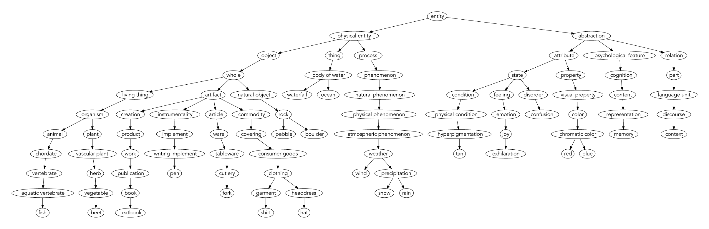
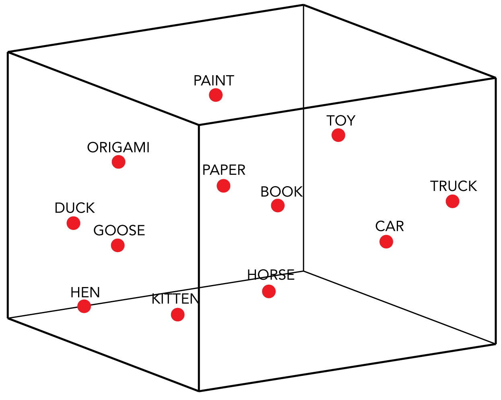
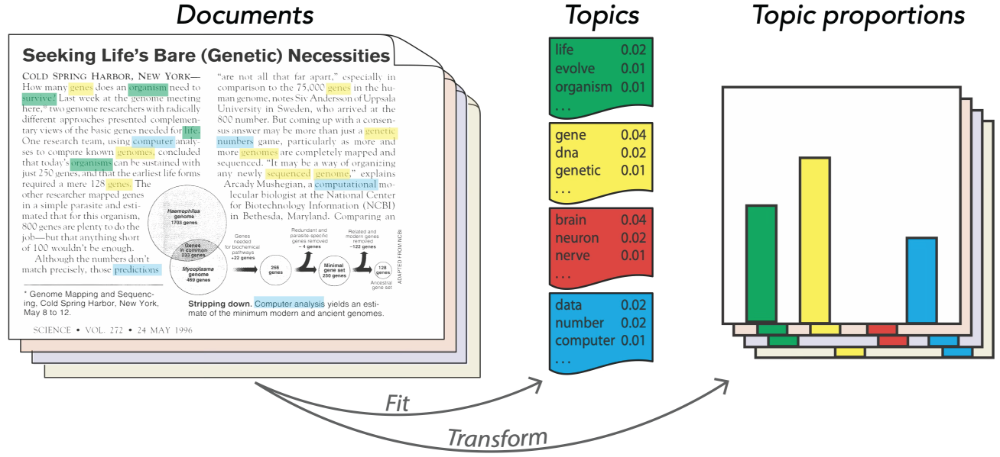

# Lecture 10: Classic embeddings
### PSYC 51.17: Models of language and communication

Jeremy R. Manning
Dartmouth College
Winter 2026

---

# Learning objectives

<div class="note-box" data-title="By the end of this lecture, you will">

1. Understand the distributional hypothesis and why it matters
2. Implement Latent Semantic Analysis (LSA) with SVD
3. Apply Latent Dirichlet Allocation (LDA) for topic modeling
4. Compare classic embedding methods and their trade-offs

</div>

<div class="tip-box" data-title="Central idea">

*"You shall know a word by the company it keeps"* — J.R. Firth (1957)

</div>

---
<!-- _class: scale-90 -->

#  How do we represent the meaning of words computationally?

<div class="example-box" data-title="Traditional approaches: labor-intensive and expensive to scale!">

- Symbolic representations (e.g., dictionaries, taxonomies)
- Manual feature engineering (e.g., counting letters, syllables, POS tags)
- Taxonomies (e.g., WordNet)

</div>

<div class="note-box" data-title="Distributional approaches: data-driven, scalable, unsupervised">

- Learn from data (large text corpora)
- Context-based (words in context)
- Let the data tell us what words mean!

</div>

---

# Example "traditional" approach: Princeton WordNet

<div class="note-box" data-title="Further reading">

[**Miller (1995, *Communications of the ACM*)**](https://dl.acm.org/doi/abs/10.1145/219717.219748) WordNet: A Lexical Database for English.

</div>



---

# The distributional hypothesis

<div class="definition-box" data-title="Definition">

Words that appear in similar contexts tend to have similar meanings.

</div>

<div class="example-box" data-title="Example 1">

- "The **cat** sat on the mat"
- "The **dog** sat on the mat"
- "The **kitten** sat on the mat"

→ *cat*, *dog*, *kitten* are probably semantically related

</div>

<div class="example-box" data-title="Example 2">

- "The **computer** processes **data** quickly by using advanced **algorithms**."

→ *computer*, *data*, *algorithms* are probably semantically related

</div>

<div class="note-box" data-title="Implication">

We can learn word meaning from co-occurrence patterns alone!

</div>

---

# From **words** to **vectors**: represent each word as a point in a high-dimensional space



---

# How can we construct these high-dimensional word vectors?

- If words that appear in similar contexts have similar meanings, we can represent each word by the contexts it appears in:
  - We could count how often each word appears near other words (co-occurrence counts)
  - We could count how often each word appears in each document in a corpus (term-document matrix)

---

# Latent Semantic Analysis (LSA): the OG distributional word representation

<div class="definition-box" data-title="Core idea">

Words that occur in similar documents have similar meanings. We can represent each word by the documents it appears in.

</div>

<div class="example-box" data-title="Term-document matrix: how many times does each word appear in each document?">

| Document | apple | banana | computer | data | algorithm |
|----------|-------|--------|----------|------|-----------|
| Doc 1    | 3     | 2      | 0        | 0    | 0         |
| Doc 2    | 0     | 0      | 4        | 5    | 2         |
| Doc 3    | 1     | 1      | 1        | 0    | 0         |
| Doc 4    | 0     | 0      | 2        | 3    | 4         |
| Doc 5    | 2     | 0      | 4        | 0    | 0         |
| Doc 6    | 0     | 3      | 0        | 0    | 0         |

</div>

---
<!-- _class: scale-60 -->

# Latent Semantic Analysis (LSA): the OG distributional word representation

<div class="note-box" data-title="Further reading">

[**Deerwester et al. (1990, *Journal of the American Society for Information Science*)**](https://doi.org/10.1002/(SICI)1097-4571(199009)41:6%3C391::AID-ASI1%3E3.0.CO;2-9) Indexing by Latent Semantic Analysis.

</div>

- Building the term-document matrix gives us a high-dimensional representation of each word (one dimension per document)
- It also gives us a high-dimensional representation of each document (one dimension per word)
- **But:** real corpora have thousands of documents and tens of thousands of words!
  - Some dimensions (documents, words) will be noisy; we should try to remove them
  - Some dimensions might be highly correlated with each other; we should try to combine them to improve reliability and efficiency
  - We can use dimensionality reduction to find a lower-dimensional representation that captures the important structure in the data


---
<!-- _class: scale-80 -->

# Formal definition of LSA

<div class="example-box" data-title="The LSA algorithm">

1. Build term-document matrix $X$
2. Perform SVD: $X = U\Sigma V^T$
3. Keep top $k$ dimensions
4. Use $U_k$ as word embeddings

</div>

<div class="definition-box" data-title="SVD (Singular Value Decomposition)">

$X = U \Sigma V^T$ decomposes matrix $X$ into the product of three matrices:

- $U$: word-topic associations (number of words × number of topics)
- $\Sigma$: topic strengths (diagonal matrix)
- $V^T$: topic-document associations (number of topics × number of documents)

</div>

<div class="note-box" data-title="Why it matters">

Learning word representations (vectors) turns the abstract problem of defining "meaning" into a concrete linear algebra problem!

</div>

---
<!-- _class: scale-60 -->

# LSA in Python

```python
from sklearn.decomposition import TruncatedSVD
from sklearn.feature_extraction.text import CountVectorizer

documents = [
    "The cat sat on the mat",
    "The dog ran in the park",
    "Machine learning is amazing",
]

# Build term-document matrix (bag-of-words)
vectorizer = CountVectorizer(max_features=5000, stop_words='english')
doc_term_matrix = vectorizer.fit_transform(documents)

# Apply LSA - reduce to 100 dimensions
# (Note: for small data, use smaller n_components)
lsa = TruncatedSVD(n_components=100, random_state=42)
doc_embeddings = lsa.fit_transform(doc_term_matrix)
```

---
<!-- _class: scale-70 -->

# Finding similar words with LSA

```python
from sklearn.metrics.pairwise import cosine_similarity

# Get word embeddings
vocab = vectorizer.get_feature_names_out()
word_embeddings = lsa.components_.T

def find_similar(word, top_n=5):
    idx = list(vocab).index(word)
    word_vec = word_embeddings[idx].reshape(1, -1)
    sims = cosine_similarity(word_vec, word_embeddings)[0]
    top_indices = sims.argsort()[-top_n-1:-1][::-1]
    return [(vocab[i], f"{sims[i]:.3f}") for i in top_indices]

print(find_similar("computer"))
# [('software', 0.82), ('program', 0.79), ('system', 0.71), ...]
```

---

# Where does LSA fall short?

- Consider the word "bank":
  - "He deposited money in the bank."
  - "The river overflowed its bank."
  - "He had to bank the airplane to the left."
- LSA will create a single vector for "bank" that mixes these meanings
- In general: LSA assumes linear relationships, which may not capture complex semantics

---
<!-- _class: scale-80 -->

# Latent Dirichlet Allocation (LDA)

<div class="note-box" data-title="Further reading">

[**Blei, Ng, & Jordan (2003, *Journal of Machine Learning Research*)**](http://www.jmlr.org/papers/volume3/blei03a/blei03a.pdf) Latent Dirichlet Allocation.

</div>

<div class="definition-box" data-title="A generative model for documents">

Documents are generated by a mixture of topics, where each topic is a distribution over words. For each document $\mathbf{w}$ in the corpus:

1. Choose $N \sim \text{Poisson}(\xi)$ (number of words in document)
2. Choose topic proportions $\theta \sim \text{Dirichlet}(\alpha)$ (mixture of topics)
3. For each word $w_n$:
   - Choose a topic $z_n \sim \text{Multinomial}(\theta)$ (topic assignment for this word)
   - Choose a word $w_n$ from $p(w_n | z_n, \beta)$ (a multinomial probability conditioned on the topic; $\beta$ is the topic-word matrix)

</div>

<div class="tip-box" data-title="Why this is useful">

By writing down a "recipe" for how documents are generated, we can invert the process to infer the hidden topics and their distributions from observed documents! It lets us capture the idea that documents can cover multiple topics, and that individual words can be associated with multiple topics.

</div>

---

# LDA: cartoon



---

<!-- _class: scale-70 -->

# LDA in Python

```python
from sklearn.decomposition import LatentDirichletAllocation
from sklearn.feature_extraction.text import CountVectorizer

# Create bag-of-words
vectorizer = CountVectorizer(max_features=1000, stop_words='english')
doc_term_matrix = vectorizer.fit_transform(documents)
vocab = vectorizer.get_feature_names_out()

# Fit LDA
lda = LatentDirichletAllocation(n_components=5, random_state=42)
doc_topics = lda.fit_transform(doc_term_matrix)

# Print top words per topic
for idx, topic in enumerate(lda.components_):
    top_words = [vocab[i] for i in topic.argsort()[-7:]]
    print(f"Topic {idx}: {', '.join(top_words)}")
```

---

# Discussion: are distributional word representations enough to capture meaning?

<div class="important-box" data-title="Yes!">

  - Captures semantic similarity (e.g., synonyms)
  - Works well in practice (e.g., information retrieval)
  - Aligns with linguistic theory (e.g., distributional hypothesis)
  - Scalable to large corpora

</div>

<div class="note-box" data-title="But also...no!">

  - Text-only (no grounding, missing embodied experience)
  - No common sense reasoning (e.g., "the sky is blue")
  - Reflects biases in data
  - The approaches we've seen today are "bag-of-words" methods (ignore word order)

</div>

---
<!-- _class: scale-85 -->

# Key ideas from today

1. **Distributional Hypothesis:** words in similar contexts have similar meanings
2. **LSA:** SVD on term-document matrix&mdash; dense embeddings that capture global structure
3. **LDA:** probabilistic topic modeling&mdash; interpretable topics and word distributions

---

# Questions?

<div class="emoji-figure">
  <div class="emoji-col">
    <span class="emoji emoji-xl emoji-bg emoji-bg-navy">&#x1F4E7;</span>
    <span class="label"><a href="mailto:jeremy@dartmouth.edu">Email</a> me</span>
  </div>
  <div class="emoji-col">
    <span class="emoji emoji-xl emoji-bg emoji-bg-purple">&#x1F4AC;</span>
    <span class="label">Join our <a href="https://discord.gg/sftEk9Ygdw">Discord</a></span>
  </div>
  <div class="emoji-col">
    <span class="emoji emoji-xl emoji-bg emoji-bg-green">&#x1F481;</span>
    <span class="label">Come to <a href="https://context-lab.youcanbook.me">office hours</a></span>
  </div>
</div>

<div class="tip-box" data-title="Up next...">

We'll kick off **week 4** with a lecture on **neural embeddings** (Word2Vec, GloVe, FastText)! Also remember that **Assignment 2** is due on **Monday at 11:59 PM**!

</div>
