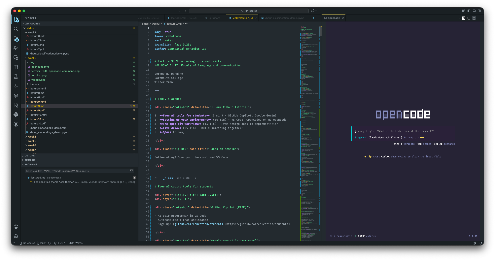
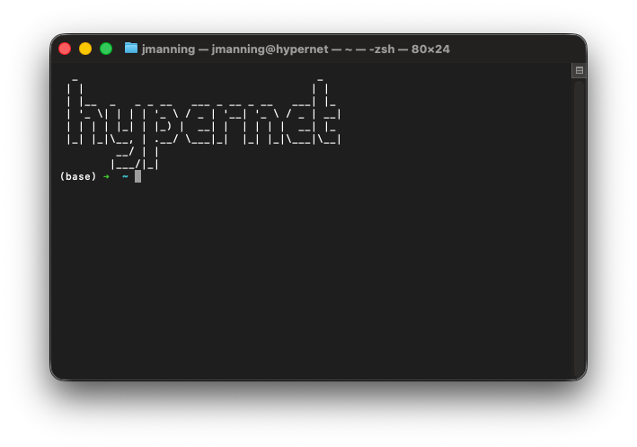
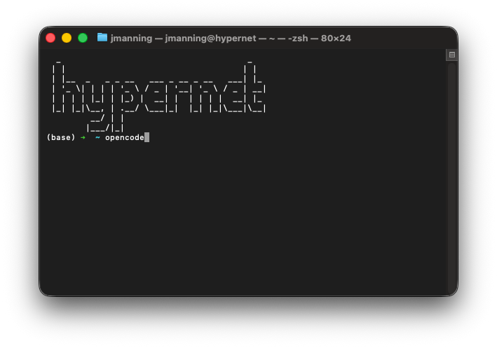
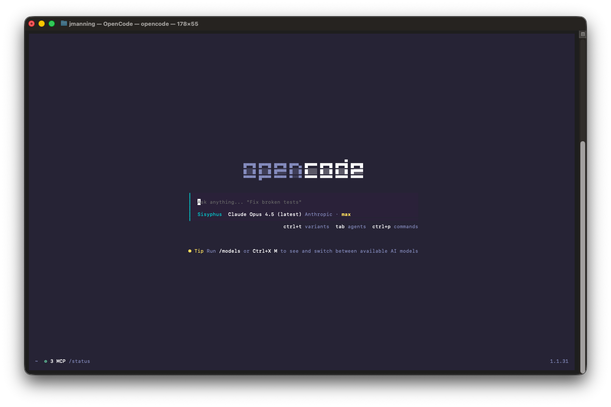

# Lecture 9: Vibe coding tips and tricks
### PSYC 51.17: Models of language and communication

Jeremy R. Manning
Dartmouth College
Winter 2026

---

# Today's agenda

<div class="definition-box" data-title="Vibe coding">

Vibe coding means using "AI" coding agents to rapidly prototype and implement software by describing what you want in natural language, then iterating on the output.

</div>

<div class="note-box" data-title="Topics we'll cover">

1. **Free AI coding tools for students:** GitHub Copilot, Google Gemini
2. **Setting up your environment:** VS Code, OpenCode, oh-my-opencode
3. **The spec-kit workflow:** from design docs to implementation
4. **Live demo:** build something together!

</div>

<div class="tip-box" data-title="Follow along!">

Install the tools (and *try using them*) as we go&mdash; and ask questions as they arise!

</div>

---
<!-- _class: scale-80 -->

# Free coding models: use them!

- [**GitHub Copilot:**](https://github.com/education/students) great at code completion, chat assistance, moderate coding tasks
- [**Google Gemini:**](https://gemini.google/students/) very long context windows, powerful models that are good at reasoning-heavy tasks
- [**Dartmouth GenAI:**](https://chat.dartmouth.edu) free access to many models (Claude, ChatGPT, Mistral, etc.)
- [**Ollama**](https://ollama.com) and [**LM Studio:**](https://lmstudio.ai) run LLMs directly on your laptop (some good ones: llama3.2, deepseek-r1, gemma3, qwen3, gpt-oss)
- [**Hugging Face**](https://huggingface.co) hosts many open models you can try in your browser or download to run locally. Not great for vibe coding, but useful for integrating models into your projects.

---
<!-- _class: scale-80 -->

# My favorite paid options

- [**Anthropic Claude:**](https://www.anthropic.com/products/claude) fantastic coding model (this is what I use most of the time!).
- [**OpenAI ChatGPT:**](https://openai.com) powerful, different behavior and feel from Claude; sometimes when one model struggles, the other can help.

<div class="note-box" data-title="Student discounts">

Most paid LLM services offer student discounts and/or free tiers.

</div>


---

# Setting up your environment: two(ish) options

1. **Integrated Development Environment (IDE):** full-featured environment with syntax highlighting, debugging, Git integration, extensions (e.g., VS Code, PyCharm)
2. **Terminal-based coding agent:** lightweight, fast, scriptable (e.g., Claude Code, ChatGPT Codex CLI, OpenCode)

<div class="note-box" data-title="Some other options to try out">

- OpenCode, Claude, and OpenAI all have native desktop apps that combine terminal-based coding agents with IDE-like features (file browsing, syntax highlighting, etc.)
- Some IDEs are explicitly designed for AI coding (e.g., [Antigravity](https://antigravity.google/), [Cursor](https://cursor.com/))
- Google Colab now builds in AI coding assistance directly into notebooks (similar to VS Code's Copilot extension); no installation required!

</div>

---

# Setting up VS Code



---

# Setting up VS Code

- Download and install from [code.visualstudio.com](https://code.visualstudio.com)
- Install essential extensions:
  - GitHub Copilot
  - Jupyter
  - Python
  - OpenCode
- Activate Copilot with your GitHub account (click the Accounts icon in bottom left)

---

# Setting up OpenCode (in Terminal)

<div class="note-box" data-title="Run in terminal to install OpenCode">

```bash
curl -fsSL https://opencode.ai/install | bash
```

</div>



---

# Launch OpenCode




---

# Launch OpenCode




---

# OpenCode configuration

- Use the `/models` command to connect opencode with your Copilot and Gemini accounts (and OpenAI/Anthropic accounts if you have them)
- Then install **oh-my-opencode** by entering the following command into opencode:

```
Install and configure oh-my-opencode by following the instructions here:
https://raw.githubusercontent.com/code-yeongyu/oh-my-opencode/refs/heads/master/docs/guide/installation.md
```

---
<!-- _class: scale-80 -->


# Oh-my-opencode highlights

- The main thing oh-my-opencode does is intelligently (and automatically!) orchestrate multiple AI agents to work together on complex tasks. You don't have to do anything special to make this happen (just install the plugin).
- If you include the keyword "`ultrawork`" in any prompt, the LLM will turn on much stricter execution policies to ensure it completes tasks fully and correctly.
- The `/ralph-loop` command lets you set up a self-referential development loop that continues working on a task until it is fully complete (or you hit a max iteration limit).
- The OpenCode extension for VS Code lets you run OpenCode commands directly inside the IDE (super convenient!)

---
<!-- _class: scale-80 -->

# Initializing OpenCode projects

<div class="note-box" data-title="Start here!">

First clone (download) your project's GitHub repository to your computer:

```bash
git clone <your-repo-url>
cd <your-repo-name>
```

</div>

- Then launch opencode (run the `opencode` command inside the project folder):
- Then initialize the project using the `/init-deep` command (in opencode)
  - This launches a deep analysis of the codebase to help coding agents understand the project structure and dependencies
  - The process leaves behind a set of `AGENTS.md` files that help future agents understand the project without having to re-analyze everything from scratch

---

# The classic four-step vibe coding workflow (for serious projects that you can't just one-shot prompt)

```flow
[Describe:green] --> [Design:blue] --> [Plan:orange] --> [Implement:purple]
```

<div style="display: flex; gap: 1.5em;">
<div style="flex: 1;">

<div class="example-box" data-title="1. Detailed description">

- What are the inputs/outputs?
- What are the edge cases?
- Include examples!

</div>

<div class="note-box" data-title="2. Technical design doc">

- Have AI draft the architecture
- Iterate until you're happy
- Include skeleton code

</div>

</div>
<div style="flex: 1;">

<div class="warning-box" data-title="3. Implementation plan">

- Break into small tasks
- Include verification steps
- Don't exceed context limits

</div>

<div class="definition-box" data-title="4. Implement and verify">

- Let AI write the code
- Test each piece
- Stress test the result!

</div>

</div>
</div>

---

# spec-kit: GitHub's toolkit for **Spec-Driven Development** (SDD)

<div class="definition-box" data-title="Core idea">

Instead of writing a technical design doc and implementation plan from scratch, you write a **specification** first. The spec becomes the executable source of truth. spec-kit guides you through the process.

</div>

<div class="example-box" data-title="The workflow">

1. `/speckit.constitution`: define architectural rules
2. `/speckit.specify`: create the spec (what + why, no how)
3. `/speckit.clarify`: AI asks clarifying questions
4. `/speckit.plan`: generate technical plan
5. `/speckit.tasks`: break into actionable tasks
6. `/speckit.implement`: execute with verification
</div>

---
<!-- _class: scale-80 -->

# Writing a good spec

<div class="warning-box" data-title="The golden rule">

Focus on **WHAT** and **WHY**, not HOW. No languages, databases, or APIs in the spec!

</div>

<div class="example-box" data-title="Example spec structure">

```markdown
### User Story 1 - Add task to board (Priority: P1)
User can create a new task with a title and optional description.
Task appears in the "To Do" column by default.

**Acceptance Scenarios:**
1. **Given** an empty board, **When** user clicks "Add Task"
   **Then** a form appears with title and description fields
2. **Given** a filled form, **When** user clicks "Save"
   **Then** task appears in "To Do" column
```

</div>

---

# Demo: AI-powered search engine

<div class="note-box" data-title="What we're building">

A **single HTML file** that creates an AI-powered search engine:
1. User asks a question
2. Browser-based LLM (SmolLM2-360M) generates search terms
3. Fetches and parses Google results
4. LLM summarizes each result, then synthesizes a final answer
5. Returns answer with annotated references

</div>

<div class="tip-box" data-title="Design decisions">

Let's create a minimalist UI with smooth animations and real-time progress indicators showing which pipeline step is running and estimated time remaining

</div>

---

# The spec-kit workflow for our demo

```flow
[Constitution:green] --> [Specify:blue] --> [Clarify:orange] --> [Plan:teal] --> [Tasks:violet] --> [Implement:red]
```

<div class="note-box" data-title="Key difference from ad-hoc prompting">

Each step produces a **document** that becomes the source of truth. The AI can't drift from the spec!

</div>

<div class="important-box" data-title="Why this matters">

LLM-based coding agents can easily get confused, distracted, or go off-track. This happens especially often with complex tasks that require multiple steps (multiple agents workng together, large codebases, and so on). The spec-kit workflow keeps everything grounded in a clear, unambiguous specification that every agent can refer back to as needed.

</div>

---
<!-- _class: scale-80 -->

# Constitution: define the **architectural DNA**&mdash; rules that govern ALL code in the project

<div class="example-box" data-title="Prompt: /speckit.constitution">

```
Create a constitution for this project with these principles:
- Single HTML file (no build tools, no npm)
- Use Transformers.js for browser-based LLM inference
- Model: SmolLM2-360M-Instruct (small enough for browser)
- Modern CSS (flexbox, grid, CSS variables)
- Vanilla JavaScript only (no frameworks)
- Graceful degradation if WebGPU unavailable
```

</div>

<div class="note-box" data-title="Output">

A `constitution.md` file with inviolable rules.

</div>

---
<!-- _class: scale-70 -->

# Specify: describe WHAT we want (not HOW)

<div class="example-box" data-title="Prompt: /speckit.specify">

```
Build a web-based AI search assistant. Single HTML file.

User Journey:
1. User sees "Ask me a question!" prompt
2. User types question and submits
3. System shows real-time progress with current step and time estimate
4. System displays final answer with numbered references
5. ... (add more details!)
```

</div>

<div class="note-box" data-title="Output">

A `spec.md` file with detailed user stories, acceptance criteria, and examples.

</div>

---
<!-- _class: scale-80 -->

# Clarify (`/speckit.clarify`): use the coding agent to identify ambiguities and ask questions

<div class="example-box" data-title="The agent might ask things like">

1. How should search results be fetched?
2. What if the LLM generates poor search terms?
3. How many results to fetch? (You said 10)
4. What's the fallback if WebGPU is unavailable?
5. Should users be able to ask follow-up questions?

</div>

<div class="tip-box" data-title="Your job">

Answer these questions (interactively) and/or provide additional details and clarifications. You can run `/speckit.clarify` multiple times until you're satisfied, or you can manually edit the `spec.md` file to add, subtract, or modify any details.

</div>

<div class="note-box" data-title="Output">

An updated `spec.md` file with clarifications incorporated.

</div>

---
<!-- _class: scale-78 -->

# Plan: specify the technical approach

<div class="example-box" data-title="Prompt: /speckit.plan">

```
Create a technical plan using:
- Transformers.js with SmolLM2-360M-Instruct
- Google search via allorigins.win CORS proxy
- Single HTML file with embedded CSS/JS
- CSS animations for progress states
- LocalStorage for model caching

Include: architecture diagram, data flow, component breakdown.
```

</div>

<div class="note-box" data-title="Output">

`plan.md` with architecture, data models, component specs.

</div>

---
<!-- _class: scale-78 -->

# Tasks: break the plan into implementable chunks

<div class="example-box" data-title="Prompt: /speckit.tasks">

```
Break the plan into tasks. Each task should:
- Be completable in <30 minutes
- Have clear acceptance criteria
- Be independently testable
```

</div>

<div class="note-box" data-title="Hypothetical generated tasks">

1. HTML skeleton + CSS variables + loading animation
2. Transformers.js setup + model loading with progress
3. Search term generation prompt + LLM call
4. Google search fetch + result parsing
5. Result summarization loop with progress updates
6. Final synthesis + reference formatting
7. Error handling + offline support

</div>

---
<!-- _class: scale-78 -->

# Implement: execute each task (and check against spec)

<div class="example-box" data-title="Prompt: /speckit.implement">

```markdown
For each task:
1. Write the code to implement the task.
2. Write tests to verify correctness.
3. Use ultrawork policies to ensure completeness.
4. Verify appearance using the playwright tool.
5. Run tests and fix any issues as you go.
```

</div>

<div class="note-box" data-title="Output">

Multiple commits implementing each task with verification steps...and a draft of the final product!

</div>

<div class="tip-box" data-title="Remember">

Implementation can take a while to run. You can do other stuff in the meantime!

</div>


---

# Testing and verification

<div class="important-box" data-title="Crucial step">

Even if you were careful in planning out your spec and tasks, things can still go wrong during implementation. Always test each piece as you complete it, and stress-test the final product to ensure it meets all acceptance criteria. You will likely need to iterate a few times to get everything working perfectly!

</div>

<div class="tip-box" data-title="Pro tip">

When you find something broken, it's tempting to vibe code a quick fix without updating the spec or plan. But this is a *very* bad idea: you (and your coding agent helpers!) will quickly find yourselves lost and confused about what the code is supposed to do. Always go back and update the spec, plan, and tasks to reflect any changes you make during implementation.

</div>

<div class="note-box">

*You* don't necessarily need to be the one to update your spec/plan/tasks. You can have your coding agents do it for you! Just be sure to review and verify the changes they make.

</div>

---
<!-- _class: scale-90 -->

# Guiding principles

<div class="definition-box" data-title="Simplicity">

Simplicity is the art of maximizing the amount of work not done.

</div>

<div class="note-box" data-title="What this means for vibe coding">

1. Spend time at the start of your project carefully figuring out what you really want to build.
2. Ambiguities in your initial idea(s) are OK at first, but then you should work with your coding agents to clarify and refine your vision before you start implementing.
3. Always be on the lookout for opportunities to simplify your design, plan, and implementation.
4. Use the "single source of truth" principle whereby each function or module is coded once and resued as needed.
5. Make sure your project remains clean: continually remove unused files, functions, and dependencies as you go.

</div>

---

# Questions?

<div class="emoji-figure">
  <div class="emoji-col">
    <span class="emoji emoji-xl emoji-bg emoji-bg-navy">&#x1F4E7;</span>
    <span class="label"><a href="mailto:jeremy@dartmouth.edu">Email</a> me</span>
  </div>
  <div class="emoji-col">
    <span class="emoji emoji-xl emoji-bg emoji-bg-purple">&#x1F4AC;</span>
    <span class="label">Join our <a href="https://discord.gg/sftEk9Ygdw">Discord</a></span>
  </div>
  <div class="emoji-col">
    <span class="emoji emoji-xl emoji-bg emoji-bg-green">&#x1F481;</span>
    <span class="label">Come to <a href="https://context-lab.youcanbook.me">office hours</a></span>
  </div>
</div>

<div class="note-box" data-title="Next up">

Lecture 10 (tomorrow): classic embeddings (LSA, LDA)

</div>
