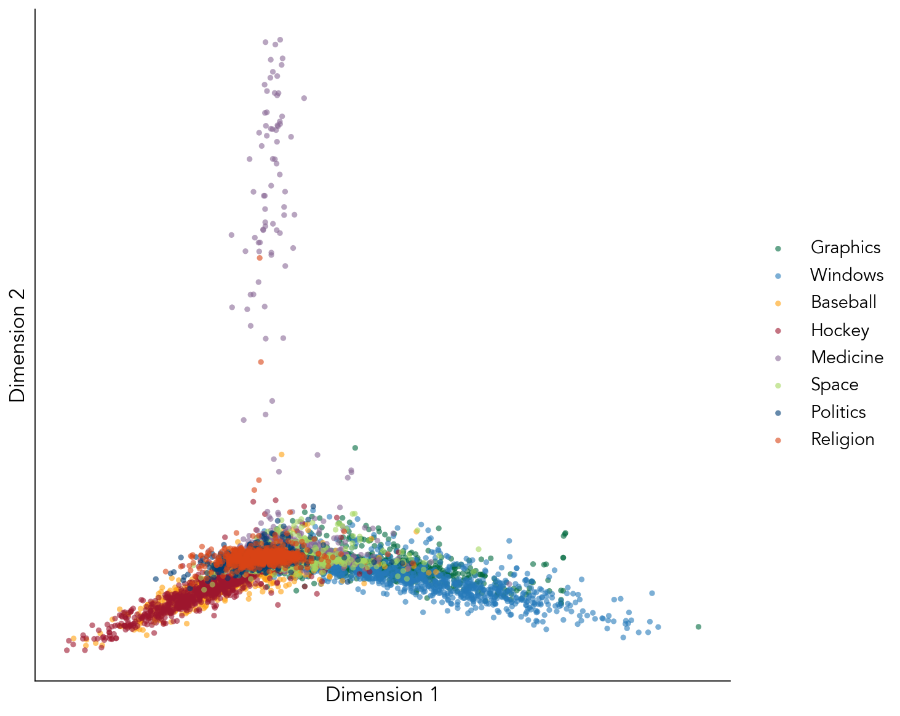
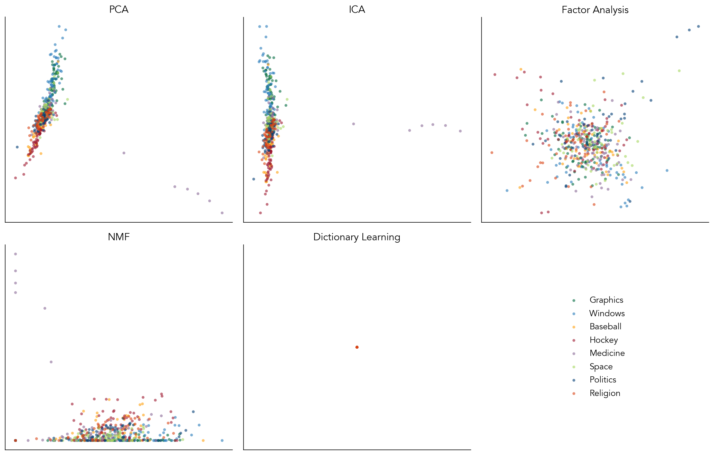
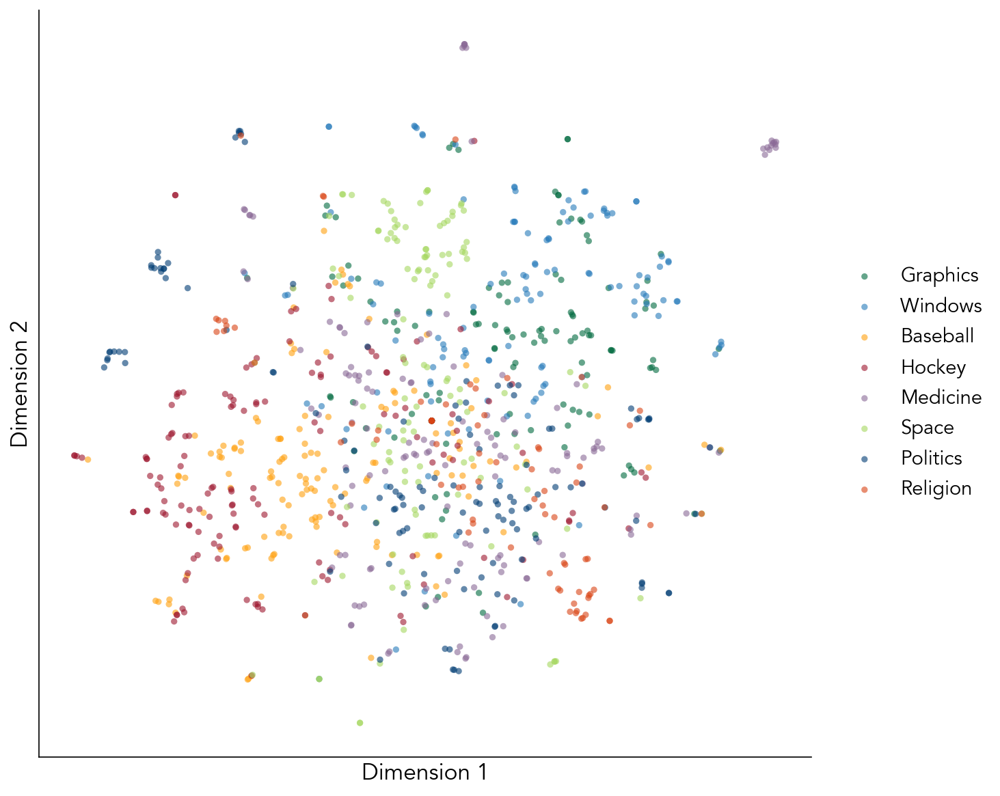
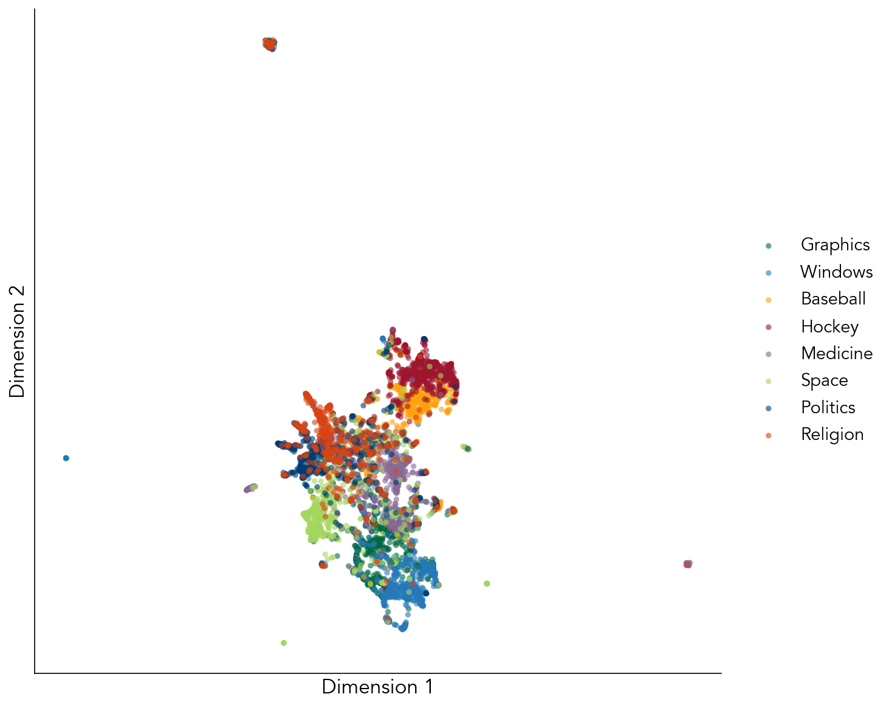
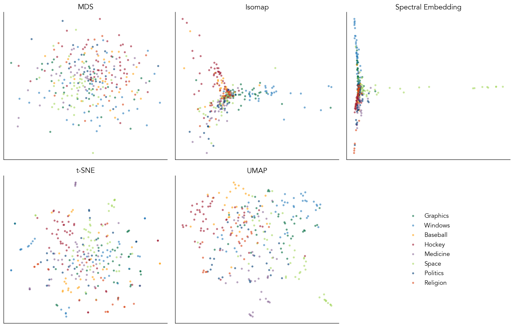

# Lecture 13: Dimensionality reduction
### PSYC 51.17: Models of language and communication

Jeremy R. Manning
Dartmouth College
Winter 2026

---

# Learning objectives

<div class="note-box" data-title="By the end of this lecture, you will">

1. Understand **why** we need dimensionality reduction for embeddings
2. Know the **matrix factorization** family (PCA, ICA, NMF, etc.)
3. Know the **manifold learning** family (t-SNE, UMAP, MDS, etc.)
4. Know **when to use** each technique
5. Apply **HyperTools** for quick visualization workflows

</div>

<div class="definition-box" data-title="The goal">

Reduce from $d$ dimensions (e.g., 300+) to 2-3 dimensions while preserving meaningful structure for visualization.

</div>

---
<!-- _class: scale-85 -->

# The challenge of high dimensions

<div class="quote-box">

> "To deal with a 14-dimensional space, visualize a 3-D space and say 'fourteen' to yourself very loudly. Everyone does it."
> 
> — Geoffrey Hinton

</div>

<div class="warning-box" data-title="Counterpoint: the curse of dimensionality">

High-dimensional spaces behave counter-intuitively: all points tend to be equidistant!

- **Word2Vec / GloVe:** 300 dimensions
- **BERT:** 768 dimensions  
- **GPT-3:** 12,288 dimensions

</div>

---

# Why dimensionality reduction?

<div class="note-box" data-title="Applications">

- **Visualization:** 2D/3D plots to explore semantic structure geometrically
- **Quality assurance:** verify embeddings capture expected relationships
- **Preprocessing:** reduce noise before clustering
- **Interpretation:** understand relationships between words/documents

</div>

<div class="tip-box" data-title="Two major families">

1. **Matrix factorization:** linear methods that decompose data into factors
2. **Manifold learning:** non-linear methods that preserve geometric structure

</div>

---
<!-- _class: scale-90 -->

# What is matrix factorization?

<div class="definition-box" data-title="Core idea">

Decompose the data matrix into a product of smaller matrices:

$$\mathbf{Y} \approx \mathbf{W} \mathbf{F}$$

Where:
- $\mathbf{Y}$ is $n \times d$ (observations × features)
- $\mathbf{W}$ is $n \times k$ (observations × components) — the **weights**
- $\mathbf{F}$ is $k \times d$ (components × features) — the **factors**

</div>

<div class="note-box" data-title="Matrix factorization comes in many flavors!">

- **PCA:** maximize variance, orthogonal factors
- **ICA:** maximize statistical independence
- **Factor Analysis:** model latent variables with noise
- **NMF:** non-negative constraints (interpretable parts)
- **Dictionary Learning:** sparse, overcomplete representations
- **Topographic Factor Analysis:** spatially organized factors
</div>

---

# PCA: Principal Component Analysis

<div class="note-box" data-title="Further reading">

[**Pearson (1901, *Philosophical Magazine*)**](https://www.tandfonline.com/doi/abs/10.1080/14786440109462720) On lines and planes of closest fit to systems of points in space.

</div>

<div class="definition-box" data-title="The classic linear method">

Finds directions of **maximum variance** and projects data onto these orthogonal "principal components."

</div>

<div class="example-box" data-title="Properties">

- **Linear transformation:** preserves global structure
- **Deterministic:** same result every time (for some implementations)
- **Fast:** efficient computation via SVD
- **Interpretable:** PCs ranked by variance explained

</div>

<div class="tip-box" data-title="When to use PCA">

Quick first exploration, preprocessing for other methods, or when computational speed is critical.

</div>

---

# PCA: 20 Newsgroups visualization



<div class="example-box" data-title="Observations">

Categories overlap significantly — PCA captures global structure but loses local clusters. Fast to compute (~100ms for 7000 documents). Only captures **linear** relationships.

</div>

---

# Matrix factorization methods compared



<div class="note-box" data-title="Key differences">

Each method optimizes different objectives: PCA maximizes variance, ICA maximizes independence, NMF ensures non-negativity. Choose based on your data's structure and interpretability needs.

</div>

---

# t-SNE: t-Distributed Stochastic Neighbor Embedding

<div class="note-box" data-title="Further reading">

[**van der Maaten & Hinton (2008, *JMLR*)**](https://www.jmlr.org/papers/volume9/vandermaaten08a/vandermaaten08a.pdf) Visualizing Data using t-SNE.

</div>

<div class="definition-box" data-title="Non-linear visualization">

Models similarity as probability distributions. Preserves **local structure** — neighbors stay neighbors.

</div>

<div class="warning-box" data-title="Caveats">

- **Slow:** O(N²) complexity
- **Non-deterministic:** Different seeds → different layouts
- **Cluster sizes are arbitrary** — don't interpret "bigger" as "more variance"
- **Distances between clusters are meaningless**

</div>

---

# t-SNE: 20 Newsgroups visualization



<div class="example-box" data-title="Observations">

Clear, tight clusters emerge — great for identifying groups. Categories now well-separated. Perplexity parameter controls local vs. global focus (here: 30).

</div>

---

# UMAP: Uniform Manifold Approximation & Projection

<div class="note-box" data-title="Further reading">

[**McInnes et al. (2018, *arXiv*)**](https://arxiv.org/abs/1802.03426) UMAP: Uniform Manifold Approximation and Projection.

</div>

<div class="definition-box" data-title="The modern standard (2018)">

Theoretically grounded in topology. Preserves **both local AND global** structure.

</div>

<div class="tip-box" data-title="Key advantages">

- **Fast:** O(N log N) complexity
- **Scalable:** Handles millions of points
- **Out-of-sample:** Can transform new points without refitting
- **Global structure:** Keeps related clusters near each other

</div>

---

# UMAP: 20 Newsgroups visualization



<div class="example-box" data-title="Observations">

Clear clusters like t-SNE, but preserves global relationships. Related categories (sci.space, sci.med) remain nearby. Much faster than t-SNE for large datasets.

</div>

---

# Manifold learning: The big picture

<div class="definition-box" data-title="Core idea">

Assume high-dimensional data lies on a lower-dimensional **manifold** (curved surface). Learn the manifold structure and unfold it.

</div>

<div class="note-box" data-title="The family">

- **MDS:** Preserve pairwise distances
- **Isomap:** Geodesic distances on manifold
- **Spectral Embedding:** Graph Laplacian eigenvectors
- **t-SNE:** Probability-based local structure
- **UMAP:** Topological structure preservation

</div>

<div class="tip-box" data-title="Key insight">

These methods capture **non-linear** relationships that matrix factorization misses.

</div>

---

# Manifold learning methods compared



<div class="note-box" data-title="Key differences">

MDS preserves global distances, Isomap uses geodesic paths, Spectral focuses on connectivity. t-SNE and UMAP balance local and global structure differently.

</div>

---

# PCA vs. t-SNE vs. UMAP

| Feature | PCA | t-SNE | UMAP |
| :--- | :--- | :--- | :--- |
| **Speed** | Very Fast | Slow | Fast |
| **Scalability** | Excellent | Poor (<10k) | Excellent |
| **Global structure** | Yes | No | Yes |
| **Local structure** | Partial | Yes | Yes |
| **Deterministic** | Yes | No | Partial |
| **Out-of-sample** | Yes | No | Yes |

<div class="tip-box" data-title="Best practice workflow">

1. **PCA to 50D:** Fast preprocessing, removes noise
2. **UMAP to 2D:** Preserves structure, scales well

</div>

---

# Visualization best practices

<div class="note-box" data-title="Preparation">

- **Standardize:** Use `StandardScaler` for PCA
- **Sample:** For very large datasets, subsample or use PCA first
- **Iterate:** Try multiple hyperparameters

</div>

<div class="tip-box" data-title="Presentation">

- **Color intelligently:** By semantic category, cluster, or feature
- **Interactive:** Use Plotly, datamapplot, or Bokeh for hover tooltips
- **Annotate selectively:** Label representative points, not every one

</div>

<div class="warning-box" data-title="What you CANNOT conclude">

- Exact distances or true high-D geometry
- Quantitative relationships between distant clusters  
- Absolute cluster sizes (especially in t-SNE)

</div>

---

# HyperTools: Quick visualization workflows

<div class="note-box" data-title="What is HyperTools?">

A Python toolbox for **dimensionality reduction-based visual exploration** of high-dimensional data. Reduce, align, and plot in a single function call.

[**GitHub**](https://github.com/ContextLab/hypertools) | [**Documentation**](https://hypertools.readthedocs.io/)

</div>

<div style="text-align: center;">


</div>

---

# HyperTools: Example code

```python
import hypertools as hyp

# Load sample high-dimensional data
data = hyp.load('weights').get_data()

# All-in-one: reduce, align, and plot
hyp.plot(data, reduce='UMAP', align='hyper', ndims=3)

# Or use functions individually
reduced = hyp.reduce(data, reduce='PCA', ndims=10)
aligned = hyp.align(data, align='hyper')
hyp.plot(aligned, fmt='o')
```

<div class="tip-box" data-title="Key functions">

- `hyp.plot()` — Visualize with automatic reduction
- `hyp.reduce()` — Dimensionality reduction (PCA, UMAP, t-SNE, etc.)
- `hyp.align()` — Align multiple datasets (Procrustes, hyperalignment)

</div>

---

# Summary

<div class="note-box" data-title="What we learned">

1. **Curse of Dimensionality:** High-D space is counter-intuitive; reduction essential for visualization
2. **Matrix Factorization:** $\mathbf{Y} \approx \mathbf{W}\mathbf{F}$ — PCA, ICA, NMF, Factor Analysis
3. **Manifold Learning:** MDS, Isomap, t-SNE, UMAP — capture non-linear structure
4. **UMAP:** Fast, scalable, preserves local and global structure. The modern default.
5. **HyperTools:** Quick workflow for reduce → align → plot

</div>

<div class="tip-box" data-title="Try it yourself!">

📓 [X-hour Notebook](https://colab.research.google.com/github/ContextLab/llm-course/blob/main/slides/week4/xhour_dimred_demo.ipynb) — Interactive demo with BERTopic and datamapplot

</div>

---

# Questions?

<div class="emoji-figure">
  <div class="emoji-col">
    <span class="emoji emoji-xl emoji-bg emoji-bg-navy">&#x1F4E7;</span>
    <span class="label"><a href="mailto:jeremy@dartmouth.edu">Email</a> me</span>
  </div>
  <div class="emoji-col">
    <span class="emoji emoji-xl emoji-bg emoji-bg-purple">&#x1F4AC;</span>
    <span class="label">Join our <a href="https://discord.gg/sftEk9Ygdw">Discord</a></span>
  </div>
  <div class="emoji-col">
    <span class="emoji emoji-xl emoji-bg emoji-bg-green">&#x1F481;</span>
    <span class="label">Come to <a href="https://context-lab.youcanbook.me">office hours</a></span>
  </div>
</div>

<div class="tip-box" data-title="Up next">

Friday: Cognitive models of semantic representation — how do humans represent meaning?

</div>
