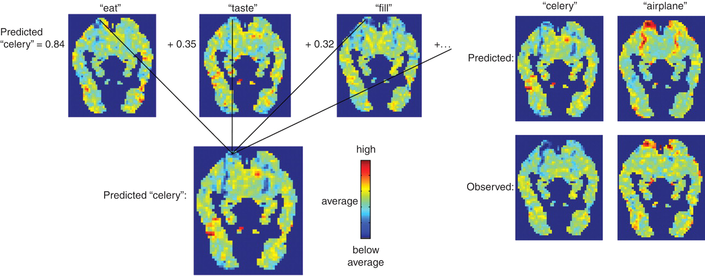
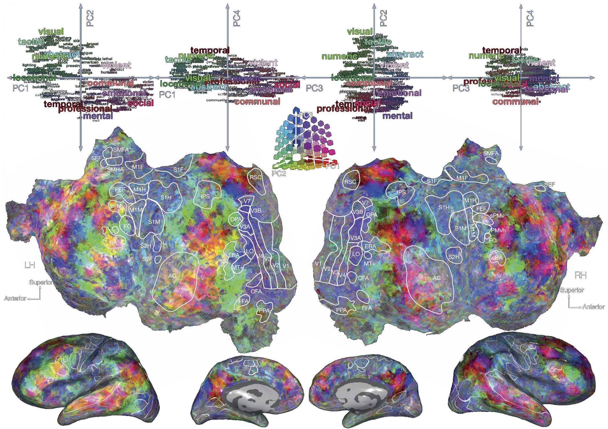

# Lecture 14: Cognitive models of semantic representation
### PSYC 51.17: Models of language and communication

Jeremy R. Manning
Dartmouth College
Winter 2026

---

# Today's agenda

Most AI discussions ask: *can machines think like us?*

Today we flip the question: **what do machines reveal about how *we* think?**

1. Computational models as cognitive mirrors
2. The surprising alignment between brains and algorithms
3. What this tells us about the architecture of human meaning
4. The boundaries of human understanding

---

# The mirror argument

When a simple algorithm (Word2Vec, BERT) captures aspects of human behavior or brain activity, this tells us something profound: **the pattern being captured was already there in human cognition.** Models don't create structure—they *reveal* structure that exists in language and thought!

If statistical co-occurrence predicts how humans judge similarity, perhaps human similarity judgments are *themselves* largely statistical. **We may be less "deep" than we imagine.**

---

# What distributional models reveal about *us*

<!-- _class: scale-90 -->

Models like LSA, LDA, and Word2Vec learn meaning purely from co-occurrence patterns in text.

Word2Vec predicts human relatedness judgments with ρ ≈ 0.70–0.75 on benchmarks like WordSim-353 ([Finkelstein et al., 2002](https://doi.org/10.1145/503104.503110)) and MEN ([Bruni et al., 2014](https://doi.org/10.1613/jair.4135)), approaching human inter-rater agreement (~0.68). **What does this say about the nature of human meaning?**

**Optimistic:** language encodes deep world knowledge; models extract it.
**Unsettling:** human "understanding" may be shallower than we think&mdash; more like pattern matching dressed up as insight.

---

# The grounding question, inverted

**Symbol grounding problem:** how can symbols acquire meaning without sensory experience? We usually think about this in terms of machines&mdash; how can an AI "understand" words without a body or sensory input?

**How much of YOUR semantic knowledge is actually grounded?**

You've never touched a quark. Never experienced the Cretaceous period. Never visited Alpha Centauri. Yet you have "concepts" of these things.

Your knowledge of most concepts is *linguistically mediated*&mdash; learned from text, speech, and symbols, not direct experience.

Perhaps humans and LLMs differ less in *kind* than in *degree*. We're both symbol manipulators; we just have more sensors.

---
<!-- _class: scale-85 -->

# How much does "having a body" matter?

Meaning arises from bodily experience. Reading the word "kick" activates motor cortex. Understanding requires simulation.

- Congenitally blind individuals understand "red" and "see" semantically (if not experientially)
- People born without limbs understand "grasp" and "kick"
- Abstract concepts (justice, infinity, democracy) have no sensorimotor referent

What is the *minimum* grounding required for genuine understanding? Is there a threshold, or is meaning a continuum?

To what extent does effective *communication* (or understanding of other minds) depend on shared grounding and/or shared experiences?

---

# 💭 Discussion: the spectrum of grounding

1. Your concept of "coffee" (you drink it daily)
2. Your concept of "durian" (you've read about it, maybe seen pictures)
3. Your concept of "quark" (purely theoretical, never directly observed)
4. Your concept of "justice" (abstract, no physical referent)
5. ChatGPT's concept of "coffee" (learned from text)

- Where do you draw the line between "real" understanding and symbol manipulation?
- Is your understanding of "quark" fundamentally different from ChatGPT's understanding of "coffee"?
- What would it take for *you* to truly understand a quark?

---

# Neural evidence: the alignment puzzle

<!-- _class: scale-85 -->

[**Mitchell et al. (2008, *Science*)**](https://www.science.org/doi/10.1126/science.1152876) Predicting brain activity associated with the meanings of nouns.

[**Huth et al. (2016, *Nature*)**](https://doi.org/10.1038/nature17637) Natural speech reveals the semantic maps that tile human cerebral cortex.

**Why should *text statistics* predict *brain activity*?**

Text has no sensory information. Yet it predicts neural patterns that supposedly require embodied grounding. Either:

1. Embodied grounding leaks into language statistics, or
2. The brain's "grounded" representations are more statistical than we thought

---

# Mitchell et al. (2008)

Trained model to predict fMRI patterns from word co-occurrence with 25 sensory-motor verbs. Result: **77% accuracy** on held-out words.

---

# Mitchell et al. (2008)

Trained model to predict fMRI patterns from word co-occurrence with 25 sensory-motor verbs. Result: **77% accuracy** on held-out words.

The brain organizes semantic information in ways that parallel statistical structure in language.

This isn't evidence that the brain *is* a statistical model, but it suggests the brain's solution and statistical solutions share deep structural properties.

---
<!-- _class: scale-70 -->

# Huth et al. (2016)

Built encoding models from word embeddings to predict brain activity during natural story listening. Found ~200 distinct semantic regions tiling the entire cortex.

---
<!-- _class: scale-70 -->

# Huth et al. (2016)

Built encoding models from word embeddings to predict brain activity during natural story listening. Found ~200 distinct semantic regions tiling the entire cortex.

Meaning is distributed across the *entire* cortex—not localized to "language areas." Every patch of cortex encodes semantic categories: people, places, numbers, social concepts, visual properties...

Human semantic representation is massively parallel and distributed...strikingly similar to how neural networks represent meaning!

---
<!-- _class: scale-90 -->

# 💭 Discussion: what do language models teach us about ourselves?

1. If someone had never seen the Mitchell and Huth results, they might assume "embodied meaning" requires fundamentally different representations than statistical learning produces. The data suggests otherwise. What does this tell us about the nature of human understanding?

2. We tend to feel that our understanding is "deep" whereas models are "shallow." But what if the brain's depth comes from *scale and integration* rather than a fundamentally different algorithm?

3. Could studying language models help us identify which aspects of human cognition are *unique* versus *universal properties of any system that processes language*?

---

# The limits of human understanding

We easily criticize LLMs for lacking "true" understanding. But what are the limits of *human* understanding?

- **Quantum superposition:** we can do the math, but can we *understand* it?
- **Fourteen-dimensional space:** we can project it, but can we *visualize* it?
- **Exponential growth:** we systematically underestimate it (disease spread, compound interest)
- **Deep time:** 4.5 billion years is a number, not a felt quantity
- **Consciousness itself:** we experience it but cannot explain it...or even understand it!

Humans seem to have a "cognitive horizon" of concepts we can manipulate symbolically but cannot truly grasp.

---

# Are humans just "stochastic parrots"?

<!-- _class: scale-75 -->

[**Bender, Gebru, McMillan-Major, and Shmitchell (2021, *FAccT*)**](https://dl.acm.org/doi/10.1145/3442188.3445922) On the dangers of stochastic parrots: can language models be too big?

Bender et al. (2021) claim that LLMs are like "stochastic parrots" that produce fluent language by reflecting statistical patterns without true understanding.

- **Confabulation:** Patients with split brains invent plausible explanations for behaviors they don't understand
- **Motivated reasoning:** We generate arguments for conclusions we've already reached
- **Expertise illusion:** We think we understand things (zippers, toilets, politics) until asked to explain them
- **Social learning:** Much of what we "know" is repeated from others, never verified

What percentage of your beliefs and utterances reflect genuine understanding versus sophisticated pattern matching and repetition?

---

# The illusion of explanatory depth

[**Rozenblit & Keil (2002, *Cognitive Science*)**](https://doi.org/10.1207/s15516709cog2605_1) The misunderstood limits of folk science: an illusion of explanatory depth.

**The experiment:** Rate your understanding of a bicycle (1-7). Now explain how it works. Re-rate your understanding.

**Result:** Ratings drop substantially after attempted explanation.

- We confuse *familiarity* with *understanding*
- We confuse *ability to use* with *ability to explain*
- We confuse *recognition* with *knowledge*

These are exactly the sorts of "failures" we attribute to LLMs.

---

# Concepts humans cannot form

[**McGinn (1989, *Mind*)**](https://www.jstor.org/stable/pdf/2254848.pdf) Can we solve the mind-body problem?

Just as dogs cannot understand calculus (not because they're stupid, but because they lack the cognitive architecture), humans may be *constitutionally incapable* of understanding certain truths.

- The hard problem of consciousness (why does subjective experience exist?)
- The nature of time (why does it flow?)
- Quantum measurement (what constitutes an "observer"?)
- Why there is something rather than nothing

---
<!-- _class: scale-80 -->

# 💭 Discussion: the boundaries of human understanding

1. **Personal limits:** is there a concept *you've* tried to understand but suspect you fundamentally *cannot*? What makes it feel unreachable? Complexity, or something deeper?

2. **Species limits:** if humans have a "cognitive horizon," how would we know? Can a system recognize its own limitations, or is that itself beyond the limitation?

3. **The comparison:** we use "understanding" as a binary (LLMs don't, humans do). But what if understanding is a *spectrum*, and humans are simply further along than current models, not categorically different? What evidence would change your mind?

4. **The pragmatic view:** does it *matter* whether understanding is "genuine"? If a doctor, lawyer, or teacher produces correct outputs, do we care about their inner experience?

---

# Summary: the mirror and the horizon

1. **The mirror:** language models reveal structure in human cognition we didn't know was there
2. **The alignment:** brain-model correlations suggest shared computational principles
3. **The inversion:** many critiques of LLM understanding apply to humans too
4. **The horizon:** humans have cognitive limits—concepts we can name but not truly grasp
5. **The spectrum:** "understanding" may be continuous, not binary

Studying how machines fail to understand helps us see how *we* might fail to understand—and what understanding even means.

---

# Questions?

  

    &#x1F4E7;
    <a href="mailto:jeremy@dartmouth.edu">Email</a> me
  

  

    &#x1F4AC;
    Join our <a href="https://discord.gg/sftEk9Ygdw">Discord</a>
  

  

    &#x1F481;
    Come to <a href="https://context-lab.youcanbook.me">office hours</a>
  

Next week we'll cover attention mechanisms and the transformer revolution!

