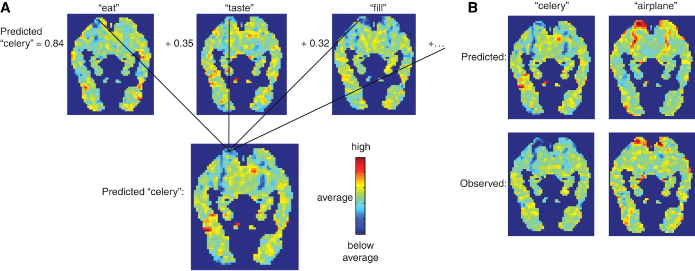
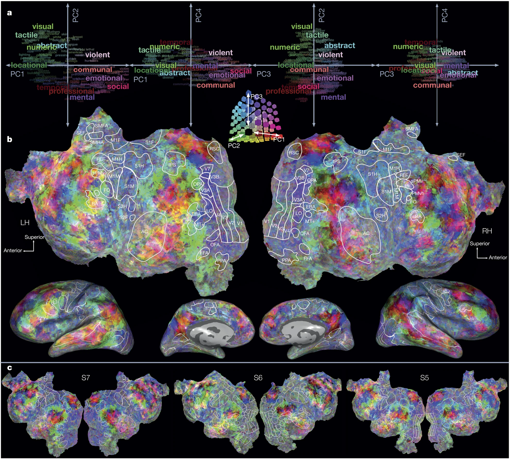

# Lecture 14: Cognitive models of semantic representation
### PSYC 51.17: Models of language and communication

Jeremy R. Manning
Dartmouth College
Winter 2026

---

# Today's agenda

Most AI discussions ask: *can machines think like us?*

Today we flip the question: **what do machines reveal about how *we* think?**

1. Computational models as cognitive mirrors
2. The surprising alignment between brains and algorithms
3. What this tells us about the architecture of human meaning
4. The boundaries of human understanding

---

# The mirror argument

When a simple algorithm (Word2Vec, BERT) captures aspects of human behavior or brain activity, this tells us something profound:

**The pattern being captured was already there in human cognition.**

Models don't create structure—they *reveal* structure that exists in language and thought!

If statistical co-occurrence predicts how humans judge similarity, perhaps human similarity judgments are *themselves* largely statistical.

**We may be less "deep" than we imagine.**

---

# What distributional models reveal about us

<!-- _class: scale-90 -->

Models like LSA, LDA, and Word2Vec learn meaning purely from co-occurrence patterns in text. See Lectures [10](../week3/lecture10.html), [11](lecture11.html), and [12](lecture12.html).

Word2Vec predicts human *relatedness* judgments with ρ ≈ 0.70–0.75 on WordSim-353 and MEN ([Pennington et al., 2014](https://aclanthology.org/D14-1162/)), approaching human inter-rater agreement (~0.68). It predicts strict *similarity* less well—ρ ≈ 0.44 on SimLex-999 ([Hill et al., 2015](https://doi.org/10.1162/COLI_a_00237)).

**Even the weaker result means ~20% of variance in human semantic judgments is captured by co-occurrence statistics alone.**

What does this say about the nature of human meaning?

**Optimistic:** Language encodes deep world knowledge; models extract it.
**Unsettling:** Human "understanding" may be shallower than we think—pattern matching dressed up as insight.

---

# The grounding question, inverted

**Symbol grounding problem:** How can symbols acquire meaning without sensory experience?

We usually ask this about machines. But consider:

**How much of YOUR semantic knowledge is actually grounded?**

You've never touched a quark. Never experienced the Cretaceous period. Never visited Alpha Centauri. Yet you have "concepts" of these things.

Your knowledge of most concepts is *linguistically mediated*—learned from text, speech, and symbols, not direct experience.

Perhaps humans and LLMs differ less in *kind* than in *degree*. We're both symbol manipulators—we just have more sensors.

---

# Embodied cognition: how much does the body matter?

<!-- _class: scale-90 -->

Meaning arises from bodily experience. Reading "kick" activates motor cortex. Understanding requires simulation.

- Congenitally blind individuals understand "red" and "see" semantically (if not experientially)
- People born without limbs understand "grasp" and "kick"
- Abstract concepts (justice, infinity, democracy) have no sensorimotor referent

**Embodiment may be *one route* to meaning, not *the* route.**

What is the *minimum* grounding required for genuine understanding? Is there a threshold—or is meaning a continuum?

---

# 💭 Discussion: The spectrum of grounding

1. Your concept of "coffee" (you drink it daily)
2. Your concept of "durian" (you've read about it, maybe seen pictures)
3. Your concept of "quark" (purely theoretical, never directly observed)
4. Your concept of "justice" (abstract, no physical referent)
5. GPT-4's concept of "coffee" (learned from text)

**Questions:**
- Where do you draw the line between "real" understanding and symbol manipulation?
- Is your understanding of "quark" fundamentally different from GPT-4's understanding of "coffee"?
- What would it take for YOU to truly understand a quark?

---

# Neural evidence: the alignment puzzle

<!-- _class: scale-85 -->

Trained model to predict fMRI patterns from word co-occurrence with 25 sensory-motor verbs. Result: **77% accuracy** on held-out words.

Built encoding models from word embeddings to predict brain activity during natural story listening. Found ~200 distinct semantic regions tiling the entire cortex.

Why should *text statistics* predict *brain activity*?

Text has no sensory information. Yet it predicts neural patterns that supposedly require embodied grounding. Either:
1. Embodied grounding leaks into language statistics, or
2. The brain's "grounded" representations are more statistical than we thought

---

# Mitchell et al. (2008)

The brain organizes semantic information in ways that parallel statistical structure in language.

This isn't evidence that the brain IS a statistical model—but it suggests the brain's solution and statistical solutions share deep structural properties.

[**Mitchell et al. (2008, *Science*)**](https://doi.org/10.1126/science.1152876)

---

# Huth et al. (2016)

Meaning is distributed across the *entire* cortex—not localized to "language areas."

Every patch of cortex encodes semantic categories: people, places, numbers, social concepts, visual properties...

Human semantic representation is massively parallel and distributed—strikingly similar to how neural networks represent meaning.

Perhaps we invented neural networks not as alien intelligences, but as mirrors of our own cognitive architecture.

---

# 💭 Discussion: What models teach us about ourselves

The Mitchell and Huth findings show that text statistics predict brain activity.

**Consider:**
1. If someone had never seen these results, they might assume "embodied meaning" requires fundamentally different representations than statistical learning produces. The data suggests otherwise. What does this tell us about the nature of human understanding?

2. We tend to feel that our understanding is "deep" while models are "shallow." But what if the brain's depth comes from *scale and integration* rather than a fundamentally different algorithm?

3. Could studying language models help us identify which aspects of human cognition are *unique* versus *universal properties of any system that processes language*?

---

# The limits of human understanding

We easily criticize LLMs for lacking "true" understanding. But what are the limits of *human* understanding?

- **Quantum superposition:** We can do the math, but can we *understand* it?
- **Four-dimensional space:** We can project it, but can we *visualize* it?
- **Exponential growth:** We systematically underestimate it (COVID-19 predictions)
- **Deep time:** 4.5 billion years is a number, not a felt quantity
- **Consciousness itself:** We experience it but cannot explain it

Humans seem to have a "cognitive horizon"—concepts we can manipulate symbolically but cannot truly grasp.

---

# Are humans "stochastic parrots" too?

<!-- _class: scale-90 -->

LLMs are "stochastic parrots"—producing fluent language without understanding. But consider human behavior:

- **Confabulation:** Patients with split brains invent plausible explanations for behaviors they don't understand
- **Motivated reasoning:** We generate arguments for conclusions we've already reached
- **Expertise illusion:** We think we understand things (zippers, toilets, politics) until asked to explain them
- **Social learning:** Much of what we "know" is repeated from others, never verified

What percentage of your beliefs and utterances reflect genuine understanding versus sophisticated pattern matching and repetition?

---

# The illusion of explanatory depth

People dramatically overestimate their understanding of how everyday objects work.

**The experiment:** Rate your understanding of a bicycle (1-7). Now explain how it works. Re-rate your understanding.

**Result:** Ratings drop substantially after attempted explanation.

- We confuse *familiarity* with *understanding*
- We confuse *ability to use* with *ability to explain*
- We confuse *recognition* with *knowledge*

These are exactly the "failures" we attribute to LLMs.

---

# Concepts humans cannot form

<!-- _class: scale-90 -->

Just as dogs cannot understand calculus (not because they're stupid, but because they lack the cognitive architecture), humans may be *constitutionally incapable* of understanding certain truths.

- The hard problem of consciousness (why does subjective experience exist?)
- The nature of time (why does it flow?)
- Quantum measurement (what constitutes an "observer"?)
- Why there is something rather than nothing

These may not be "hard problems" awaiting clever solutions. They may be *cognitive illusions*—questions that feel meaningful but lie outside our representational capacity.

We may be LLMs hallucinating that these questions have answers.

---

# 💭 Discussion: The boundaries of human understanding

1. **Personal limits:** Is there a concept you've tried to understand but suspect you fundamentally *cannot*? What makes it feel unreachable—complexity, or something deeper?

2. **Species limits:** If humans have a "cognitive horizon," how would we know? Can a system recognize its own limitations, or is that itself beyond the limitation?

3. **The comparison:** We use "understanding" as a binary (LLMs don't, humans do). But what if understanding is a *spectrum*—and humans are simply further along than current models, not categorically different? What evidence would change your mind?

4. **The pragmatic view:** Does it *matter* whether understanding is "genuine"? If a doctor, lawyer, or teacher produces correct outputs, do we care about their inner experience?

---

# The role of language in thought

Does language *shape* thought, or merely *express* it?

If Word2Vec captures semantic structure from text alone, this suggests language *encodes* thought structure—it's not a neutral medium.

**Implication:** The structure of your language may constrain the thoughts you can think.

There are concepts in other languages without English equivalents (saudade, hygge, Schadenfreude, wabi-sabi).

Can you *truly understand* these concepts? Or only approximate them through translation?

Are there concepts in no human language—thoughts no human has ever thought?

---

# Meaning as a construction

<!-- _class: scale-90 -->

Meaning isn't discovered—it's *constructed* through interaction between an agent and its environment.

Both humans and LLMs construct meaning from their training experience. The difference is:
- Humans: embodied, social, extended in time, multimodal
- LLMs: disembodied, text-only, compressed, no continuous identity

Which of these differences is *necessary* for "real" understanding?

If we gave an LLM a body, persistent memory, and social interaction—at what point would it cross the threshold?

Or is there no threshold—just increasingly sophisticated constructions of meaning, human and machine alike?

---

# Summary: The mirror and the horizon

1. **The mirror:** Language models reveal structure in human cognition we didn't know was there
2. **The alignment:** Brain-model correlations suggest shared computational principles
3. **The inversion:** Many critiques of LLM understanding apply to humans too
4. **The horizon:** Humans have cognitive limits—concepts we can name but not truly grasp
5. **The spectrum:** "Understanding" may be continuous, not binary

Studying how machines fail to understand helps us see how *we* might fail to understand—and what understanding even means.

---

# 💭 Final reflection: Know thyself

The philosopher's injunction was "know thyself."

After today's lecture:
- What do you think you *truly* understand (not just recognize or use)?
- What have you realized you understand less than you thought?
- Are there important concepts you suspect you *cannot* understand—and how do you relate to that boundary?

Write a few sentences. These questions have no answers—only honest self-examination.

---

# Questions?

  

    &#x1F4E7;
    <a href="mailto:jeremy@dartmouth.edu">Email</a> me
  

  

    &#x1F4AC;
    Join our <a href="https://discord.gg/sftEk9Ygdw">Discord</a>
  

  

    &#x1F481;
    Come to <a href="https://context-lab.youcanbook.me">office hours</a>
  

**Next lecture:** Attention mechanisms and the transformer revolution
