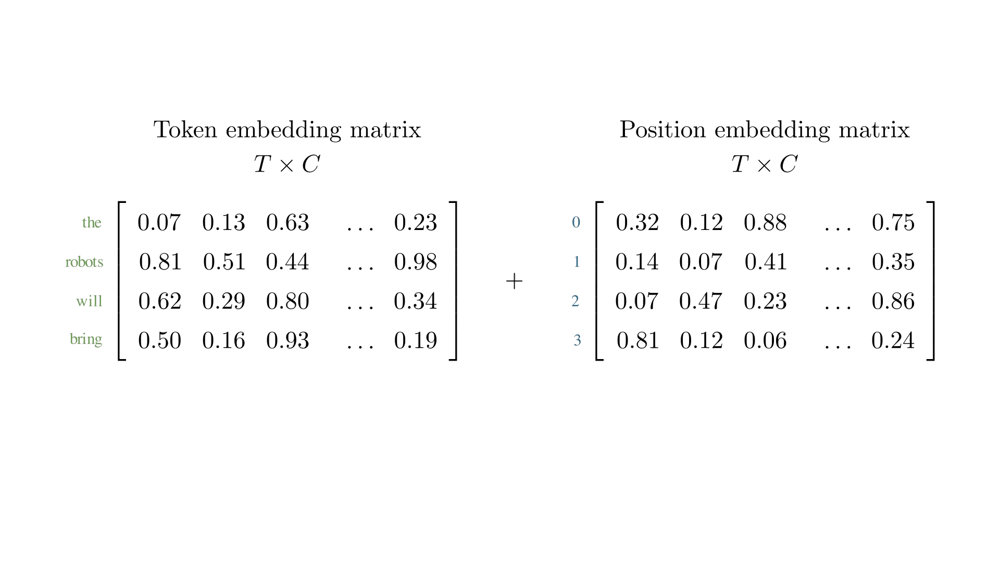
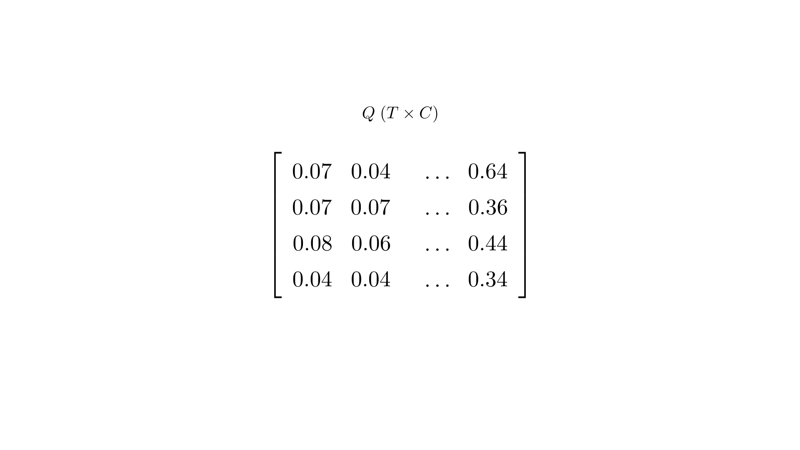
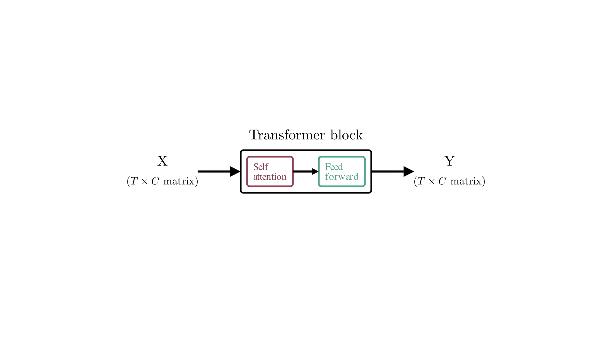
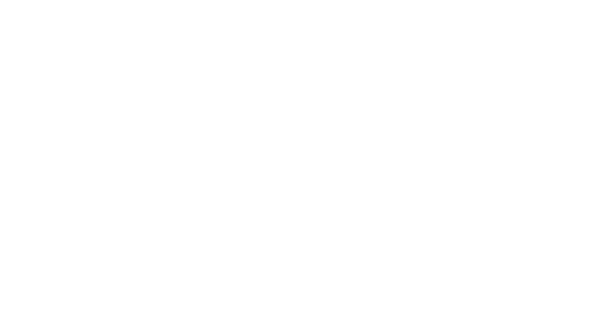

# Lecture 15: The transformer model
### PSYC 51.17: Models of language and communication

Jeremy R. Manning
Dartmouth College
Winter 2026

---

# Learning objectives

1. Understand the transformer as a function that predicts the next word
2. Follow data from raw text through tokenization, embedding, and attention
3. Explain how queries, keys, and values enable self-attention
4. See how multiple attention heads capture different patterns
5. Understand how stacking blocks creates deep representations

---
<!-- _class: scale-90 -->

# The transformer model

See [The Animated Transformer](https://prvnsmpth.github.io/animated-transformer/) for a visual walkthrough of the transformer architecture. (Today's lecture is heavily inspired by this resource!)

The transformer is a machine learning model for **sequence modeling**. Given a sequence of *things*, the model can predict what the next *thing* in the sequence might be.

We can think of the transformer as a function: $\text{Transformer}(X, \theta) \rightarrow Y$
- $X$ is our input sequence
- $\theta$ represents the model parameters
- $Y$ is the predicted next token

---

# The transformer model

---

# Tokenization

The transformer operates on sequences of *numbers*. So first we need to **tokenize** the input text into discrete units (tokens) and map those tokens to unique IDs.  The model doesn't understand tokens directly—it identifies them using unique numbers from a vocabulary.

"the robots will bring" → [3206, 2736, 3657, 400]

Each word maps to a unique ID in the vocabulary. (In practice, tokenization is more complex—subword units, punctuation, etc.—but this simplified example suffices for our purposes.)

---

# Embeddings: numbers speak louder than words

The transformer maintains **embeddings** of each token in its vocabulary. These embeddings are learned vectors that capture semantic information about the tokens.

This is the same idea as LSA, LDA, Word2Vec, GloVe, FastText, etc.- but here the embeddings are learned jointly with the rest of the model.

---

# Token embeddings

---

# Token embeddings

Our transformer has embedding vectors of length $C = 768$. All embeddings can be packed together in a single $T \times C$ matrix, where (in our example) $T = 4$ is the number of input tokens.

Each *row* of this matrix corresponds to a token in the input sequence, and each *column* corresponds to a dimension in the embedding space.

---

# Position embeddings

---

# Position embeddings

Each position in the input sequence (1st, 2nd, 3rd, etc.) also has a learned embedding vector of length $C = 768$. These position embeddings are stored in a separate $T \times C$ matrix.

In order to capture the significance of the **position** of a token within a sequence, the transformer also maintains embeddings for each position.

Without position information, "cat sat" and "sat cat" would look identical to the model!

Each *row* of this matrix corresponds to a position in the input sequence, and each *column* corresponds to a dimension in the embedding space.

Notice that both token and position embeddings have the same shape: $T \times C$. This allows the model to capture both the identity of the token and its position in the sequence within compatable embedding spaces.

---

# Combined embeddings

---

# Combined embeddings

The token and position embedding matrices ($T \times C$ each) are **added together** to obtain a position-dependent embedding for each token.

The token and position embeddings are all part of $\theta$, meaning they are tuned during model training.

Adding the embeddings allows the model to consider both the identity of the token and its position in the sequence simultaneously.

---

# Queries, keys, and values

The Transformer computes three vectors for each token: **query**, **key**, and **value**. This is done by multiplying with learned weight matrices:

$$Q = XW_Q \quad K = XW_K \quad V = XW_V$$

The weight matrices $W_Q$, $W_K$, $W_V$ are all part of $\theta$.

The $W_Q$, $W_K$, and $W_V$ matrices each have shape $C \times C$. Multiplying the input matrix $X$ ($T \times C$) by these weight matrices results in three new $T \times C$ matrices: $Q$, $K$, and $V$.

---

# Queries, keys, and values

---

# Queries, keys, and values

Imagine you have a database of images with text descriptions:

- **Query:** the user's search text
- **Key:** the text descriptions in your database
- **Value:** the actual images

Only those images (values) whose descriptions (keys) best match the search (query) are returned.

Self-attention works similarly—tokens "query" other tokens to find which ones they should "pay attention" to. In this context, "paying attention" means incorporating information from relevant tokens into their own representation (i.e., their row in the output matrix).

---

# Many heads are better than one

The Transformer splits the Q, K, V matrices into multiple **heads**. With $C = 768$ columns and 12 heads, each head operates on 64 dimensions.

Different heads can specialize in different patterns: syntax, co-reference, semantic roles, etc. The model "decides" (i.e., learns from training data) what's useful!

---

# Splitting into heads

---
<!-- _class: scale-80 -->

# Time to pay attention

*Self-attention* is the core idea behind the transformer. We compute an **attention scores** matrix:

$$A = \frac{Q \cdot K^T}{\sqrt{H}}$$

This matrix tells us how much attention each token should pay to every other token.

- $Q$ is $T \times C$
- $K^T$ is $C \times T$
- $A$ is $T \times T$
- $H$ is the head dimension (e.g., 64)

1. $A$ can be enormous for long sequences (e.g., $2048$ tokens → $2048 \times 2048$ matrix). This is a key computational bottleneck.
2. Notice that the "$V$" matrix isn't used yet; it'll come back soon!

---

# Computing attention scores

---
<!-- _class: scale-80 -->

# Applying attention

To get the final output, we need to apply the attention scores to the value matrix $V$ by multiplying $A$ and $V$.

$V$ contains the information we want to aggregate, while $A$ tells us *how much* of each token's value to include in the output for each token. We end up with a new $T \times C$ matrix where each token's representation is a weighted sum of the value vectors of all tokens.

The attention score for a token needs to be **masked** if it occurs later in the sequence. In our example, "bring" can pay attention to "robots", but not vice-versa—a token shouldn't look at future tokens when predicting its next token.

1. **Mask** future tokens (set upper triangle to 0)
2. **Softmax** each row (normalize to probabilities)
3. **Multiply by V** (weighted sum of value vectors)

---

# Applying attention

---

# Merging heads

After computing attention outputs for each head, we **concatenate** the outputs from all heads along the feature dimension to form a single $T \times C$ matrix.

Each head captures different aspects of the input sequence. By concatenating them, we preserve the diverse information learned by each head.

---

# Merging heads

---

# Feed forward

A **feed-forward network** processes each token's representation independently using two linear transformations with a non-linear activation in between:

$$\text{FFN}(x) = \text{ReLU}(xW_{nn} + b_1)W_{mm} + b_2$$

The hidden layer expands to $4C = 3072$ dimensions, then projects back to $C = 768$.

- $W_{nn}$: $C \times 4C$
- $b_1$: $4C$
- $W_{mm}$: $4C \times C$
- $b_2$: $C$

Everything so far has used **linear operations**. The non-linearity (ReLU) in the FFN allows the model to learn complex, non-linear relationships.

---

# Feed-forward network

---

# Feed-forward network

All the weight matrices in the FFN are part of $\theta$ (i.e., the model parameters) and are learned during training. The FFN allows the model to transform the attention outputs into richer representations before passing them to the next layer.

The expansion to $4C$ dimensions allows the model to capture more complex patterns, while the projection back to $C$ ensures that the output remains compatible with the rest of the model.

---

# We need to go deeper

All the steps thus constitute a *single* **Transformer block**. Each block takes a $T \times C$ matrix as input and outputs a $T \times C$ matrix.

- GPT-2: 12–48 blocks
- GPT-3: 96 blocks
- GPT-4: Unknown (likely 120+)
- GPT-5: Hundreds?

---

# Stacking transformer blocks

---

# Making a prediction

Take the last token's output vector and multiply by a $V \times C$ weight matrix, where $V$ is the vocabulary size. Normalize to get a probability distribution over all words.

In our example, "prosperity" might get a 92% probability, but "suffering" only 20%, and so on.

So if "prosperity" has the highest probability, the model predicts "the robots will bring **prosperity**"

---

# Making a prediction

---

# Text generator go brrr

---

# Autoregressive generation

The first token produced is added to the prompt and fed back to produce the second token, which is then fed back to produce the third, and so on.

Transformers have a maximum context length (N tokens). As generation continues, we drop the oldest tokens.

Remember that $A$ matrix? Its size grows quadratically with context length ($N \times N$). Longer contexts require more memory and computation, which can be a bottleneck. This limits how far back the model can "remember" during generation: **tokens prior to the start of the context window are completely invisible to the model!**

---

# And...that's it!

1. **Tokenize** text to IDs
2. **Embed** tokens + positions
3. **Project** to Q, K, V
4. **Split** into attention heads
5. **Compute** attention scores
6. **Apply** masking and softmax
7. **Multiply** by V for output
8. **Feed forward** with non-linearity
9. **Stack** many blocks
10. **Predict** next token

---

# ...Mostly!

To focus on the most important aspects, we skipped:
- **Layer normalization** (stabilizes training)
- **Residual connections** (helps gradient flow)
- **Dropout** (regularization)
- **Training** (how $\theta$ is learned)

See [nanoGPT](https://github.com/karpathy/nanoGPT/blob/master/model.py) for a complete implementation.

---

# References

[**Vaswani et al. (2017, *arXiv*)**](https://arxiv.org/abs/1706.03762) "Attention Is All You Need" — The original transformer paper.

[**The Animated Transformer**](https://prvnsmpth.github.io/animated-transformer/) — Visual walkthrough that inspired this lecture.

[**The Illustrated Transformer**](https://jalammar.github.io/illustrated-transformer/) — Jay Alammar's detailed visual guide.

[**nanoGPT**](https://github.com/karpathy/nanoGPT) — Andrej Karpathy's minimal GPT implementation.

---

# Questions?

  

    &#x1F4E7;
    <a href="mailto:jeremy@dartmouth.edu">Email</a>
  

  

    &#x1F4AC;
    <a href="https://discord.gg/sftEk9Ygdw">Discord</a>
  

  

    &#x1F481;
    <a href="https://context-lab.youcanbook.me">Office hours</a>
  

Training transformers: loss functions, optimization, and scaling laws...*oh my!*

