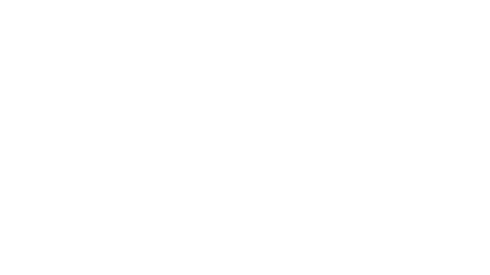

# Lecture 15: The animated transformer
### PSYC 51.17: Models of language and communication

Jeremy R. Manning
Dartmouth College
Winter 2026

---

# Learning objectives

1. Understand the Transformer as a function that predicts the next word
2. Follow data from raw text through tokenization, embedding, and attention
3. Explain how queries, keys, and values enable self-attention
4. See how multiple attention heads capture different patterns
5. Understand how stacking blocks creates deep representations

---

# What is a Transformer?

The Transformer is a machine learning model for **sequence modeling**. Given a sequence of *things*, the model can predict what the next *thing* in the sequence might be.

We can think of the Transformer as a function that operates on a phrase:

$$\text{Transformer}(X, \theta) \rightarrow Y$$

where $X$ is our input sequence and $\theta$ represents the model parameters.

---

# What is a Transformer?

**Input:** "the robots will bring ___"
**Output:** "prosperity" (the model's best guess for the next word)

---

# Tokenization

The Transformer operates on sequences, so we first need to **tokenize** the input phrase. One approach is to treat each word as a token.

The model doesn't understand words directly—it identifies tokens using unique numbers from a vocabulary.

---

# Tokenization

"the robots will bring" → [3206, 2736, 3657, 400]

Each word maps to a unique ID in the vocabulary.

---

# 1. Embeddings: Numbers speak louder than words

For each token, the Transformer maintains a vector called an **embedding**. An embedding aims to capture the semantic meaning of the token—similar tokens have similar embeddings.

This is the same idea as Word2Vec, but the embeddings are learned jointly with the rest of the model.

---

# Token embeddings

Our transformer has embedding vectors of length **C = 768**. All embeddings can be packed together in a single $T \times C$ matrix, where $T = 4$ is the number of input tokens.

---

# Position embeddings

In order to capture the significance of the **position** of a token within a sequence, the Transformer also maintains embeddings for each position.

Without position information, "cat sat" and "sat cat" would look identical to the model!

---

# Position embeddings

$$PE_{(pos, 2i)} = \sin\left(\frac{pos}{10000^{2i/d}}\right)$$

Different frequencies encode both absolute position and relative distances.

---

# Combined embeddings

Finally, these two $T \times C$ matrices are **added together** to obtain a position-dependent embedding for each token.

---

# Combined embeddings

Each position now has a unique representation combining **what** (token meaning) and **where** (sequence position).

---

# 2. Queries, keys, and values

The Transformer computes three vectors for each of the $T$ input vectors: **query**, **key**, and **value**.

This is done by multiplying with learned weight matrices:

$$Q = XW_Q \quad K = XW_K \quad V = XW_V$$

---

# Queries, keys, and values

$W_Q$, $W_K$, and $W_V$ are all part of $\theta$—the learned model parameters.

---

# What are Q, K, V?

Imagine you have a database of images with text descriptions:

- **Query:** The user's search text
- **Key:** The text descriptions in your database
- **Value:** The actual images

Only those images (values) whose descriptions (keys) best match the search (query) are returned.

Self-attention works similarly—tokens "query" other tokens to find which ones they should pay attention to.

---

# 3. Two heads are better than one

The Transformer splits the Q, K, V matrices into multiple **heads**.

With C = 768 columns and 12 heads, each head operates on 64 dimensions.

---

# Splitting into heads

Different heads can specialize in different patterns—syntax, coreference, semantic roles, etc. The model decides what's useful!

---

# 4. Time to pay attention

Self-attention is the core idea behind the Transformer.

We compute an attention scores matrix by multiplying query and key matrices:

$$A = \frac{Q \cdot K^T}{\sqrt{d_k}}$$

---

# Attention scores

The attention matrix tells us how much attention each token should pay to every other token. E.g., "bring" might have a score of 0.3 for "robots" (row 4, column 2).

---

# 5. Applying attention

The attention score for a token needs to be **masked** if it occurs later in the sequence.

"bring" can pay attention to "robots", but not vice-versa—a token shouldn't look at future tokens when predicting its own next token.

---

# Applying attention

1. **Mask** future tokens (set upper triangle to $-\infty$)
2. **Softmax** each row (normalize to probabilities)
3. **Multiply by V** (weighted sum of value vectors)

---

# Weighted output

The output for "robots" is a weighted sum of value vectors:

$$Y(\text{robots}) = 0.47 \cdot V(\text{the}) + 0.53 \cdot V(\text{robots})$$

Each token's new representation is informed by relevant context!

---

# 5. Putting all heads together

Having computed outputs for all 12 heads, we now **concatenate** them:

$$\text{MultiHead} = \text{Concat}(Y_1, Y_2, ..., Y_{12}) \cdot W_O$$

---

# Concatenating heads

64 dimensions per head × 12 heads = 768 = C

The input and output of self-attention are both $T \times C$ matrices.

---

# 6. Feed forward

Everything so far has been **linear operations**. This isn't enough to capture complex relationships!

$$\text{FFN}(x) = \text{ReLU}(xW_1 + b_1)W_2 + b_2$$

The hidden layer expands to $4C = 3072$ dimensions, then projects back to $C = 768$.

---

# Feed-forward network

All the weight matrices in the FFN are part of $\theta$. Research suggests this is where factual "knowledge" is stored.

---

# 7. We need to go deeper

All the steps in sections 2–6 constitute a single **Transformer block**.

Each block takes a $T \times C$ matrix as input and outputs a $T \times C$ matrix. To capture complex relationships, many blocks are stacked together.

---

# Stacking blocks

- GPT-2: 12–48 blocks
- GPT-3: 96 blocks
- GPT-4: Unknown (estimated 120+)

---

# 8. Making a prediction

Finally, we're ready to predict the next token!

Take the last token's output vector and multiply by a $V \times C$ weight matrix, where $V$ is the vocabulary size. Apply softmax to get a probability distribution over all words.

---

# Making a prediction

"prosperity" gets 92% probability, "destruction" only 5%.

So: "the robots will bring **prosperity**"

---

# 9. Text generator go brrr

Now that we can predict the next token, we can **generate text** one token at a time.

The first token produced is added to the prompt and fed back to produce the second token, which is then fed back to produce the third, and so on.

---

# Autoregressive generation

Transformers have a maximum context length (N tokens). As generation continues, we may need to drop the oldest tokens.

---

# And that's it!

1. **Tokenize** text to IDs
2. **Embed** tokens + positions
3. **Project** to Q, K, V
4. **Split** into attention heads
5. **Compute** attention scores
6. **Apply** masking and softmax
7. **Multiply** by V for output
8. **Concatenate** heads
9. **Feed forward** with non-linearity
10. **Stack** many blocks
11. **Predict** next token

---

# What we left out

To focus on the core concepts, we skipped:
- **Layer normalization** (stabilizes training)
- **Residual connections** (helps gradient flow)
- **Dropout** (regularization)
- **Training** (how $\theta$ is learned)

See [nanoGPT](https://github.com/karpathy/nanoGPT/blob/master/model.py) for a complete implementation.

---

# References

[**Vaswani et al. (2017)**](https://arxiv.org/abs/1706.03762) "Attention Is All You Need" — The original transformer paper.

[**The Animated Transformer**](https://prvnsmpth.github.io/animated-transformer/) — Visual walkthrough that inspired this lecture.

[**The Illustrated Transformer**](https://jalammar.github.io/illustrated-transformer/) — Jay Alammar's detailed visual guide.

[**nanoGPT**](https://github.com/karpathy/nanoGPT) — Andrej Karpathy's minimal GPT implementation.

---

# Questions?

  

    &#x1F4E7;
    <a href="mailto:jeremy@dartmouth.edu">Email</a>
  

  

    &#x1F4AC;
    <a href="https://discord.gg/sftEk9Ygdw">Discord</a>
  

  

    &#x1F481;
    <a href="https://context-lab.youcanbook.me">Office hours</a>
  

**Lecture 16:** Training transformers — loss functions, optimization, and scaling laws

