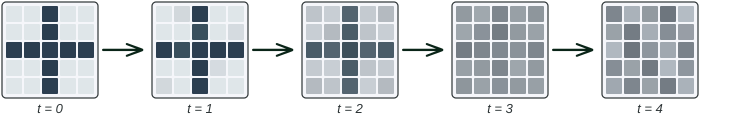

# Lecture 21: Diffusion models for text
### PSYC 51.17: Models of language and communication

Jeremy R. Manning
Dartmouth College
Winter 2026

---

# Learning objectives

<div class="note-box" data-title="By the end of this lecture, you will be able to...">

1. Explain how **diffusion models** generate content by iteratively refining noise into signal
2. Describe the **forward** and **reverse** processes in continuous diffusion (foundation for Lectures 22–23)
3. Explain how **discrete diffusion** adapts the framework for text by replacing Gaussian noise with **masking**
4. Compare **autoregressive** and **diffusion-based** text generation and articulate their tradeoffs
5. Build intuition for why iterative refinement is a powerful paradigm for language generation

</div>

---

# Announcements

<div class="important-box" data-title="Assignment 4 due today!">

**Assignment 4** (Customer Service Chatbot) is due **today at 11:59 PM EST**.

</div>

<div class="note-box" data-title="Final project and optional assignment">

- **Final Project** has been released! Due **March 9, 11:59 PM EST**
- **Assignment 5** (Build GPT) is now available as **optional extra credit**

</div>

---
<!-- _class: scale-90 -->

# Final project

<div class="important-box" data-title="Your LLM Research Capstone">

Work in **teams of 2-3(ish)** to build an ambitious, open-ended project over **Weeks 7-10**. Explore novel applications, replicate and extend published research, build innovative systems, or evaluate LLM capabilities.

</div>

<div class="note-box" data-title="Timeline">

- **Weeks 7–8**: Form teams and brainstorm ideas
- **Week 9**: Core development and experiments
- **Week 10**: Final submission + in-class presentations (**March 9, 11:59 PM EST**)

</div>

<div class="tip-box" data-title="Get started">

- Full instructions: [Final Project](https://contextlab.github.io/llm-course/assignments/final-project/)
- Accept the assignment: [GitHub Classroom](https://classroom.github.com/a/IFw74DY7)
- 20+ project ideas on the assignment page to inspire you!

</div>

---

# Why diffusion models?

<div class="definition-box" data-title="A different approach to generation">

Every language model we've studied so far — from ELIZA to GPT — generates text **one token at a time**, left to right. Diffusion models take a fundamentally different approach: start with **pure noise** and iteratively refine it into a coherent output, generating **all positions simultaneously**.

</div>

<div class="tip-box" data-title="The core analogy">

Imagine writing an essay by first typing random letters into every position, then making many editing passes — each pass fixing more of the text until a polished essay emerges. That's diffusion. It sounds absurd, but it works remarkably well — and for some tasks, it's **better** than left-to-right generation.

</div>

---

# Two paradigms for generation

<div class="note-box" data-title="Autoregressive vs diffusion">

| | Autoregressive (GPT) | Diffusion |
|---|---|---|
| **Generation order** | Left to right, one token at a time | All positions at once, refined iteratively |
| **Analogy** | Speaking a sentence word by word | Editing a rough draft into a polished one |
| **Key strength** | Simple, proven at scale | Bidirectional context, flexible editing |
| **Key weakness** | Can't "go back" — early errors propagate | Requires many refinement steps |

</div>

<div class="important-box" data-title="Why this matters for language">

When you write, you don't commit to each word in sequence. You draft, revise, restructure. Diffusion models formalize this **iterative refinement** process — and recent results show they can match autoregressive models at the scale of billions of parameters ([LLaDA; Nie et al., 2025](https://arxiv.org/abs/2502.09992)).

</div>

---

# The diffusion framework: big picture

<div class="definition-box" data-title="Two processes, one framework">

Every diffusion model has two processes:

1. **Forward process** (corruption): Gradually destroy information in the data until nothing remains but noise
2. **Reverse process** (generation): Learn to undo the corruption, step by step, recovering the original data from noise

The key insight from [Sohl-Dickstein et al. (2015)](https://arxiv.org/abs/1503.03585): if each corruption step is **small enough**, then each reversal step can be learned by a neural network.

</div>

```flow
[Clean data:green] --> [Slightly noisy] --> [Noisier] --> [...] --> [Pure noise:red]
```

```flow
[Pure noise:red] --> [Slightly cleaner] --> [Cleaner] --> [...] --> [Generated output:green]
```

---
<!-- _class: scale-90 -->

# Diffusion was born in image space

<div class="note-box" data-title="The visual origin">

Diffusion models were originally developed for **image generation** ([Sohl-Dickstein et al., 2015](https://arxiv.org/abs/1503.03585); [Ho et al., 2020](https://arxiv.org/abs/2006.11239)). The idea is intuitive with images: start with a clean picture and gradually corrupt it by adding random noise until the image is unrecognizable. Then train a neural network to reverse the process.

</div>



<div class="tip-box" data-title="From images to text">

This visual intuition made diffusion wildly successful for image generation (DALL-E, Stable Diffusion, Midjourney — covered in Lectures 22–23). But how do we extend this to **text**, where "adding a little noise to a word" is meaningless? We'll answer this after establishing the mathematical framework.

</div>

---

# Continuous diffusion: the foundation

<div class="definition-box" data-title="Adding Gaussian noise (Ho et al., 2020)">

For continuous data (images, audio, embeddings), the forward process adds Gaussian noise at each timestep $t = 1, \ldots, T$:

$$\mathbf{x}_t \sim \mathcal{N}\!\left(\sqrt{1 - \beta_t}\;\mathbf{x}_{t-1},\;\; \beta_t\,\mathbf{I}\right)$$

where $\beta_t$ is a small noise amount at step $t$. After $T \approx 1000$ steps, the original signal is completely destroyed — $\mathbf{x}_T$ is indistinguishable from pure Gaussian noise.

</div>

<div class="note-box" data-title="Closed-form shortcut">

We can jump directly to any timestep. Define $\bar\alpha_t = \prod_{s=1}^{t}(1 - \beta_s)$:

$$\mathbf{x}_t = \sqrt{\bar\alpha_t}\;\mathbf{x}_0 + \sqrt{1 - \bar\alpha_t}\;\boldsymbol{\epsilon}, \quad \boldsymbol{\epsilon} \sim \mathcal{N}(\mathbf{0}, \mathbf{I})$$

This is essential for efficient training — no need to iterate through all $t$ steps.

</div>

---

# Continuous diffusion: learning to reverse

<div class="definition-box" data-title="The DDPM training objective">

A neural network $\boldsymbol{\epsilon}_\theta(\mathbf{x}_t, t)$ is trained to **predict the noise** that was added at each step. The loss is simply mean squared error ([Ho et al., 2020](https://arxiv.org/abs/2006.11239)):

$$\mathcal{L} = \mathbb{E}_{t,\,\mathbf{x}_0,\,\boldsymbol{\epsilon}}\!\left[\left\|\boldsymbol{\epsilon} - \boldsymbol{\epsilon}_\theta(\mathbf{x}_t, t)\right\|^2\right]$$

To generate, start from pure noise $\mathbf{x}_T \sim \mathcal{N}(\mathbf{0}, \mathbf{I})$ and iteratively subtract the predicted noise, step by step, until clean data $\mathbf{x}_0$ emerges.

</div>

<div class="tip-box" data-title="Why we're covering this...">

Lectures 22 and 23 build on this continuous framework (latent diffusion, classifier-free guidance, DiT, Stable Diffusion, Sora). Understanding Gaussian diffusion provides the conceptual foundation — but **text is not continuous**. Tokens are discrete symbols. So how do we adapt diffusion for language?

</div>

---
<!-- _class: scale-95 -->

# The problem with text

<div class="warning-box" data-title="Tokens aren't pixels">

Adding Gaussian noise to a sentence doesn't work:

- Pixel values are continuous numbers (0–255) — small perturbations are meaningful
- Token IDs are discrete symbols — "adding 0.1 to the token 'cat'" is meaningless
- There's no natural metric space where "cat" is close to "car" but far from "democracy"

</div>

<div class="definition-box" data-title="Two solutions emerged">

1. **Continuous embedding approach** ([Diffusion-LM; Li et al., 2022](https://arxiv.org/abs/2205.14217)): Map tokens to continuous embeddings, run Gaussian diffusion there, then round back to tokens
2. **Discrete diffusion** ([D3PM; Austin et al., 2021](https://arxiv.org/abs/2107.03006)): Replace Gaussian noise with **discrete corruption** — randomly changing tokens to other tokens or to `[MASK]`

The discrete approach turns out to be simpler, more effective, and connects beautifully to something you already know.

</div>

---
<!-- _class: scale-90 -->

# Discrete diffusion: replacing noise with masking

<div class="definition-box" data-title="The absorbing state forward process">

Instead of adding Gaussian noise, the forward process **randomly masks tokens**:

- At each step, each unmasked token has a small probability of being replaced with `[MASK]`
- As $t$ increases, more tokens become masked
- At $t = T$: **every token is masked** — the sequence is pure noise (all `[MASK]`)
- At $t = 0$: the original clean text

</div>

```flow
[The cat sat on the mat:green] --> [The _ sat on _ mat] --> [_ _ sat _ _ mat] --> [_ _ _ _ _ _:red]
```

<div class="tip-box" data-title="Why 'absorbing state'?">

Once a token becomes `[MASK]`, it stays masked. The `[MASK]` state **absorbs** tokens — they can't escape. This is the simplest discrete corruption: there's only one type of noise, and...you've seen it before!

</div>

---

# Does this remind you of anything?

<div class="note-box" data-title="BERT is (almost) a diffusion model!">

Recall from Lecture 18: BERT trains by masking 15% of tokens and predicting the originals. Discrete diffusion does the **same thing** — but with a key generalization:

| | BERT (Lecture 18) | Discrete diffusion |
|---|---|---|
| Mask rate | Select 15%, then 80/10/10 | Varies from 0% to 100% over a schedule |
| Prediction | One-shot: predict all masks at once | Iterative: unmask a few tokens at a time |
| Training | Single forward pass per example | Sample random mask rate $t$, predict masked tokens |
| Generation | Not designed for generation | Built for generation: start at 100% masked, iteratively unmask |

</div>

<div class="tip-box" data-title="The insight">

Discrete diffusion **generalizes** masked language modeling into a generation framework. BERT is a special case — a single-step diffusion model at a fixed noise level.

</div>

---
<!-- _class: scale-75 -->

# MDLM: masked diffusion language models

<div class="note-box" data-title="Sahoo et al. (2024, NeurIPS)">

[MDLM](https://arxiv.org/abs/2406.07524) formalizes the connection between masked language modeling and diffusion. The key ingredients:

1. **Forward process**: A continuous-time masking schedule $\gamma(t)$ that specifies the probability a token is masked at time $t \in [0, 1]$. At $t = 0$, nothing is masked; at $t = 1$, everything is.
2. **Reverse process**: A transformer predicts the identity of each masked token, conditioned on all visible tokens and the current noise level $t$.
3. **Training**: Sample a random time $t$, mask tokens according to $\gamma(t)$, and train the model to predict the masked tokens — exactly like BERT, but at every mask rate.

</div>

<div class="definition-box" data-title="Rao-Blackwellization">

[Rao-Blackwellization](https://en.wikipedia.org/wiki/Rao%E2%80%93Blackwell_theorem) is a statistical technique: when estimating something, if you can **compute part of the answer exactly** instead of approximating it, your overall estimate becomes more precise. In diffusion training, this means replacing some approximation steps with exact calculations — leading to less noisy gradients and faster learning.

</div>

<div class="tip-box" data-title="Why MDLM works so well">

MDLM uses a **Rao-Blackwellized** training objective that reduces variance compared to naïve discrete diffusion. In practice, this means the model trains efficiently with the same architecture as BERT — no special modifications needed. On text benchmarks, MDLM matches autoregressive models of the same size.

</div>

---
<!-- _class: scale-90 -->

# How text diffusion generates

<div class="definition-box" data-title="The reverse process: iterative unmasking">

To generate text with MDLM, we reverse the masking:

1. Start with a sequence of all `[MASK]` tokens (length $N$)
2. At each step, the model predicts a probability distribution over the vocabulary for each masked position
3. **Unmask** a subset of positions by sampling from these distributions
4. Repeat until all positions are unmasked

</div>

```flow
[_ _ _ _ _ _:red] --> [_ cat _ _ _ _] --> [_ cat _ on _ mat] --> [The cat sat on the mat:green]
```

<div class="important-box" data-title="Bidirectional context at every step">

Unlike GPT, which can only see tokens to the **left**, the diffusion model sees **all unmasked tokens** when predicting each mask — regardless of position. This means the model can use "mat" to help predict "cat" and vice versa. The generation order is not fixed — the model decides what to fill in first.

</div>

---
<!-- _class: scale-90 -->

# What does the model learn to do first?

<div class="note-box" data-title="Emergence of generation order">

When generating text via iterative unmasking, models don't unmask uniformly. They develop preferences:

- **High-confidence tokens first**: Function words ("the", "is", "of") and predictable tokens tend to be unmasked early
- **Content words later**: Nouns, verbs, and less predictable tokens come after the "scaffolding" is in place
- **Context-dependent tokens last**: Words that depend heavily on surrounding context wait until that context is available

</div>

<div class="tip-box" data-title="A linguistic insight">

This mirrors how humans plan sentences — we often have the **gist** (content words) and **structure** (function words) before the exact phrasing. Diffusion models discover a similar strategy: build the scaffolding first, then fill in the details. This is fundamentally different from GPT's strict left-to-right constraint.

</div>

---

# D3PM: the general framework

<div class="definition-box" data-title="Austin et al. (2021, NeurIPS)">

[D3PM (Discrete Denoising Diffusion Probabilistic Models)](https://arxiv.org/abs/2107.03006) provides the theoretical foundation for all discrete diffusion. Instead of Gaussian noise, D3PM uses **transition matrices** $\mathbf{Q}_t$ that define how tokens corrupt at each step:

$$q(\mathbf{x}_t \mid \mathbf{x}_{t-1}) = \text{Cat}(\mathbf{x}_t;\; \mathbf{x}_{t-1} \mathbf{Q}_t)$$

where $\text{Cat}$ is the categorical distribution and $\mathbf{Q}_t$ specifies the probability of each token transitioning to any other token.

</div>

<div class="note-box" data-title="Three types of discrete noise">

| Noise type | How it works | Intuition |
|-----------|-------------|-----------|
| **Uniform** | Any token → any random token | Like replacing letters with random ones |
| **Absorbing** | Any token → `[MASK]` only | Like erasing letters one by one |
| **Token similarity** | Token → similar token | Like introducing typos |

MDLM uses **absorbing** noise because it's the simplest and most effective for text.

</div>

---
<!-- _class: scale-90 -->

# Scaling up: LLaDA

<div class="definition-box" data-title="Nie et al. (2025): Large Language Diffusion with Assistant">

[LLaDA](https://arxiv.org/abs/2502.09992) asks: can discrete diffusion compete with autoregressive models **at scale**? They trained an 8 billion parameter masked diffusion model on 2.3 trillion tokens and found:

- On [**MMLU**](https://arxiv.org/abs/2009.03300), LLaDA-8B (66.6) matches LLaMA 3-8B (66.2)
- On [**GSM8K**](https://arxiv.org/abs/2110.14168) (math reasoning), LLaDA-8B (74.0) substantially outperforms LLaMA 3-8B (52.8)
- LLaDA handles instruction following, reasoning, and long-form generation
- It naturally solves the **reversal curse** — since it doesn't generate left-to-right, it can answer "Who is A's mother?" even when trained on "B is the mother of A"

</div>

<div class="important-box" data-title="Why this matters">

For years, the assumption was that autoregressive generation was the only way to build competitive language models. LLaDA disproves this. Diffusion-based LLMs are a viable alternative paradigm — not just a research curiosity, but a practical one at the 8B parameter scale.

</div>

---
<!-- _class: scale-80 -->

# The Diffusion-LM approach: embeddings as a bridge

<div class="definition-box" data-title="Li et al. (2022, NeurIPS)">

Before discrete diffusion matured, [Diffusion-LM](https://arxiv.org/abs/2205.14217) tried a different approach: run Gaussian diffusion in **continuous embedding space**:

1. Map each token to its embedding vector (e.g., 768-dim)
2. Run standard Gaussian diffusion on these embeddings
3. At generation time, round each denoised embedding back to the **nearest vocabulary token**

</div>

<div class="note-box" data-title="Tradeoffs">

| | Diffusion-LM (continuous) | MDLM / D3PM (discrete) |
|---|---|---|
| Noise type | Gaussian in embedding space | Masking or token swaps |
| Rounding step | Required (introduces errors) | Not needed |
| Controllability | Excellent — gradient-based guidance | Good — conditional masking |
| Scalability | Limited by rounding artifacts | Scales to 8B+ parameters |

Discrete methods have won out for pure text generation, but continuous approaches remain valuable for **controllable generation** — e.g., guiding text toward specific sentiment, topics, or structural constraints.

</div>

---
<!-- _class: scale-90 -->

# Intuition: why does iterative refinement work?

<div class="definition-box" data-title="Three intuitions for text diffusion">

**1. The editing analogy**: A first draft with blanks is easier to improve than starting from scratch. Each unmasking step gives the model more context, making the remaining predictions easier.

**2. The jigsaw puzzle analogy**: In a jigsaw puzzle, each piece you place constrains where other pieces go. Similarly, each unmasked token constrains the remaining tokens — the problem gets easier as you go.

**3. The ensemble effect**: At each step, the model makes predictions using **bidirectional context** from all visible tokens. Early steps leverage global structure; later steps leverage local details. This multi-scale reasoning is hard for autoregressive models.

</div>

<div class="tip-box" data-title="The deep insight">

Diffusion works because it **factorizes a hard problem** (generating a full sequence from nothing) into a sequence of **easier problems** (predicting a few tokens given most of the context). Each step is essentially a fill-in-the-blank task — something neural networks are very good at.

</div>

---

# Practical advantages of text diffusion

<div class="note-box" data-title="What diffusion can do that autoregressive models can't (easily)">

| Capability | Autoregressive | Text diffusion |
|-----------|---------------|----------------|
| **Infilling**: Fill in a gap mid-sentence | Requires special fine-tuning | Native — just mask the gap |
| **Iterative editing**: Refine parts of generated text | Must regenerate from the edit point | Re-mask and re-denoise locally |
| **Length control**: Generate exactly $N$ tokens | Hard — models tend to over/under-generate | Natural — initialize $N$ masks |
| **Parallel decoding**: Generate multiple tokens simultaneously | Sequential by definition | Unmask multiple positions per step |
| **Bidirectional coherence**: Ensure beginning matches end | Can't look ahead | Sees all unmasked positions |

</div>

<div class="important-box" data-title="The tradeoff">

Text diffusion typically requires 10–100 refinement steps, each involving a full forward pass. Autoregressive generation requires $N$ steps (one per token) but each step is faster. For short sequences, autoregressive wins on speed. For tasks requiring bidirectional coherence or editing, diffusion wins on quality.

</div>

---
<!-- _class: scale-70 -->

# Current limitations

<div class="warning-box" data-title="Where text diffusion still falls short">

1. **Long-range coherence**: Autoregressive models maintain a running context that naturally ensures consistency. Diffusion models must learn long-range dependencies through the iterative process, which can fail for very long documents.

2. **Sampling speed**: Even with optimized schedules, generating text with diffusion is slower than autoregressive generation with KV-caching for most practical sequence lengths.

3. **Ecosystem maturity**: Autoregressive models have years of tooling — RLHF, DPO, KV-caching, speculative decoding. Diffusion-based LLMs are catching up but lack this infrastructure.

4. **Evaluation**: Perplexity (the standard LM metric) doesn't directly apply to diffusion models, making fair comparison difficult.

</div>

<div class="definition-box" data-title="Definitions">

- **RLHF** (Lecture 16): Reinforcement Learning from Human Feedback — humans rank model outputs, and the model is trained to prefer higher-ranked responses
- **DPO** (Direct Preference Optimization): A simpler alternative to RLHF that skips the reward model and directly optimizes the language model on human preference pairs
- **KV-caching**: During autoregressive generation, previously computed key/value vectors are stored and reused so each new token only requires one forward pass through the new position — not the entire sequence

</div>

---
<!-- _class: scale-85 -->

# Take-home messages

<div class="note-box" data-title="Think about it...">

- BERT's masked prediction training (Lecture 18) — which seemed like just a pretraining trick — turns out to be the **foundation of an entire generation paradigm**.
- The idea of **iterative refinement** from noise is a powerful principle that extends beyond text to images, audio, and video.
- Because the same diffusion framework applies to both **continuous** data (images, audio, video) and **discrete** data (text), it provides a natural foundation for **multimodal models** that generate across modalities — as we'll see in Lectures 22–23.

</div>

---
<!-- _class: scale-85 -->

# Further reading

<div class="note-box" data-title="Further reading">

[**Sohl-Dickstein et al. (2015, *ICML*)**](https://arxiv.org/abs/1503.03585) "Deep Unsupervised Learning using Nonequilibrium Thermodynamics" — The original diffusion model paper, grounded in statistical physics.

[**Ho, Jain & Abbeel (2020, *NeurIPS*)**](https://arxiv.org/abs/2006.11239) "Denoising Diffusion Probabilistic Models" — Made diffusion practical with the simplified noise-prediction objective.

[**Austin et al. (2021, *NeurIPS*)**](https://arxiv.org/abs/2107.03006) "Structured Denoising Diffusion Models in Discrete State-Spaces" — D3PM: the theoretical foundation for all discrete diffusion.

[**Li et al. (2022, *NeurIPS*)**](https://arxiv.org/abs/2205.14217) "Diffusion-LM Improves Controllable Text Generation" — Continuous embedding approach to text diffusion with gradient-based control.

[**Lou et al. (2024, *ICML*)**](https://arxiv.org/abs/2310.16834) "Discrete Diffusion Modeling by Estimating the Ratios of the Data Distribution" — SEDD: score matching for discrete spaces (Best Paper).

[**Sahoo et al. (2024, *NeurIPS*)**](https://arxiv.org/abs/2406.07524) "Simple and Effective Masked Diffusion Language Models" — MDLM: connecting BERT-style masking to diffusion.

[**Nie et al. (2025, *arXiv*)**](https://arxiv.org/abs/2502.09992) "Large Language Diffusion Models" — LLaDA: 8B-parameter diffusion LLM competitive with LLaMA 3.

</div>

---

# Questions?

<div class="emoji-figure">
  <div class="emoji-col">
    <span class="emoji emoji-xl emoji-bg emoji-bg-navy">&#x1F4E7;</span>
    <span class="label"><a href="mailto:jeremy@dartmouth.edu">Email</a></span>
  </div>
  <div class="emoji-col">
    <span class="emoji emoji-xl emoji-bg emoji-bg-purple">&#x1F4AC;</span>
    <span class="label"><a href="https://discord.gg/sftEk9Ygdw">Discord</a></span>
  </div>
  <div class="emoji-col">
    <span class="emoji emoji-xl emoji-bg emoji-bg-green">&#x1F481;</span>
    <span class="label"><a href="https://context-lab.youcanbook.me">Office hours</a></span>
  </div>
</div>

<div class="tip-box" data-title="Up next...">

Diffusion model extensions: latent diffusion, classifier-free guidance, and the Diffusion Transformer

</div>
