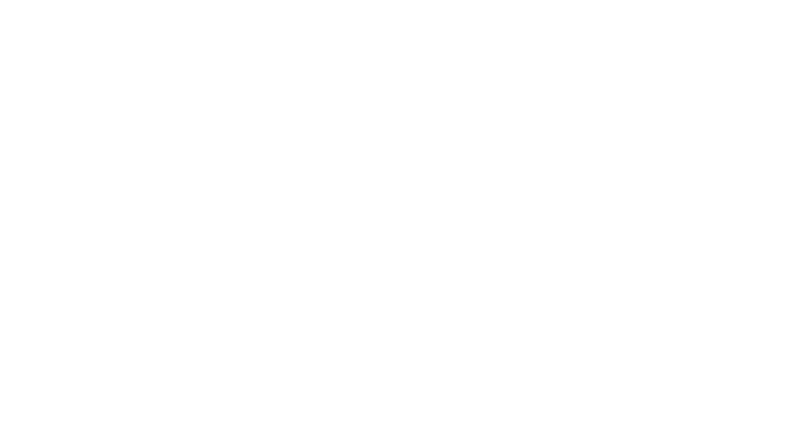

# Lecture 21: Diffusion models
### PSYC 51.17: Models of language and communication

Jeremy R. Manning
Dartmouth College
Winter 2026

---

# Learning objectives

1. Explain the **forward diffusion process** and how it progressively destroys information
2. Derive why the **reverse process** requires a learned neural network
3. Describe the **U-Net architecture** for noise prediction with timestep conditioning
4. Understand the **simplified DDPM training objective** and why it works
5. Compare **DDPM** and **DDIM** sampling strategies and their tradeoffs

---

# Announcements

**Assignment 4** (Customer Service Chatbot) is due **February 16, 11:59 PM EST**.

- **Final Project** has been released! Due **March 9, 11:59 PM EST**
- **Assignment 5** (Build GPT) is now available as **optional extra credit**

---

# Why diffusion models?

So far in this course, we have focused on **autoregressive** models — transformers that generate one token at a time, left to right. Diffusion models take a fundamentally different approach: they generate **everything at once** through iterative refinement.

What if instead of building an output one piece at a time, we started with **pure noise** and gradually refined it into something meaningful? This is the intuition behind diffusion models — and it has produced some of the most stunning generative AI results to date (DALL-E, Stable Diffusion, Sora).

---

# The thermodynamic inspiration

Diffusion models are inspired by **non-equilibrium thermodynamics**. Imagine dropping a drop of ink into water:
- **Forward process**: The ink disperses until the water is uniformly colored (order → disorder)
- **Reverse process**: If we could reverse time, the uniform color would reconcentrate into the original drop

The key insight from [Sohl-Dickstein et al. (2015)](https://arxiv.org/abs/1503.03585): if the forward process is simple enough (small Gaussian noise at each step), then the reverse process is **also approximately Gaussian** — and we can learn it with a neural network.

---

# The forward diffusion process

Given a clean data sample $\mathbf{x}_0$, the forward process adds a small amount of Gaussian noise at each timestep $t = 1, 2, \ldots, T$:

$$q(\mathbf{x}_t \mid \mathbf{x}_{t-1}) = \mathcal{N}(\mathbf{x}_t;\; \sqrt{1 - \beta_t}\,\mathbf{x}_{t-1},\; \beta_t \mathbf{I})$$

where $\beta_t$ is a small positive constant (the **noise schedule**) that controls how much noise is added at each step.

At each step, we slightly shrink the signal ($\sqrt{1 - \beta_t}$) and add a small amount of noise ($\beta_t$). After enough steps ($T \approx 1000$), the original data is completely destroyed — $\mathbf{x}_T$ is indistinguishable from pure Gaussian noise.

---

# The forward process

---

# Noise schedules

The noise schedule $\{\beta_1, \beta_2, \ldots, \beta_T\}$ controls the rate of information destruction:

- **Linear schedule** ([Ho et al., 2020](https://arxiv.org/abs/2006.11239)): $\beta_t$ increases linearly from $\beta_1 = 10^{-4}$ to $\beta_T = 0.02$
- **Cosine schedule** ([Nichol & Dhariwal, 2021](https://arxiv.org/abs/2102.09672)): Designed so that $\bar\alpha_t$ follows a cosine curve, preserving more signal at early timesteps

A linear schedule destroys too much information too quickly in the early steps. The cosine schedule preserves fine details longer, leading to better sample quality — especially for high-resolution images.

---

# Noise schedules

---

# The closed-form shortcut

We don't need to apply noise one step at a time. Define $\alpha_t = 1 - \beta_t$ and $\bar\alpha_t = \prod_{s=1}^{t} \alpha_s$. Then we can jump directly from $\mathbf{x}_0$ to any $\mathbf{x}_t$:

$$q(\mathbf{x}_t \mid \mathbf{x}_0) = \mathcal{N}(\mathbf{x}_t;\; \sqrt{\bar\alpha_t}\,\mathbf{x}_0,\; (1 - \bar\alpha_t)\mathbf{I})$$

In practice, we sample $\mathbf{x}_t$ using:

$$\mathbf{x}_t = \sqrt{\bar\alpha_t}\,\mathbf{x}_0 + \sqrt{1 - \bar\alpha_t}\,\boldsymbol{\epsilon}, \quad \boldsymbol{\epsilon} \sim \mathcal{N}(\mathbf{0}, \mathbf{I})$$

This is essential for training — we can generate any noisy version of $\mathbf{x}_0$ in a single step, without iterating through all $t$ steps.

---

# The reverse process

The reverse process starts from noise $\mathbf{x}_T \sim \mathcal{N}(\mathbf{0}, \mathbf{I})$ and gradually removes noise to recover $\mathbf{x}_0$:

$$p_\theta(\mathbf{x}_{t-1} \mid \mathbf{x}_t) = \mathcal{N}(\mathbf{x}_{t-1};\; \boldsymbol{\mu}_\theta(\mathbf{x}_t, t),\; \sigma_t^2 \mathbf{I})$$

The mean $\boldsymbol{\mu}_\theta$ is parameterized by a neural network that takes the noisy input $\mathbf{x}_t$ and the timestep $t$, and predicts how to denoise it.

While the forward process has a known, fixed form (just add Gaussian noise), the reverse process requires knowing $q(\mathbf{x}_{t-1} \mid \mathbf{x}_t)$ — which depends on the **entire data distribution**. Since we don't know this distribution analytically, we approximate it with a learned model $p_\theta$.

---

# The reverse process

---

# U-Net: the noise prediction network

The neural network $\boldsymbol{\epsilon}_\theta(\mathbf{x}_t, t)$ that predicts noise uses a **U-Net** architecture ([Ronneberger et al., 2015](https://arxiv.org/abs/1505.04597)):

- **Encoder** (downsampling path): Progressively compresses the spatial dimensions while increasing channels
- **Bottleneck**: Processes the most compressed representation
- **Decoder** (upsampling path): Progressively restores spatial resolution
- **Skip connections**: Direct connections from encoder to decoder at each resolution level, preserving fine-grained details

The U-shape is ideal for denoising because it captures both **global structure** (via the bottleneck) and **local details** (via skip connections). The network needs both to effectively remove noise while preserving meaningful content.

---

# U-Net architecture

---

# Timestep conditioning

The same U-Net must denoise at *every* timestep — from nearly clean ($t = 1$) to pure noise ($t = T$). It needs to know which timestep it's working at. The timestep $t$ is converted to a vector using **sinusoidal embeddings** (the same idea as positional embeddings in transformers, Lecture 15):

$$\text{emb}(t) = [\sin(t / 10000^{0/d}),\; \cos(t / 10000^{0/d}),\; \sin(t / 10000^{2/d}),\; \cos(t / 10000^{2/d}),\; \ldots]$$

This embedding is then added to or concatenated with the intermediate features inside the U-Net.

---

# Timestep embedding

---
<!-- _class: scale-90 -->

# The training objective

Instead of predicting $\mathbf{x}_0$ or $\boldsymbol{\mu}_\theta$ directly, [Ho et al. (2020)](https://arxiv.org/abs/2006.11239) found it more effective to train the network to predict **the noise that was added**:

1. Sample a clean image $\mathbf{x}_0$ from the training data
2. Sample a random timestep $t \sim \text{Uniform}(1, T)$
3. Sample noise $\boldsymbol{\epsilon} \sim \mathcal{N}(\mathbf{0}, \mathbf{I})$
4. Create the noisy version: $\mathbf{x}_t = \sqrt{\bar\alpha_t}\,\mathbf{x}_0 + \sqrt{1 - \bar\alpha_t}\,\boldsymbol{\epsilon}$
5. Train the network to predict $\boldsymbol{\epsilon}$ from $\mathbf{x}_t$ and $t$

The network doesn't learn to generate images — it learns to **identify and remove noise**. Generation happens by applying this denoising repeatedly, starting from pure noise.

---

# The training loop

---

# The simplified loss

The full variational lower bound (ELBO) for diffusion models involves a sum of KL divergences across all timesteps. [Ho et al. (2020)](https://arxiv.org/abs/2006.11239) showed that a much simpler loss works just as well:

$$\mathcal{L}_{\text{simple}} = \mathbb{E}_{t,\, \mathbf{x}_0,\, \boldsymbol{\epsilon}} \left[ \left\| \boldsymbol{\epsilon} - \boldsymbol{\epsilon}_\theta(\mathbf{x}_t, t) \right\|^2 \right]$$

This is just **mean squared error** between the true noise $\boldsymbol{\epsilon}$ and the predicted noise $\boldsymbol{\epsilon}_\theta(\mathbf{x}_t, t)$.

Dropping the weighting terms from the full ELBO loss actually *improves* sample quality. The uniform weighting across timesteps forces the network to denoise well at every noise level, rather than focusing on easy (low-noise) timesteps.

---

# The simplified loss

---

# Score matching perspective

An alternative view comes from **score matching** ([Song & Ermon, 2019](https://arxiv.org/abs/1907.05600)). The **score function** is the gradient of the log probability density:

$$\mathbf{s}(\mathbf{x}) = \nabla_{\mathbf{x}} \log p(\mathbf{x})$$

This vector field points "uphill" toward regions of high probability. If we know the score function, we can generate samples by starting from noise and following the gradient.

It turns out that predicting noise $\boldsymbol{\epsilon}$ is equivalent to estimating the score function: $\boldsymbol{\epsilon}_\theta(\mathbf{x}_t, t) \approx -\sqrt{1 - \bar\alpha_t}\;\nabla_{\mathbf{x}_t} \log q(\mathbf{x}_t)$. The DDPM and score matching perspectives are mathematically unified by [Song et al. (2021)](https://arxiv.org/abs/2011.13456).

---

# Score matching

---
<!-- _class: scale-90 -->

# DDPM sampling algorithm

To generate a new sample, we run the learned reverse process:

1. Sample $\mathbf{x}_T \sim \mathcal{N}(\mathbf{0}, \mathbf{I})$
2. For $t = T, T-1, \ldots, 1$:
   - Predict noise: $\hat{\boldsymbol{\epsilon}} = \boldsymbol{\epsilon}_\theta(\mathbf{x}_t, t)$
   - Compute: $\mathbf{x}_{t-1} = \frac{1}{\sqrt{\alpha_t}} \left( \mathbf{x}_t - \frac{\beta_t}{\sqrt{1 - \bar\alpha_t}}\,\hat{\boldsymbol{\epsilon}} \right) + \sigma_t \mathbf{z}$
   - where $\mathbf{z} \sim \mathcal{N}(\mathbf{0}, \mathbf{I})$ for $t > 1$, else $\mathbf{z} = \mathbf{0}$
3. Return $\mathbf{x}_0$

This requires **1000 forward passes** through the neural network (one per timestep). At ~100ms per pass on a GPU, that's ~100 seconds per image. This motivates faster sampling methods like DDIM.

---

# The sampling process

---

# DDIM: faster sampling

[DDIM](https://arxiv.org/abs/2010.02502) makes sampling **deterministic** and allows **skipping steps**:

- Instead of 1000 steps, use a subsequence (e.g., 50 evenly spaced steps)
- The update rule becomes deterministic (no random noise $\mathbf{z}$)
- Same trained model — just a different sampling procedure

| Property | DDPM | DDIM |
|----------|------|------|
| Steps needed | ~1000 | ~20–50 |
| Stochastic? | Yes (random noise added) | No (deterministic) |
| Sample quality | Excellent | Slightly lower |
| Speed | ~100 seconds | ~2–5 seconds |
| Same model? | Yes | **Yes** — no retraining needed |

---

# Diffusion vs autoregressive generation

| | Autoregressive (Transformer) | Diffusion |
|---|---|---|
| Generation order | Left to right, one token at a time | All positions simultaneously, refining iteratively |
| Native domain | Discrete sequences (text) | Continuous signals (images, audio) |
| Steps to generate | $N$ (sequence length) | $T$ (denoising steps, typically 20–1000) |
| Key operation | Next-token prediction | Noise prediction |
| Training signal | Cross-entropy loss | MSE loss (noise prediction) |

Autoregressive models excel at **sequential, discrete** data (language). Diffusion models excel at **continuous, spatial** data (images, video, audio). As we'll see in Lecture 23, combining them yields the most powerful generative systems.

---

# Diffusion vs autoregressive generation

---

# Discussion

1. **Iterative refinement**: Humans often create by revising drafts — a rough sketch becomes a polished drawing. Is diffusion's iterative denoising a better model of human creativity than autoregressive generation?

2. **The noise perspective**: Diffusion models learn by predicting noise. Transformers learn by predicting the next token. Are these fundamentally different, or two views of the same underlying process?

3. **Information destruction**: The forward process deliberately destroys all information. Why does this make the reverse process *easier* to learn, rather than harder?

4. **Computational cost**: DDPM requires ~1000 neural network evaluations per sample. Is there a theoretical lower bound on how many steps are needed, or will we eventually generate in a single step?

---
<!-- _class: scale-85 -->

# Further reading

[**Ho, Jain & Abbeel (2020, *NeurIPS*)**](https://arxiv.org/abs/2006.11239) "Denoising Diffusion Probabilistic Models" — The paper that made diffusion models practical. Clean formulation, excellent results.

[**Sohl-Dickstein et al. (2015, *ICML*)**](https://arxiv.org/abs/1503.03585) "Deep Unsupervised Learning using Nonequilibrium Thermodynamics" — The original diffusion model paper, grounded in statistical physics.

[**Song & Ermon (2019, *NeurIPS*)**](https://arxiv.org/abs/1907.05600) "Generative Modeling by Estimating Gradients of the Data Distribution" — Score matching perspective on diffusion.

[**Nichol & Dhariwal (2021, *ICML*)**](https://arxiv.org/abs/2102.09672) "Improved Denoising Diffusion Probabilistic Models" — Cosine schedule, learned variance, improved sampling.

[**Song et al. (2021, *ICLR*)**](https://arxiv.org/abs/2010.02502) "Denoising Diffusion Implicit Models" — DDIM: deterministic, fast sampling from the same trained model.

---

# Questions?

  

    &#x1F4E7;
    <a href="mailto:jeremy@dartmouth.edu">Email</a>
  

  

    &#x1F4AC;
    <a href="https://discord.gg/sftEk9Ygdw">Discord</a>
  

  

    &#x1F481;
    <a href="https://context-lab.youcanbook.me">Office hours</a>
  

Diffusion model extensions: latent diffusion, classifier-free guidance, and the Diffusion Transformer

