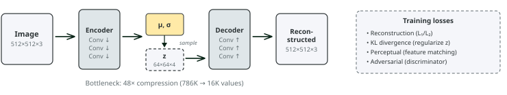
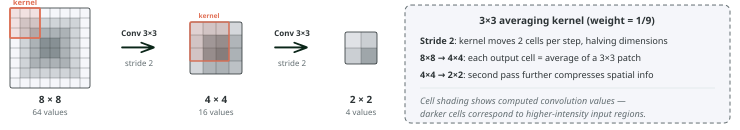
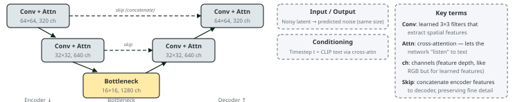

# Lecture 22: Image diffusion and multimodal generation
### PSYC 51.17: Models of language and communication

Jeremy R. Manning
Dartmouth College
Winter 2026

---

# Learning objectives

<div class="note-box" data-title="By the end of this lecture, you will be able to...">

1. Explain how **latent diffusion** compresses computation via a VAE to enable high-resolution image generation
2. Describe how **CLIP** creates a shared embedding space for text and images
3. Explain how **cross-attention** and **classifier-free guidance** enable text-controlled image generation
4. Compare the **U-Net** and **Transformer (DiT)** backbones for diffusion models
5. Generate images from text prompts using the HuggingFace `diffusers` library

</div>

---

# From text to images

<div class="definition-box" data-title="Bridging Lecture 21 and today">

In Lecture 21, we saw how diffusion models generate **text** by iteratively unmasking tokens (discrete diffusion). Today we turn to the domain where diffusion was born — **images** — and ask: how do we generate high-resolution images from text prompts?

</div>

<div class="note-box" data-title="The key challenges">

| Challenge | Solution (this lecture) |
|-----------|----------------------|
| Images are huge (786K+ values) | **Latent diffusion** — compress first, diffuse in latent space |
| Text must control generation | **CLIP** + **cross-attention** — bind words to spatial regions |
| Output must match the prompt | **Classifier-free guidance** — amplify text alignment |
| Architecture must scale | **U-Net** or **DiT** — backbones for the denoising network |

</div>

---

# The pixel problem

<div class="warning-box" data-title="Why pixel-space diffusion is expensive">

The DDPM framework (Lecture 21) can be applied to images by adding Gaussian noise to pixels and learning to reverse the process. But for a 512×512 RGB image, the denoising network must process $512 \times 512 \times 3 = 786{,}432$ values at every step — far too expensive for high-resolution generation.

</div>

<div class="definition-box" data-title="U-Net (brief preview)">

The **U-Net** ([Ronneberger et al., 2015](https://arxiv.org/abs/1505.04597)) is an encoder-decoder neural network with skip connections, originally designed for image segmentation. It became the default backbone for diffusion models — we'll cover it in detail later this lecture.

</div>

<div class="note-box" data-title="The numbers">

| Resolution | Pixels | Memory | Time per image |
|-----------|--------|--------|----------------|
| 64 × 64 | 12,288 | ~2 GB | ~30 seconds |
| 256 × 256 | 196,608 | ~8 GB | ~5 minutes |
| 512 × 512 | 786,432 | ~32 GB | ~20 minutes |

The solution: don't run diffusion in pixel space. Run it in a **compressed latent space**.

</div>

---
<!-- _class: scale-75 -->

# Latent diffusion

<div class="definition-box" data-title="Compressing before diffusing">

[Latent diffusion](https://arxiv.org/abs/2112.10752) separates image generation into two stages:

1. **Compression**: A pretrained **variational autoencoder** (VAE) encodes images into a compact latent space (typically 8× spatial compression)
2. **Generation**: The diffusion process operates entirely in the latent space before decoding back to pixels

The VAE is described on the next slide.

</div>


<div class="note-box" data-title="Further reading">

[**Rombach et al. (2022, *CVPR*)**](https://arxiv.org/abs/2112.10752) "High-resolution image synthesis with latent diffusion models" — The paper that introduced latent diffusion and enabled Stable Diffusion.

</div>

---
<!-- _class: scale-75 -->

# Variational autoencoder (VAE)

<div class="definition-box" data-title="Compressing images to a latent space">

A **VAE** learns to compress images into a low-dimensional latent representation and reconstruct them:

1. **Encoder**: Maps image $\mathbf{x} \in \mathbb{R}^{512 \times 512 \times 3}$ to mean $\boldsymbol{\mu}$ and standard deviation $\boldsymbol{\sigma}$ of a latent distribution
  - $\boldsymbol{\mu}$ represents the "average" latent representation for the image
  - $\boldsymbol{\sigma}$ captures uncertainty — how much the latent can vary while still reconstructing the image
2. **Sampling**: Draw $\mathbf{z} \sim \mathcal{N}(\boldsymbol{\mu}, \boldsymbol{\sigma}^2)$ — a latent vector in $\mathbb{R}^{64 \times 64 \times 4}$
3. **Decoder**: Reconstructs the image from $\mathbf{z}$

</div>



<div class="note-box" data-title="Why this works">

The VAE learns to preserve perceptually important information while discarding redundant detail. Diffusion in latent space is **~50× cheaper** than in pixel space, with negligible quality loss. This single insight enabled [Stable Diffusion](https://arxiv.org/abs/2112.10752) — the first open-source, consumer-GPU image generator.

</div>

---
<!-- _class: scale-70 -->

# How convolutions compress images

<div class="definition-box" data-title="Convolution: the key building block">

A **convolution** slides a small filter (kernel) across an image, computing a weighted sum at each position. With **stride 2**, the filter moves 2 pixels at a time, halving the spatial dimensions:

- **8×8** input → 3×3 conv, stride 2 → **4×4** output (4× fewer values)
- **4×4** → 3×3 conv, stride 2 → **2×2** (4× fewer again)

Stacking convolution layers creates a hierarchy: pixels → edges → textures → objects.

</div>



<div class="tip-box" data-title="The intuition">

In practice, kernels are **learned**, not fixed. Early layers detect **edges** and gradients; deeper layers compose these into **textures** and **shapes**. The averaging kernel above is simplified — real networks learn *what* to compress. This hierarchy (pixels → edges → textures → objects) is exactly what the VAE encoder learns.

</div>

---
<!-- _class: scale-60 -->

# The VAE bottleneck

<div class="tip-box" data-title="Stable Diffusion's VAE in numbers">

| Property | Value |
|----------|-------|
| Input resolution | 512 × 512 × 3 |
| Latent resolution | 64 × 64 × 4 |
| Compression ratio | 48× (786K → 16K values) |
| Reconstruction quality | Near-lossless for natural images |

The VAE is trained once and frozen. The diffusion model only ever sees latent representations — it never touches pixels during training or sampling.

</div>

<div class="note-box" data-title="How the VAE is trained">

- **Reconstruction loss**: Ensure decoded image matches the original
- **KL divergence**: Regularize the latent space so it's smooth and continuous
- **Perceptual loss**: Compare *features* extracted by a pretrained network (e.g., VGG), not raw pixels — so the model prioritizes visual similarity over pixel-exact matching
- **Adversarial loss**: A discriminator network tries to distinguish real from reconstructed images, pushing the decoder toward photorealistic outputs

</div>

<div class="definition-box" data-title="KL divergence">

The **Kullback-Leibler (KL) divergence** measures how one probability distribution $Q$ diverges from a reference distribution $P$:

$$D_{KL}(Q \| P) = \int Q(z) \log \frac{Q(z)}{P(z)} dz$$

Intuitively, it quantifies how much information is lost when $Q$ is used to approximate $P$. In VAEs, we want the learned latent distribution to be close to a simple prior (e.g., standard normal) to ensure smoothness and generalization.

</div>

---
<!-- _class: scale-70 -->

# CLIP: connecting text and images

<div class="definition-box" data-title="Contrastive language-image pre-training (CLIP)">

[CLIP](https://arxiv.org/abs/2103.00020) learns a **shared embedding space** for text and images. It was trained on 400 million image-text pairs from the internet:

1. **Image encoder** (Vision Transformer): Maps an image to a vector
2. **Text encoder** (Transformer): Maps a caption to a vector
3. **Contrastive training**: Matching pairs are pulled close; non-matching pairs are pushed apart

</div>

<div class="important-box" data-title="Why CLIP matters for diffusion">

CLIP provides the "language understanding" for text-to-image systems. When you type "a cat wearing a hat," CLIP's text encoder converts it into an embedding that captures the **visual meaning** — not just the linguistic meaning. This embedding then guides diffusion via cross-attention.

</div>

<div class="note-box" data-title="Further reading">

[**Radford et al. (2021, *ICML*)**](https://arxiv.org/abs/2103.00020) "Learning transferable visual models from natural language supervision" — Connection to Lecture 11: CLIP extends the idea of **learned embeddings** (Word2Vec, GloVe) to a *joint* text-image space.

</div>

---
<!-- _class: scale-75 -->

# Text conditioning with cross-attention

<div class="note-box" data-title="How text controls image generation">

To generate images from text, the denoising backbone adds **cross-attention** layers (recall attention from Lecture 15). At each layer:

1. The text prompt is encoded by CLIP into a sequence of token embeddings
2. The image features at that layer serve as **queries** (Q)
3. The text embeddings serve as **keys** (K) and **values** (V)
4. Cross-attention allows each spatial location in the image to attend to relevant words

</div>


<div class="example-box" data-title="How 'a cat wearing a hat' becomes an image">

The word "cat" activates high attention weights in the spatial region where the cat is generated. The word "hat" activates weights near the top of the cat region. This spatial-linguistic binding is learned entirely from image-caption pairs.

</div>

---
<!-- _class: scale-60 -->

# Classifier-free guidance

<div class="definition-box" data-title="Controlling generation quality">

[Classifier-free guidance (CFG)](https://arxiv.org/abs/2207.12598) improves alignment between text and generated images. During training, the text condition is randomly dropped some fraction of the time. At inference:

$$\tilde{\boldsymbol{\epsilon}} = \underbrace{\boldsymbol{\epsilon}_\theta(\mathbf{x}_t, t, \varnothing)}_{\text{unconditional}} + w \cdot \Big(\underbrace{\boldsymbol{\epsilon}_\theta(\mathbf{x}_t, t, c)}_{\text{conditional}} - \underbrace{\boldsymbol{\epsilon}_\theta(\mathbf{x}_t, t, \varnothing)}_{\text{unconditional}}\Big)$$

- $\boldsymbol{\epsilon}_\theta$ — the **denoising network** (U-Net or DiT), parameterized by $\theta$
- $\mathbf{x}_t$ — the **noisy latent** at timestep $t$
- $c$ — the **text condition** (CLIP embedding of the prompt)
- $\varnothing$ — **no text** (empty prompt, i.e., unconditional)
- **Unconditional** $\boldsymbol{\epsilon}_\theta(\mathbf{x}_t, t, \varnothing)$ — what the model predicts *without* any text guidance
- **Conditional** $\boldsymbol{\epsilon}_\theta(\mathbf{x}_t, t, c)$ — what it predicts *guided by* the prompt
- $w$ — the **guidance scale** (typically 7–15): how much to amplify the text signal

</div>

<div class="tip-box" data-title="The intuition">

Think of CFG as asking: "What's *different* about images that match this prompt versus random images?" Then amplifying that difference. The model learns both what a "dog on a beach" looks like *and* what a random image looks like — guidance amplifies the gap. See the next slide for examples.

</div>

<div class="note-box" data-title="Further reading">

[**Ho & Salimans (2022)**](https://arxiv.org/abs/2207.12598) "Classifier-free diffusion guidance" — Used in virtually all modern text-to-image systems.

</div>

---
<!-- _class: scale-65 -->

# The guidance scale tradeoff

<div class="note-box" data-title="What different guidance scales produce">


</div>

<div class="important-box" data-title="In practice">

Nearly every text-to-image system uses CFG. Stable Diffusion defaults to $w = 7.5$; DALL-E 2 uses $w \approx 4$. The range of 7–10 balances prompt fidelity against visual quality — pushing higher creates oversaturated, artifact-prone images.

</div>

---
<!-- _class: scale-75 -->

# Try it: varying the guidance scale

<div class="example-box" data-title="Experiment with CFG (Google Colab)">

```python
from diffusers import StableDiffusionPipeline
import torch

pipe = StableDiffusionPipeline.from_pretrained(
    "runwayml/stable-diffusion-v1-5", torch_dtype=torch.float16
).to("cuda")

for scale in [1.0, 7.5, 20.0]:
    img = pipe("a cat in a hat", guidance_scale=scale).images[0]
    img.save(f"guidance_{scale}.png")
```

</div>

<div class="tip-box" data-title="What to expect">

- **scale = 1.0**: Effectively no guidance — diverse but often off-prompt
- **scale = 7.5**: Default sweet spot — faithful to prompt with natural variation
- **scale = 20.0**: Over-guided — saturated colors, sharp artifacts, but very literal

</div>

---
<!-- _class: scale-70 -->

# U-Net: the original diffusion backbone

<div class="definition-box" data-title="An encoder-decoder with skip connections">

The [U-Net](https://arxiv.org/abs/1505.04597) is the default backbone for diffusion models from DDPM through Stable Diffusion 1–2. Its U-shaped design provides **multi-scale reasoning**:

1. **Encoder** (downsampling): Reduces spatial resolution while increasing channels — captures global context
2. **Bottleneck**: Lowest resolution, largest receptive field — reasons about overall composition
3. **Decoder** (upsampling): Restores spatial resolution — generates fine details
4. **Skip connections**: Concatenate encoder features directly to the matching decoder layer — without these, the decoder must reconstruct spatial detail from the bottleneck alone, losing fine texture and edges

</div>



<div class="note-box" data-title="Further reading">

[**Ronneberger et al. (2015, *MICCAI*)**](https://arxiv.org/abs/1505.04597) "U-Net: convolutional networks for biomedical image segmentation" — Originally for medical imaging, now the workhorse of diffusion.

</div>

---
<!-- _class: scale-70 -->

# Diffusion Transformer (DiT)

<div class="definition-box" data-title="Replacing U-Net with a Transformer">

The [Diffusion Transformer (DiT)](https://arxiv.org/abs/2212.09748) replaces the U-Net with a standard Vision Transformer:

1. **Patchify**: Divide the noisy latent into non-overlapping patches (e.g., 2×2)
2. **Flatten**: Treat patches as a sequence of tokens (just like ViT treats image patches — Lecture 15)
3. **Process**: Apply standard Transformer blocks with self-attention
4. **Unpatchify**: Reshape back to spatial dimensions to get the predicted noise

</div>


<div class="definition-box" data-title="Key terms">

- **Vision Transformer (ViT)**: A Transformer that treats an image as a sequence of patches (like tokens in text) — no convolutions needed
- **Noisy latent**: The VAE-compressed image with Gaussian noise added at timestep $t$ — this is the input the denoising network must "clean up"
- **Predicted noise**: The network's estimate of what noise was added — subtract it from the noisy latent to get a cleaner image

</div>

---
<!-- _class: scale-65 -->

# DiT: why replace U-Net?

<div class="important-box" data-title="Transformers scale better">

DiT-XL/2 (675M parameters) achieves state-of-the-art [FID](https://arxiv.org/abs/1706.08500) of 2.27 on ImageNet, beating all previous diffusion models. More importantly, DiT shows **clean scaling behavior** — larger models consistently produce better results, with no architectural bottlenecks.

</div>

<div class="definition-box" data-title="Key terms">

- **[Fréchet Inception Distance (FID)](https://arxiv.org/abs/1706.08500)** ([Heusel et al., 2017](https://arxiv.org/abs/1706.08500)) measures the distance between real and generated image distributions using features from a pretrained Inception network. Lower FID = more realistic.
- **Inductive biases** are assumptions built into the architecture — e.g., convolutions assume local spatial structure; Transformers make fewer such assumptions and let the model learn structure from data.

</div>

<div class="tip-box" data-title="The intuition">

U-Nets have strong inductive biases for spatial data (locality, hierarchy). These help with small models but become constraints at scale. Transformers make fewer assumptions — the same lesson we saw with language models (Lectures 15–16).

</div>

<div class="note-box" data-title="Further reading">

[**Peebles & Xie (2023, *ICCV*)**](https://arxiv.org/abs/2212.09748) "Scalable diffusion models with Transformers" — DiT showed that Transformers can replace U-Nets in diffusion, and the result scales better.

</div>

---
<!-- _class: scale-75 -->

# Try it: generate an image

<div class="example-box" data-title="Text-to-image with Stable Diffusion (Google Colab)">

```python
from diffusers import StableDiffusionPipeline
import torch

pipe = StableDiffusionPipeline.from_pretrained(
    "runwayml/stable-diffusion-v1-5", torch_dtype=torch.float16
).to("cuda")

image = pipe("a photo of an astronaut riding a horse on mars").images[0]
image.save("astronaut.png")
```

</div>

<div class="tip-box" data-title="What's happening under the hood">

1. CLIP encodes your text prompt into embeddings
2. The U-Net iteratively denoises a random latent, guided by those embeddings via cross-attention
3. CFG amplifies the text signal at each step (default `guidance_scale=7.5`)
4. The VAE decoder converts the final latent back to a 512×512 pixel image

Every concept from this lecture is working together in those 5 lines of code.

</div>

---
<!-- _class: scale-80 -->

# Take-home messages

<div class="note-box" data-title="Key ideas from today">

- The key bottleneck in high-resolution generation wasn't the diffusion process itself — it was **where** you run it. Compressing to latent space via a VAE made consumer-GPU generation possible.
- Text-to-image generation requires a **bridge between modalities**: CLIP creates a shared embedding space (extending the idea of word embeddings from Lecture 11), and cross-attention lets the diffusion model "listen" to text at every spatial location (using the same mechanism as encoder-decoder attention from Lecture 15).
- Classifier-free guidance shows that **controlling** generation is as important as generation itself — the trick is surprisingly simple: learn what conditional and unconditional outputs look like, then amplify the difference.
- The field evolves by **composing** innovations (VAE + CLIP + CFG + U-Net/DiT), not replacing them. Each addresses one specific limitation.

</div>

---

# Questions?

<div class="emoji-figure">
  <div class="emoji-col">
    <span class="emoji emoji-xl emoji-bg emoji-bg-navy">&#x1F4E7;</span>
    <span class="label"><a href="mailto:jeremy@dartmouth.edu">Email</a></span>
  </div>
  <div class="emoji-col">
    <span class="emoji emoji-xl emoji-bg emoji-bg-purple">&#x1F4AC;</span>
    <span class="label"><a href="https://discord.gg/sftEk9Ygdw">Discord</a></span>
  </div>
  <div class="emoji-col">
    <span class="emoji emoji-xl emoji-bg emoji-bg-green">&#x1F481;</span>
    <span class="label"><a href="https://context-lab.youcanbook.me">Office hours</a></span>
  </div>
</div>

<div class="tip-box" data-title="Up next...">

More diffusion applications (text-to-video, text-to-audio) and ethics of multimodal generative models

</div>
