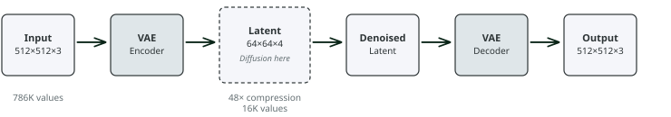
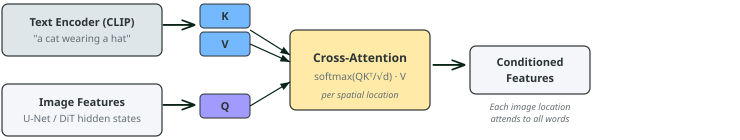
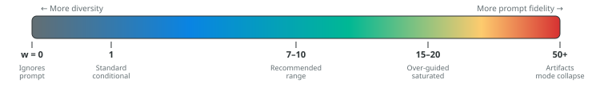
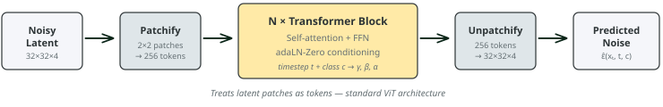
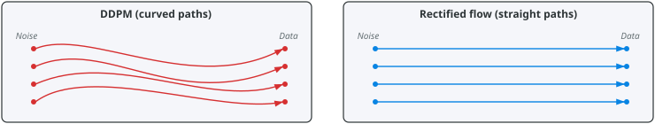

# Lecture 22: Image diffusion and multimodal generation
### PSYC 51.17: Models of language and communication

Jeremy R. Manning
Dartmouth College
Winter 2026

---

# Learning objectives

1. Explain how **latent diffusion** compresses computation via a VAE to enable high-resolution image generation
2. Describe how **CLIP** creates a shared embedding space for text and images
3. Explain how **cross-attention** and **classifier-free guidance** enable text-controlled image generation
4. Compare the **U-Net** and **Transformer (DiT)** backbones for diffusion models
5. Understand **flow matching** as a simpler alternative to DDPM and trace the path to **Stable Diffusion 3**

---

# From text to images

In Lecture 21, we saw how diffusion models generate **text** by iteratively unmasking tokens (discrete diffusion). Today we return to the domain where diffusion was born — **images** — and ask: how do we build systems that generate high-resolution images from text prompts?

| Challenge | Solution (this lecture) |
|-----------|----------------------|
| Images are huge (786K+ values) | **Latent diffusion** — compress first, diffuse in latent space |
| Text must control generation | **CLIP** + **cross-attention** — bind words to spatial regions |
| Output must match the prompt | **Classifier-free guidance** — amplify text alignment |
| Architecture must scale | **DiT** — replace U-Net with Transformers |
| Training should be simple | **Flow matching** — straight paths, no noise schedule |

---
<!-- _class: scale-85 -->

# The pixel problem

The continuous diffusion framework from Lecture 21 (DDPM) operates directly on pixel space when applied to images. For a 512×512 RGB image, the denoising network processes tensors of size $512 \times 512 \times 3 = 786{,}432$ values at every step. With 1000 steps, this is prohibitively expensive for high-resolution generation.

| Resolution | Pixels | U-Net memory | Time per image |
|-----------|--------|-------------|----------------|
| 64 × 64 | 12,288 | ~2 GB | ~30 seconds |
| 256 × 256 | 196,608 | ~8 GB | ~5 minutes |
| 512 × 512 | 786,432 | ~32 GB | ~20 minutes |
| 1024 × 1024 | 3,145,728 | Not feasible | — |

The solution: don't run diffusion in pixel space. Run it in a **compressed latent space**.

---
<!-- _class: scale-85 -->

# Latent diffusion models

[Latent diffusion](https://arxiv.org/abs/2112.10752) separates the problem into two stages:

1. **Compression**: A pretrained VAE (variational autoencoder) encodes images into a compact latent space (typically 8× spatial compression)
2. **Generation**: Diffusion operates entirely in this latent space

The VAE learns to compress images while preserving perceptually important information. Diffusion in latent space is **~50× cheaper** than in pixel space, with negligible quality loss. This single insight enabled Stable Diffusion — the first open-source, consumer-GPU-capable image generator.

---

# The VAE bottleneck

The VAE encoder maps an image $\mathbf{x} \in \mathbb{R}^{H \times W \times 3}$ to a latent $\mathbf{z} \in \mathbb{R}^{h \times w \times c}$ where $h = H/f$, $w = W/f$, and $f$ is the downsampling factor (typically $f = 8$).

| Property | Value |
|----------|-------|
| Input resolution | 512 × 512 × 3 |
| Latent resolution | 64 × 64 × 4 |
| Compression ratio | 48× (786K → 16K values) |
| VAE training | Perceptual loss + adversarial loss |
| Reconstruction quality | Near-lossless for natural images |

The VAE is trained once and frozen. The diffusion model only ever sees latents — it never touches pixel space during training or sampling.

---
<!-- _class: scale-90 -->

# CLIP: understanding text for images

[CLIP](https://arxiv.org/abs/2103.00020) learns a **shared embedding space** for text and images using contrastive learning on 400 million image-text pairs from the internet:

1. **Image encoder** (ViT or ResNet): Maps an image to a vector
2. **Text encoder** (Transformer): Maps a caption to a vector
3. **Contrastive training**: Matching image-text pairs are pulled together; non-matching pairs are pushed apart

CLIP provides the "language understanding" for text-to-image systems. When you type a prompt like "a cat wearing a hat," CLIP's text encoder converts it into an embedding that captures the **visual meaning** of those words — not just their linguistic meaning. This embedding then guides the diffusion process through cross-attention.

In CLIP's embedding space, the text "a golden retriever on a beach" is **near** a photo of a golden retriever on a beach, and **far** from a photo of a city skyline. This geometric relationship is what makes text-conditional generation possible.

---

# Text conditioning with cross-attention

To generate images from text prompts, latent diffusion adds **cross-attention** layers to the denoising backbone. At each spatial resolution:

1. The text prompt is encoded by CLIP into a sequence of embeddings
2. The backbone's intermediate features serve as **queries** (Q)
3. The text embeddings serve as **keys** (K) and **values** (V)
4. Cross-attention allows each spatial location in the image to attend to relevant words

The word "cat" activates high attention weights in the spatial region where the cat is being generated. The word "hat" activates attention weights near the top of the cat region. This spatial-linguistic binding is learned entirely from image-caption pairs during training.

---
<!-- _class: scale-90 -->

# Classifier-free guidance

[Classifier-free guidance (CFG)](https://arxiv.org/abs/2207.12598) is a technique for improving the alignment between text prompts and generated images. During training, the text condition is randomly dropped (replaced with an empty prompt) some fraction of the time. At inference, the model makes two predictions:

- **Conditional**: $\boldsymbol{\epsilon}_\theta(\mathbf{x}_t, t, c)$ — with the text prompt
- **Unconditional**: $\boldsymbol{\epsilon}_\theta(\mathbf{x}_t, t, \varnothing)$ — without the text prompt

The final prediction extrapolates *away* from the unconditional toward the conditional:

$$\tilde{\boldsymbol{\epsilon}}_\theta = (1 + w)\,\boldsymbol{\epsilon}_\theta(\mathbf{x}_t, t, c) - w\,\boldsymbol{\epsilon}_\theta(\mathbf{x}_t, t, \varnothing)$$

where $w$ is the **guidance scale** (typically 7–15).

---

# The guidance scale tradeoff

Think of CFG as asking: "What's different about images that match this prompt versus random images?" Then amplifying that difference. Higher guidance = more amplification = more faithful to the prompt but less natural variation.

Nearly every text-to-image system uses CFG. Stable Diffusion defaults to $w = 7.5$; DALL-E 2 uses $w \approx 4$. The "recommended range" of 7–10 balances prompt fidelity against visual quality — pushing higher creates oversaturated, artifact-prone images.

---
<!-- _class: scale-75 -->

# U-Net: the original diffusion backbone

The [U-Net](https://arxiv.org/abs/1505.04597) was originally designed for biomedical image segmentation, but became the default backbone for diffusion models from DDPM through Stable Diffusion 1–2:

1. **Encoder path** (downsampling): Progressively reduces spatial resolution while increasing channels — captures global context
2. **Decoder path** (upsampling): Progressively restores spatial resolution — generates fine details
3. **Skip connections**: Connect encoder layers to decoder layers at matching resolutions — preserve high-frequency spatial information

| Property | Typical configuration |
|----------|----------------------|
| Input/output | Same-sized latent (e.g., 64×64×4) |
| Conditioning | Timestep $t$ via sinusoidal embeddings; text via cross-attention |
| Skip connections | Concatenate encoder features to decoder features |
| Parameters | ~860M (Stable Diffusion 1.5) |

The U-shaped design gives diffusion models **multi-scale reasoning**: coarse structure from the bottleneck, fine detail from skip connections.

---
<!-- _class: scale-78 -->

# Diffusion Transformer (DiT)

The [Diffusion Transformer (DiT)](https://arxiv.org/abs/2212.09748) replaces the U-Net backbone with a standard Vision Transformer (ViT):

1. **Patchify**: Divide the latent into non-overlapping patches (e.g., 2×2)
2. **Flatten**: Treat patches as a sequence of tokens (just like ViT treats image patches)
3. **Process**: Apply standard Transformer blocks with self-attention
4. **Unpatchify**: Reshape back to spatial dimensions

Transformers scale better than U-Nets. DiT-XL/2 (675M parameters) achieves a new state-of-the-art [FID](https://en.wikipedia.org/wiki/Fr%C3%A9chet_inception_distance) of 2.27 on ImageNet, beating all previous diffusion models. More importantly, DiT shows **clean scaling behavior** — larger models consistently produce better results, with no architectural bottlenecks.

---

# adaLN-Zero: conditioning in DiT

DiT conditions on timestep and class label using **adaptive Layer Normalization (adaLN-Zero)**:

1. The timestep and class embeddings are combined and projected to produce **scale** ($\gamma$) and **shift** ($\beta$) parameters
2. These modulate the LayerNorm output: $\text{adaLN}(\mathbf{h}) = \gamma \odot \text{LN}(\mathbf{h}) + \beta$
3. Additionally, a **gating parameter** $\alpha$ scales the residual connection, initialized to zero

Initializing the gating parameter $\alpha = 0$ means each Transformer block initially acts as an **identity function**. This makes training stable even for very deep models — the network starts by doing nothing and gradually learns to denoise. This is the same principle behind residual learning ([He et al., 2016](https://arxiv.org/abs/1512.03385)).

---

# Flow matching

[Flow matching](https://arxiv.org/abs/2210.02747) offers a cleaner mathematical framework than DDPM. Instead of a discrete chain of noising steps, flow matching defines a **continuous path** from noise to data using an ordinary differential equation (ODE):

$$\frac{d\mathbf{x}}{dt} = v_\theta(\mathbf{x}_t, t)$$

where $v_\theta$ is a neural network that predicts the **velocity** (direction and speed) of the flow at each point.

- **[ODE](https://en.wikipedia.org/wiki/Ordinary_differential_equation)** (Ordinary Differential Equation): An equation describing how a quantity changes over time via a deterministic rule — given the current state, the next state is fully determined
- **[SDE](https://en.wikipedia.org/wiki/Stochastic_differential_equation)** (Stochastic Differential Equation): Like an ODE but with a random noise term — the path from noise to data has some randomness at each step

---
<!-- _class: scale-70 -->

# Flow matching vs DDPM

| | DDPM | Flow matching |
|---|---|---|
| Path type | Stochastic (SDE) | Deterministic (ODE) |
| Training | Predict noise $\boldsymbol{\epsilon}$ | Predict velocity $v$ |
| Interpolation | $\mathbf{x}_t = \sqrt{\bar\alpha_t}\,\mathbf{x}_0 + \sqrt{1 - \bar\alpha_t}\,\boldsymbol{\epsilon}$ | $\mathbf{x}_t = (1-t)\,\mathbf{x}_0 + t\,\boldsymbol{\epsilon}$ |
| Simplicity | Requires noise schedule design | Schedule-free |

**The intuition:** Flow matching defines a straight interpolation from noise to data and learns the velocity field along it — no noise schedule needed.

---

# Rectified flow

**Rectified flow** ([Liu et al., 2023, ICLR](https://arxiv.org/abs/2209.03003)) uses the simplest possible interpolation — a straight line between the data point and a noise sample:

$$\mathbf{x}_t = (1 - t)\,\mathbf{x}_0 + t\,\boldsymbol{\epsilon}$$

The velocity along this path is constant: $v = \boldsymbol{\epsilon} - \mathbf{x}_0$

Straight paths are the shortest paths between noise and data. Since they don't curve, they can be accurately simulated with **fewer ODE solver steps** — as few as 1–4 steps with distillation. This is the foundation of Stable Diffusion 3's fast generation.

---
<!-- _class: scale-70 -->

# Stable Diffusion 3: putting it all together

[Stable Diffusion 3](https://arxiv.org/abs/2403.03206) combines all of the techniques we've discussed into a single system:

| Component | Choice | Why |
|-----------|--------|-----|
| Latent space | VAE with 16-channel latent | Higher capacity than SD 1.x (4 channels) |
| Backbone | **MMDiT** (multimodal DiT) | Transformers scale better than U-Net |
| Text encoders | CLIP-L + CLIP-G + T5-XXL | Three encoders for rich text understanding |
| Conditioning | Joint attention (text + image tokens) | Text and image tokens attend to each other |
| Training framework | **Rectified flow** | Simpler than DDPM, faster sampling |
| Guidance | CFG with dynamic rescaling | Better prompt adherence |

Each generation of image diffusion models combines insights from the previous one. SD3 isn't one breakthrough — it's the accumulation of latent diffusion + CLIP + CFG + DiT + flow matching + better text encoders. Understanding the individual pieces (this lecture) is the key to understanding the whole.

---
<!-- _class: scale-80 -->

# Discussion

1. **Latent vs pixel space**: Latent diffusion trades exact pixel control for speed. Are there tasks where pixel-space diffusion would be strictly better? What information might the VAE discard?

2. **Guidance as amplification**: CFG amplifies the difference between conditional and unconditional predictions. Is this analogous to anything in human cognition — e.g., how we exaggerate features when imagining something vividly?

3. **U-Net vs Transformer**: DiT replaced U-Net because Transformers scale better. But U-Net's inductive biases (locality, skip connections) seem useful for spatial data. Is there a hybrid that gets the best of both?

4. **Language drives vision**: Imagen (Lecture 23) found that scaling the text encoder improves image quality more than scaling the diffusion model. What does this tell us about the relationship between language and visual imagination?

---

# Take-home messages

- The key bottleneck in high-resolution generation wasn't the diffusion process itself — it was **where** you run it. Compressing to latent space (via a VAE) made consumer-GPU generation possible.
- Text-to-image generation requires a **bridge between modalities**: CLIP creates a shared embedding space, and cross-attention lets the diffusion model "listen" to text at every spatial location.
- Classifier-free guidance shows that **controlling** generation is as important as generation itself — and the trick is surprisingly simple: learn what the conditional and unconditional outputs look like, then amplify the difference.
- The field evolves by **composing** innovations (latent space + CLIP + CFG + DiT + flow matching), not replacing them. Each addresses one specific limitation.

---
<!-- _class: scale-85 -->

# Further reading

[**Rombach et al. (2022, *CVPR*)**](https://arxiv.org/abs/2112.10752) "High-Resolution Image Synthesis with Latent Diffusion Models" — Latent diffusion and the foundation of Stable Diffusion.

[**Radford et al. (2021, *ICML*)**](https://arxiv.org/abs/2103.00020) "Learning Transferable Visual Models From Natural Language Supervision" — CLIP: the shared embedding space that makes text-to-image generation possible.

[**Ho & Salimans (2022, *arXiv*)**](https://arxiv.org/abs/2207.12598) "Classifier-Free Diffusion Guidance" — The guidance technique used in virtually all modern diffusion systems.

[**Ronneberger et al. (2015, *MICCAI*)**](https://arxiv.org/abs/1505.04597) "U-Net: Convolutional Networks for Biomedical Image Segmentation" — The U-shaped architecture that served as the default diffusion backbone.

[**Peebles & Xie (2023, *ICCV*)**](https://arxiv.org/abs/2212.09748) "Scalable Diffusion Models with Transformers" — DiT: replacing U-Net with Transformers for clean scaling.

[**Lipman et al. (2023, *ICLR*)**](https://arxiv.org/abs/2210.02747) "Flow Matching for Generative Modeling" — A simpler, ODE-based alternative to diffusion SDEs.

[**Esser et al. (2024, *ICML*)**](https://arxiv.org/abs/2403.03206) "Scaling Rectified Flow Transformers for High-Resolution Image Synthesis" — Stable Diffusion 3 and the MMDiT architecture.

---

# Questions?

  

    &#x1F4E7;
    <a href="mailto:jeremy@dartmouth.edu">Email</a>
  

  

    &#x1F4AC;
    <a href="https://discord.gg/sftEk9Ygdw">Discord</a>
  

  

    &#x1F481;
    <a href="https://context-lab.youcanbook.me">Office hours</a>
  

Diffusion applications: text-to-image, text-to-video, and the ethics of generative AI

