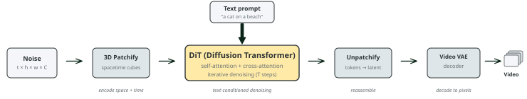
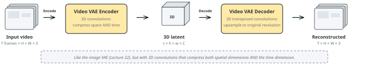
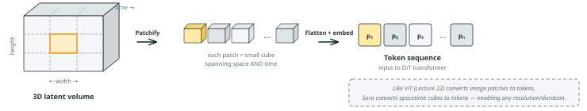
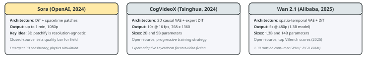
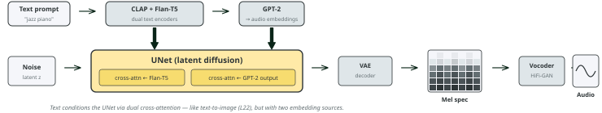
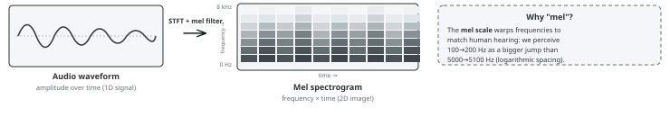
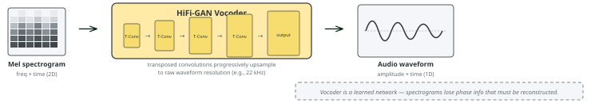

# Lecture 23: Diffusion models for video and audio; ethics of generative AI
### PSYC 51.17: Models of language and communication

Jeremy R. Manning
Dartmouth College
Winter 2026

---

# Learning objectives

1. Explain how **Sora** extends diffusion to video via **spacetime patches**
2. Describe how text-to-audio systems generate sound using **spectrogram-based diffusion**
3. Compare open-source text-to-video models and their architectural choices
4. Evaluate ethical implications of multimodal generative AI: **deepfakes**, consent, bias, and regulation

---

# Roadmap and companion notebook

There are **no classes February 23–27** (I'll be away!). Use this time to work on your **final project** and the optional Assignment 5 (Build GPT).

📓 [Companion Notebook](https://colab.research.google.com/github/ContextLab/llm-course/blob/main/slides/week7/video_audio_diffusion_demo.ipynb) — generate video from text, create audio with AudioLDM 2, and visualize spectrograms.

---
<!-- _class: scale-70 -->

# The Sora pipeline

[Sora](https://openai.com/research/video-generation-models-as-world-simulators) (OpenAI, 2024) extends the DiT architecture (Lecture 22) from 2D image patches to 3D **spacetime patches**:

1. **Patchify**: Divide the 3D latent volume into spacetime cubes → a token sequence
2. **Denoise**: A DiT transformer processes the tokens, conditioned on text via cross-attention
3. **Unpatchify**: Reassemble tokens back into a 3D latent volume
4. **Decode**: The video VAE decoder reconstructs pixel-space video frames

[**OpenAI (2024)**](https://openai.com/research/video-generation-models-as-world-simulators) "Video generation models as world simulators" — Sora treats video generation as spacetime denoising.

---
<!-- _class: scale-70 -->

# The video VAE

Like the image VAE from Lecture 22, a **video VAE** compresses input into a lower-dimensional latent space. The key difference: it uses **3D convolutions** that compress along the temporal dimension as well as spatial dimensions.

- **Encoder**: Raw video (T × H × W × 3) → 3D latent (t × h × w × C) with t ≪ T, h ≪ H, w ≪ W
- **Decoder**: 3D latent → reconstructed video at original resolution
- This compression makes diffusion tractable — denoising operates in the small latent space, not on raw pixels

---
<!-- _class: scale-70 -->

# 3D spacetime patchify

After the video VAE compresses video into a 3D latent, **patchify** converts it into a sequence of tokens — just like ViT (Lecture 22) does for images:

1. **Divide** the 3D latent volume into small cubes (e.g., 2 × 2 × 2 in height × width × time)
2. **Flatten** each cube into a vector
3. **Project** each vector into the transformer's embedding dimension via a linear layer

Because patches are resolution-agnostic, Sora can handle **any resolution, aspect ratio, or duration** — the token sequence simply gets longer or shorter. This is a major advantage over fixed-resolution architectures.

---
<!-- _class: scale-70 -->

# Sora: emergent capabilities

Sora exhibits surprising behaviors not explicitly trained:

- **3D consistency**: Objects maintain shape as the camera moves
- **Long-range coherence**: Characters persist across scene changes
- **Physics simulation**: Water flows, reflections update, objects interact plausibly
- **Variable format**: Handles different resolutions, aspect ratios, and durations — because spacetime patches are resolution-agnostic

OpenAI describes Sora as a "world simulator." Does a model that generates plausible physics *understand* physics, or is it pattern-matching at a scale we find convincing? This connects to our discussion of language and understanding (Lecture 20) — predicting the next token (or the next frame) may be more powerful than it appears.

---
<!-- _class: scale-70 -->

# The text-to-video landscape

All major text-to-video models share Sora's core recipe — **video VAE + DiT + text conditioning** — but vary in scale, training data, and architectural details.

[**Hong et al. (2024)**](https://arxiv.org/abs/2408.06072) "CogVideoX: Text-to-Video Diffusion Models with An Expert Transformer" — 3D causal VAE + expert adaptive LayerNorm.

[**Wan Video Team (2025)**](https://github.com/Wan-Video/Wan2.1) "Wan 2.1" — Top [VBench](https://vchitect.github.io/VBench-project/) scores; 1.3B model runs on consumer GPUs (~8 GB VRAM).

---
<!-- _class: scale-70 -->

# From waveforms to spectrograms

Audio generation applies diffusion to **spectrograms** — visual representations of sound frequencies over time:

1. **Convert**: Transform audio into a [mel spectrogram](https://en.wikipedia.org/wiki/Mel-frequency_cepstrum) (frequency bands × time steps, weighted to match human hearing)
2. **Compress**: A VAE encodes the spectrogram into a latent space (just like image latent diffusion)
3. **Denoise**: Latent diffusion generates a clean spectrogram conditioned on text
4. **Reconstruct**: A **[vocoder](https://en.wikipedia.org/wiki/Vocoder)** (e.g., HiFi-GAN) converts the spectrogram back to an audio waveform

By converting audio to a spectrogram, we turn a 1D temporal signal into a 2D image — and the entire image diffusion toolkit (VAE, latent diffusion, text conditioning) transfers directly.

---

# Mel spectrograms: turning sound into images

A **mel spectrogram** is a 2D image representing sound. It is computed by:

1. **[Short-time Fourier transform (STFT)](https://en.wikipedia.org/wiki/Short-time_Fourier_transform)**: Slice the audio into overlapping windows and compute the frequency content of each
2. **[Mel filter bank](https://en.wikipedia.org/wiki/Mel-frequency_cepstrum)**: Re-weight frequency bins onto the **mel scale**, which spaces low frequencies widely and high frequencies narrowly — matching how humans perceive pitch
3. **[Log scaling](https://en.wikipedia.org/wiki/Decibel)**: Convert power to decibels for better dynamic range

The result: a 2D image (frequency × time) that diffusion models can process using the same architectures designed for photographs.

---
<!-- _class: scale-70 -->

# Text conditioning in AudioLDM 2

[AudioLDM 2](https://arxiv.org/abs/2308.05734) uses **dual cross-attention** to condition the UNet on text — similar to text-to-image diffusion (Lecture 22), but with two embedding sources:

1. **[CLAP](https://arxiv.org/abs/2211.06687) + [Flan-T5](https://arxiv.org/abs/2210.11416)** encode the text prompt into embeddings
2. **[GPT-2](https://en.wikipedia.org/wiki/GPT-2)** auto-regressively generates audio-space embeddings from the text embeddings
3. The UNet receives **two cross-attention inputs**: Flan-T5 embeddings AND GPT-2 output embeddings

Cross-attention works the same way here as in text-to-image: the **queries** come from the audio latent features, and the **keys/values** come from the text embeddings. This lets the denoising network "look up" which parts of the text are relevant at each spatial/frequency location.

CLAP captures audio-text alignment (like CLIP for images), while Flan-T5 provides rich semantic understanding. The GPT-2 bridge translates between text and audio embedding spaces — producing the ["language of audio" (LOA)](https://arxiv.org/abs/2308.05734).

---
<!-- _class: scale-65 -->

# Text-to-audio systems

| System | Modality | Approach | Key feature |
|--------|----------|----------|-------------|
| [AudioLDM 2](https://arxiv.org/abs/2308.05734) | Music + speech + effects | Latent diffusion | CLAP text encoder |
| [Stable Audio](https://arxiv.org/abs/2404.10301) (Stability AI) | Music + effects | Latent diffusion + timing | Controllable duration |
| [MusicGen](https://arxiv.org/abs/2306.05284) (Meta) | Music | Autoregressive (not diffusion) | Single-stage, no vocoder |
| [Bark](https://github.com/suno-ai/bark) (Suno) | Speech | Autoregressive + diffusion | Multilingual, emotion control |

Diffusion and autoregressive approaches are **converging** — many systems use hybrid architectures.

- **[CLAP](https://arxiv.org/abs/2211.06687)** (Contrastive Language-Audio Pretraining): The audio equivalent of CLIP — learns a shared embedding space for text and audio, enabling text-conditioned generation
- **[Vocoder](https://en.wikipedia.org/wiki/Vocoder)**: A neural network (e.g., [HiFi-GAN](https://arxiv.org/abs/2010.05646)) that reconstructs audio waveforms from spectrograms

---
<!-- _class: scale-70 -->

# The vocoder: from spectrograms to sound

Converting a mel spectrogram back to audio is **not** a simple inverse transform. Spectrograms discard **phase information** — the timing relationships between frequency components. Recovering natural-sounding audio requires a **learned neural network**.

[HiFi-GAN](https://arxiv.org/abs/2010.05646) (Kong et al., 2020) is a GAN-based vocoder: a **generator** uses transposed convolutions to progressively upsample the spectrogram to waveform resolution, while **multi-scale discriminators** judge audio quality at different time scales. It produces 22 kHz audio at 168× real-time speed.

---
<!-- _class: scale-80 -->

# Ethics: deepfakes and consent

Diffusion models can generate photorealistic images of people who never consented to being depicted. This has led to:

- **Non-consensual intimate imagery**: Deepfake tools targeting individuals (predominantly women), with devastating personal consequences
- **Political disinformation**: Fabricated images of public figures in compromising situations, weaponized during elections
- **Identity fraud**: Generated faces used for fake accounts, scam operations, and social engineering

A [2019 Sensity AI (Deeptrace) report](https://sensity.ai/blog/deepfake-detection/mapping-the-deepfake-landscape/) found that **96% of deepfake videos online are non-consensual intimate imagery**, and the number of deepfake videos doubled in just 9 months. By 2023, [Sumsub reported](https://sumsub.com/blog/deepfake-statistics/) a 10× increase in detected deepfakes year-over-year. The democratization of generation tools has far outpaced legal and technical protections.

---
<!-- _class: scale-80 -->

# Ethics: bias in generated content

Diffusion models trained on internet-scale datasets inherit (and sometimes amplify) societal biases:

- **Gender stereotypes**: "CEO" generates predominantly white male faces; "nurse" generates predominantly female faces
- **Racial bias**: Prompts for "beautiful person" over-represent light-skinned individuals
- **Cultural erasure**: Non-Western artistic styles, architectural traditions, and cultural contexts are underrepresented
- **Homogenization**: Generated images converge toward a narrow aesthetic — the "AI look" — reducing visual diversity

Bias exists at every level: in the training data (internet images skew Western/male/young), in the text encoder (CLIP's training data has similar biases), and in the evaluation metrics (FID scores reward realism of common scenes over diverse representation).

---

# Ethics: copyright and training data

| Case | Status | Key issue |
|------|--------|-----------|
| [Getty Images v. Stability AI](https://www.bakerlaw.com/getty-images-v-stability-ai/) | UK: copyright claims rejected (Nov 2025); US: ongoing | Training on copyrighted stock photos |
| [Andersen v. Stability AI](https://jipel.law.nyu.edu/andersen-v-stability-ai-the-landmark-case-unpacking-the-copyright-risks-of-ai-image-generators/) | Class action (2023 –); trial Sept 2026 | Artists' styles replicated without consent |
| [NYT v. OpenAI](https://www.npr.org/2025/03/26/nx-s1-5288157/new-york-times-openai-copyright-case-goes-forward) | Filed Dec 2023; copyright claims survive (Mar 2025) | Verbatim reproduction of articles |
| [Thomson Reuters v. Ross](https://perkinscoie.com/insights/update/fair-use-defense-failed-in-thomson-reuters-v-ross-jury-still-out-for-generative-ai) | Ruled Feb 2025 — fair use defense failed | Training on proprietary legal database |

Training data is scraped from the internet without explicit consent. Artists argue this constitutes copyright infringement — their styles are being replicated without compensation. Companies argue this is "fair use" and transformative. Courts are still deciding, but the outcome will shape the future of all generative AI, not just diffusion models.

---
<!-- _class: scale-80 -->

# Ethics: regulation and provenance

- **[EU AI Act](https://eur-lex.europa.eu/eli/reg/2024/1689/oj/eng) (2024)**: Requires labeling of AI-generated content, transparency about training data, risk classification for generative systems
- **[C2PA](https://c2pa.org/) (Coalition for Content Provenance and Authenticity)**: Technical standard for embedding provenance metadata in images and videos — "nutrition labels" for digital content
- **[US Executive Order 14110](https://www.federalregister.gov/documents/2023/11/01/2023-24283/safe-secure-and-trustworthy-development-and-use-of-artificial-intelligence) (Oct 2023)**: Requires watermarking of AI-generated content from government contractors
- **[China's deep synthesis regulations](https://www.chinalawtranslate.com/en/deep-synthesis/) (2023)**: Mandatory labeling and registration of deepfake services

Regulation works when enforced. But technical solutions (watermarking, detection models) face an arms race: as detectors improve, generators adapt. The most promising approach may be **provenance** — embedding an unforgeable record of how content was created, rather than trying to detect fakes after the fact.

---
<!-- _class: scale-85 -->

# Discussion

1. **The world simulator question**: Sora generates videos with plausible physics. Does this mean it has learned a model of the physical world, or is it pattern-matching at a scale we find convincing? How would we tell the difference?

2. **The spectrogram trick**: Converting audio to spectrograms lets us reuse image diffusion tools for sound. What other modalities could be "converted to images" and generated this way? What are the limits of this approach?

3. **Regulation tradeoffs**: Strict regulation of generative AI could slow harmful applications but also impede beneficial research. How should society balance these? Is open-source part of the problem or part of the solution?

4. **The compression connection**: Language compresses thought (Lecture 20). VAEs compress images. Spectrograms compress audio. Diffusion generates by decompressing noise. Is there a deep connection between communication, compression, and generation?

---

# Take-home messages

- The same diffusion framework scales across modalities — images (Lecture 22), video (Sora), and audio (AudioLDM) — suggesting **iterative refinement from noise** is a general-purpose generation principle.
- The **spectrogram trick** illustrates a powerful pattern: convert your data into a format where existing tools work, then convert back. Turning audio into "images" unlocks the entire latent diffusion pipeline.
- Sora's emergent physics simulation raises the question: is **predicting the next frame** enough to learn a world model? The same question we asked about language (Lecture 20) now applies to vision.
- The ethics of generative AI are not optional add-ons — **consent**, **bias**, **copyright**, and **provenance** are central design challenges, not afterthoughts.

---
<!-- _class: scale-85 -->

# Further reading

[**OpenAI (2024)**](https://openai.com/research/video-generation-models-as-world-simulators) "Video Generation Models as World Simulators" — Sora: spacetime patches and emergent physics.

[**Liu et al. (2023, *IEEE/ACM TASLP*)**](https://arxiv.org/abs/2308.05734) "AudioLDM 2: Learning Holistic Audio Generation with Self-supervised Pretraining" — Latent diffusion for audio with CLAP conditioning.

[**Hong et al. (2024)**](https://arxiv.org/abs/2408.06072) "CogVideoX: Text-to-Video Diffusion Models with An Expert Transformer" — Open-source text-to-video with 3D causal VAE.

[**Yang et al. (2024, *ACM Computing Surveys*)**](https://arxiv.org/abs/2409.00587) "Diffusion Models: A Comprehensive Survey of Methods and Applications" — Broad overview of diffusion across modalities.

---

# Questions?

  

    &#x1F4E7;
    <a href="mailto:jeremy@dartmouth.edu">Email</a>
  

  

    &#x1F4AC;
    <a href="https://discord.gg/sftEk9Ygdw">Discord</a>
  

  

    &#x1F481;
    <a href="https://context-lab.youcanbook.me">Office hours</a>
  

Week 9 (after break): Agents and tool use — giving language models the ability to act in the world, mixture-of-expert models

