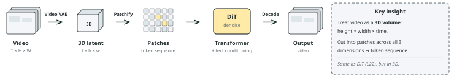
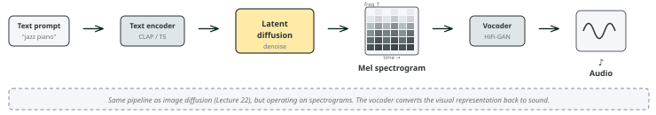

# Lecture 23: Diffusion applications and ethics
### PSYC 51.17: Models of language and communication

Jeremy R. Manning
Dartmouth College
Winter 2026

---

# Learning objectives

1. Explain how **Sora** extends diffusion to video via **spacetime patches**
2. Describe how text-to-audio systems generate sound using **spectrogram-based diffusion**
3. Explain **discrete diffusion** for text generation and its connection to BERT
4. Evaluate ethical implications of multimodal generative AI: **deepfakes**, consent, bias, and regulation
5. Connect diffusion models back to the course themes of language and communication

---

# Roadmap and companion notebook

There are **no classes February 23–27** (instructor away). Use this time to work on your **final project** and the optional Assignment 5 (Build GPT).

📓 [Companion Notebook](https://colab.research.google.com/github/ContextLab/llm-course/blob/main/slides/week7/diffusion_demo.ipynb) — generate images with Stable Diffusion, experiment with guidance scales, and explore discrete diffusion for text.

---
<!-- _class: scale-70 -->

# From images to video

Video is a sequence of images over time. [Sora](https://openai.com/research/video-generation-models-as-world-simulators) (OpenAI, 2024) extends the DiT architecture (Lecture 22) from 2D image patches to 3D **spacetime patches**:

1. **Compress**: A video VAE encodes frames into a 3D latent space (height × width × time)
2. **Patchify**: Divide the 3D latent volume into spacetime patches — small cubes spanning space *and* time
3. **Denoise**: A DiT-like transformer processes the patch sequence, conditioned on text
4. **Decode**: The VAE decoder reconstructs the video frames

[**OpenAI (2024)**](https://openai.com/research/video-generation-models-as-world-simulators) "Video generation models as world simulators" — Sora treats video generation as spacetime denoising.

---
<!-- _class: scale-70 -->

# Sora: emergent capabilities

Sora exhibits surprising behaviors not explicitly trained:

- **3D consistency**: Objects maintain shape as the camera moves
- **Long-range coherence**: Characters persist across scene changes
- **Physics simulation**: Water flows, reflections update, objects interact plausibly
- **Variable format**: Handles different resolutions, aspect ratios, and durations — because spacetime patches are resolution-agnostic

OpenAI describes Sora as a "world simulator." Does a model that generates plausible physics *understand* physics, or is it pattern-matching at a scale we find convincing? This connects to our discussion of language and understanding (Lecture 20) — predicting the next token (or the next frame) may be more powerful than it appears.

Sora combines three ideas from Lecture 22: **latent compression** (video VAE, like the image VAE), **classifier-free guidance** (text controls generation), and **DiT** (Transformer backbone, scaled to 3D patches).

---
<!-- _class: scale-70 -->

# From waveforms to spectrograms

Audio generation applies diffusion to **spectrograms** — visual representations of sound frequencies over time:

1. **Convert**: Transform audio into a [mel spectrogram](https://en.wikipedia.org/wiki/Mel-frequency_cepstrum) (frequency bands × time steps, weighted to match human hearing)
2. **Compress**: A VAE encodes the spectrogram into a latent space (just like image latent diffusion)
3. **Denoise**: Latent diffusion generates a clean spectrogram conditioned on text
4. **Reconstruct**: A **vocoder** (e.g., HiFi-GAN) converts the spectrogram back to an audio waveform

By converting audio to a spectrogram, we turn a 1D temporal signal into a 2D image — and the entire image diffusion toolkit (VAE, latent diffusion, text conditioning) transfers directly. The vocoder handles the "last mile" conversion back to sound.

---
<!-- _class: scale-65 -->

# Text-to-audio systems

| System | Modality | Approach | Key feature |
|--------|----------|----------|-------------|
| [AudioLDM 2](https://arxiv.org/abs/2308.05734) | Music + speech + effects | Latent diffusion | CLAP text encoder |
| [Stable Audio](https://arxiv.org/abs/2404.10301) (Stability AI) | Music + effects | Latent diffusion + timing | Controllable duration |
| [MusicGen](https://arxiv.org/abs/2306.05284) (Meta) | Music | Autoregressive (not diffusion) | Single-stage, no vocoder |
| [Bark](https://github.com/suno-ai/bark) (Suno) | Speech | Autoregressive + diffusion | Multilingual, emotion control |

Diffusion and autoregressive approaches are **converging** — many systems use hybrid architectures.

- **[CLAP](https://arxiv.org/abs/2211.06687)** (Contrastive Language-Audio Pretraining): The audio equivalent of CLIP — learns a shared embedding space for text and audio, enabling text-conditioned generation
- **Vocoder**: A neural network (e.g., [HiFi-GAN](https://arxiv.org/abs/2010.05646)) that reconstructs audio waveforms from spectrograms — the "decoder" that turns images back into sound

---

# Discrete diffusion for text

Standard diffusion adds Gaussian noise to continuous data. For discrete data like text, [MDLM](https://arxiv.org/abs/2406.07524) replaces "adding noise" with **masking tokens**:

- **Forward process**: Randomly replace tokens with [MASK], increasing the masking rate over time
- **Reverse process**: A transformer predicts the masked tokens, gradually unmasking the sequence
- At $t = T$: all tokens are masked. At $t = 0$: the full text is revealed.

This should sound familiar! BERT (Lecture 18) also predicts masked tokens. The key difference: BERT masks a fixed 15% of tokens and predicts them in one shot. MDLM uses a **continuous masking schedule** and iteratively unmasks over multiple steps — bridging masked language modeling and diffusion.

---

# Why discrete diffusion matters for NLP

| Property | Autoregressive (GPT) | Discrete diffusion (MDLM) |
|----------|---------------------|--------------------------|
| Generation order | Left to right only | Any order (parallel) |
| Editing | Must regenerate from edit point | Re-mask and re-denoise locally |
| Speed | $O(N)$ sequential steps | Can trade steps for parallelism |
| Controllability | Prompt engineering | Direct guidance at any position |

Discrete diffusion suggests that autoregressive generation isn't the only way to produce text. Just as image diffusion generates all pixels simultaneously through refinement, text diffusion could generate all tokens simultaneously — more like how humans revise a draft than how they speak word-by-word.

---
<!-- _class: scale-80 -->

# What diffusion teaches us about language

Diffusion models offer a new lens on language and communication:

- **Iterative refinement** mirrors how humans write: rough draft → revision → polished text. MDLM formalizes this as a denoising process.
- **Compression**: Latent diffusion shows that perceptually important information can be compressed dramatically (48× for images). Is language itself a compression of thought (Delétang et al., 2024, Lecture 20)?
- **Multimodal communication**: Text-to-image systems prove that language can guide visual generation. Speaker-listener neural coupling (Lecture 20) suggests human brains do something similar — using language to reconstruct visual experiences.

From ELIZA's pattern matching (Week 1) to diffusion's iterative refinement (Week 7), we've seen that generation is fundamentally about **transforming noise into signal**. Whether that noise is random tokens, random pixels, or the ambiguity of human communication, the core challenge is the same.

---
<!-- _class: scale-80 -->

# Ethics: deepfakes and consent

Diffusion models can generate photorealistic images of people who never consented to being depicted. This has led to:

- **Non-consensual intimate imagery**: Deepfake tools targeting individuals (predominantly women), with devastating personal consequences
- **Political disinformation**: Fabricated images of public figures in compromising situations, weaponized during elections
- **Identity fraud**: Generated faces used for fake accounts, scam operations, and social engineering

A [2019 Sensity AI (Deeptrace) report](https://sensity.ai/blog/deepfake-detection/mapping-the-deepfake-landscape/) found that **96% of deepfake videos online are non-consensual intimate imagery**, and the number of deepfake videos doubled in just 9 months. By 2023, [Sumsub reported](https://sumsub.com/blog/deepfake-statistics/) a 10× increase in detected deepfakes year-over-year. The democratization of generation tools has far outpaced legal and technical protections.

---
<!-- _class: scale-80 -->

# Ethics: bias in generated content

Diffusion models trained on internet-scale datasets inherit (and sometimes amplify) societal biases:

- **Gender stereotypes**: "CEO" generates predominantly white male faces; "nurse" generates predominantly female faces
- **Racial bias**: Prompts for "beautiful person" over-represent light-skinned individuals
- **Cultural erasure**: Non-Western artistic styles, architectural traditions, and cultural contexts are underrepresented
- **Homogenization**: Generated images converge toward a narrow aesthetic — the "AI look" — reducing visual diversity

Bias exists at every level: in the training data (internet images skew Western/male/young), in the text encoder (CLIP's training data has similar biases), and in the evaluation metrics (FID scores reward realism of common scenes over diverse representation).

---

# Ethics: copyright and training data

| Case | Status | Key issue |
|------|--------|-----------|
| Getty Images v. Stability AI | Ongoing (2023–) | Training on copyrighted stock photos |
| Andersen v. Stability AI | Class action (2023–) | Artists' styles replicated without consent |
| NYT v. OpenAI | Filed Dec 2023 | Verbatim reproduction of articles |
| Thomson Reuters v. Ross | Ruled 2025 | Training on proprietary legal database |

Training data is scraped from the internet without explicit consent. Artists argue this constitutes copyright infringement — their styles are being replicated without compensation. Companies argue this is "fair use" and transformative. Courts are still deciding, but the outcome will shape the future of all generative AI, not just diffusion models.

---
<!-- _class: scale-80 -->

# Ethics: regulation and provenance

- **EU AI Act (2024)**: Requires labeling of AI-generated content, transparency about training data, risk classification for generative systems
- **[C2PA](https://c2pa.org/) (Coalition for Content Provenance and Authenticity)**: Technical standard for embedding provenance metadata in images and videos — "nutrition labels" for digital content
- **US Executive Order (Oct 2023)**: Requires watermarking of AI-generated content from government contractors
- **China's deep synthesis regulations (2023)**: Mandatory labeling and registration of deepfake services

Regulation works when enforced. But technical solutions (watermarking, detection models) face an arms race: as detectors improve, generators adapt. The most promising approach may be **provenance** — embedding an unforgeable record of how content was created, rather than trying to detect fakes after the fact.

---
<!-- _class: scale-55 -->

# Discussion

1. **The world simulator question**: Sora generates videos with plausible physics. Does this mean it has learned a model of the physical world, or is it pattern-matching at a scale we find convincing? How would we tell the difference?

2. **The spectrogram trick**: Converting audio to spectrograms lets us reuse image diffusion tools for sound. What other modalities could be "converted to images" and generated this way? What are the limits of this approach?

3. **Discrete diffusion and writing**: If MDLM can generate text by iterative refinement (all tokens at once, gradually unmasking), does this better capture how humans write than GPT's left-to-right generation? What about poetry, where the end is often written before the middle?

4. **Regulation tradeoffs**: Strict regulation of generative AI could slow harmful applications but also impede beneficial research. How should society balance these? Is open-source part of the problem or part of the solution?

5. **The compression connection**: Language compresses thought (Lecture 20). VAEs compress images. Spectrograms compress audio. Diffusion generates by decompressing noise. Is there a deep connection between communication, compression, and generation?

---

# Take-home messages

- The same diffusion framework scales across modalities — images (Lecture 22), video (Sora), audio (AudioLDM), and text (MDLM) — suggesting **iterative refinement from noise** is a general-purpose generation principle.
- The **spectrogram trick** illustrates a powerful pattern: convert your data into a format where existing tools work, then convert back. Turning audio into "images" unlocks the entire latent diffusion pipeline.
- Sora's emergent physics simulation raises the question: is **predicting the next frame** enough to learn a world model? The same question we asked about language (Lecture 20) now applies to vision.
- The ethics of generative AI are not optional add-ons — **consent**, **bias**, **copyright**, and **provenance** are central design challenges, not afterthoughts.

---
<!-- _class: scale-85 -->

# Further reading

[**OpenAI (2024)**](https://openai.com/research/video-generation-models-as-world-simulators) "Video Generation Models as World Simulators" — Sora: spacetime patches and emergent physics.

[**Liu et al. (2023, *IEEE/ACM TASLP*)**](https://arxiv.org/abs/2308.05734) "AudioLDM 2: Learning Holistic Audio Generation with Self-supervised Pretraining" — Latent diffusion for audio with CLAP conditioning.

[**Sahoo et al. (2024, *NeurIPS*)**](https://arxiv.org/abs/2406.07524) "Simple and Effective Masked Diffusion Language Models" — MDLM: bridging BERT and diffusion for text.

[**Yang et al. (2024, *ACM Computing Surveys*)**](https://arxiv.org/abs/2409.00587) "Diffusion Models: A Comprehensive Survey of Methods and Applications" — Broad overview of diffusion across modalities.

---

# Questions?

  

    &#x1F4E7;
    <a href="mailto:jeremy@dartmouth.edu">Email</a>
  

  

    &#x1F4AC;
    <a href="https://discord.gg/sftEk9Ygdw">Discord</a>
  

  

    &#x1F481;
    <a href="https://context-lab.youcanbook.me">Office hours</a>
  

Week 9 (after break): Agents and tool use — giving language models the ability to act in the world

