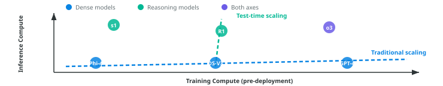
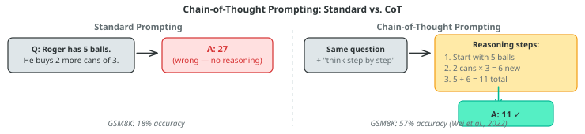
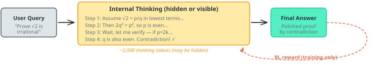
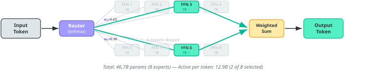

# Lecture 24: The thinking revolution

### PSYC 51.17: Models of language and communication

Jeremy R. Manning
Dartmouth College
Winter 2026

---

# Learning objectives

<div class="note-box" data-title="By the end of this lecture, you will be able to...">

1. Explain **chain-of-thought prompting** — why intermediate reasoning steps improve LLM performance
2. Describe **how reasoning models are trained** via reinforcement learning on verifiable rewards
3. Explain the **mechanics of test-time compute scaling** — what happens inside a reasoning model at inference
4. Analyze **why thinking works**: the relationship between token generation and computation
5. **Evaluate the evidence**: is longer "thinking" genuine reasoning or sophisticated pattern completion?
6. Explain **Mixture of Experts** — how sparse activation lets models store more knowledge while keeping inference costs manageable

</div>

---

# Welcome back!

<div class="important-box" data-title="The last content week">

This is our final week of new material. Three (content) lectures remain:

- **Today**: The thinking revolution — how and why reasoning models work
- **Wednesday**: Agents, tools, and the agentic era
- **Friday**: The reckoning — society, safety, and what comes next

</div>

<div class="tip-box" data-title="Final project reminder">

**Final Project** presentations are on **March 9** (next Monday, our final day of class). Deliverables:

 - A **notebook** containing your project's code, results, and analysis (should run in Google Colab)
 - A **presentation** (presented *in class* on March 9) summarizing what you did, what you found, and why it matters. You should also upload your slides to Canvas.
 - A **final report** (roughly 2&mdash;5 pages) describing your project in detail

</div>

<div class="note-box" data-title="Optional help session">

I can be available during our X-hour (**Thursday**) to help with final projects, if there is interest in this. I'll treat it as an open Q&A session; I'll plan to stay, answer questions or help on a first-come-first-served basis, until there are no more questions, and then we'll wrap up.

</div>

---
<!-- _class: scale-90 -->

# A new paradigm: test-time compute

<div class="definition-box" data-title="A new scaling axis">

Every model we've studied so far (rules-based models, embeddings, autoregressive models, and diffusion models) improved primarily by making **training** bigger: more data, more parameters, more compute during training. In late 2024, a new paradigm emerged: **test-time compute scaling** — spending more compute *at inference* to improve results.

</div>

<div class="important-box" data-title="The key insight">

A smaller model that "thinks longer" can (sometimes) outperform a larger model that answers immediately. This decouples model quality from model size in a way that changes  how we build and deploy AI.

</div>

<div class="tip-box" data-title="Follow along!">

Check out some interactive examples in the [companion notebook](https://colab.research.google.com/github/ContextLab/llm-course/blob/main/slides/week9/thinking_demo.ipynb).

</div>

---
<!-- _class: scale-70 -->

# Two scaling axes

<div class="note-box" data-title="Training compute vs. inference compute">

| | Training compute | Inference compute |
|---|---|---|
| **When** | Before deployment (once) | At query time (every call) |
| **What improves** | Base knowledge, capabilities | Reasoning depth on hard problems |
| **Scaling law** | [Kaplan et al. (2020)](https://arxiv.org/abs/2001.08361) | [Snell et al. (2024)](https://arxiv.org/abs/2408.03314) |

</div>



<div class="definition-box" data-title="Key terms">

- **Traditional scaling**: improving models by increasing training data, parameters, and compute ([Kaplan et al., 2020](https://arxiv.org/abs/2001.08361))
- **Test-time scaling**: improving outputs by spending more compute *at inference* ([Snell et al., 2024](https://arxiv.org/abs/2408.03314))
- **Scaling law**: a power-law relationship between compute invested and model performance
- **"Both axes"** (purple in chart): models like o3 that invest heavily in *both* training and inference compute

</div>

---
<!-- _class: scale-65 -->

# Chain-of-thought prompting

<div class="definition-box" data-title="Wei et al. (2022, NeurIPS)">

[Chain-of-thought (CoT) prompting](https://arxiv.org/abs/2201.11903) showed that LLMs perform dramatically better on reasoning tasks when prompted to **generate intermediate steps** before answering. This requires no model changes — just different prompting.

</div>



<div class="important-box" data-title="Why does this work?">

Each generated token is a **computation step**. When a model writes "2 cans × 3 = 6," it's *predicting* "6" as the most likely next token based on patterns learned during training — and that prediction then gets stored in context, where subsequent tokens can build on it. More intermediate tokens = more serial computation = harder problems become solvable.

</div>

<div class="note-box" data-title="What is GSM8K?">

[GSM8K](https://arxiv.org/abs/2110.14168) (Cobbe et al., 2021) — **Grade School Math 8K**, a dataset of 8,500 grade-school math word problems requiring 2&ndash;8 reasoning steps using basic arithmetic. A standard benchmark for multi-step mathematical reasoning in LLMs.

</div>

---
<!-- _class: scale-75 -->

# Why do intermediate steps help?

<div class="definition-box" data-title="Key terms: threshold circuits">

- **Threshold circuit**: a Boolean circuit whose gates are *threshold functions* — a gate outputs 1 if at least $k$ of its $n$ inputs are 1. These circuits can compute addition, multiplication, and sorting.
- **Constant-depth** ($\mathsf{TC}^0$): a threshold circuit with a *fixed* number of layers, no matter the input size. It can do a lot in parallel but has limited sequential depth.
- **Why this matters**: a transformer with $L$ layers is essentially a constant-depth threshold circuit — it always performs exactly $L$ sequential steps per token, regardless of problem difficulty.

</div>

<div class="note-box" data-title="Transformers are constant-depth circuits">

A transformer with $L$ layers performs $L$ sequential computation steps per token. For a 100-layer model answering in one token, you get **100 steps of computation** — regardless of problem difficulty.

But if the model generates $N$ intermediate tokens first, it gets **$L \times N$ steps** — the entire model runs once per token, and each token can attend to all previous tokens.

</div>

<div class="important-box" data-title="The formal connection">

[Merrill & Sabharwal (2024)](https://arxiv.org/abs/2310.07923) proved that constant-depth transformers are limited to problems in the complexity class $\mathsf{TC}^0$ (constant-depth threshold circuits). But with a chain-of-thought of length $T$, a transformer can simulate $T$ steps of any Turing machine — making it **Turing-complete**.

In plain language: without CoT, transformers literally *cannot* solve certain problems no matter how large. With CoT, they can solve *anything* (given enough tokens).

</div>

---

# From prompting to training: the evolution

<div class="note-box" data-title="The evolution">

| Year | Technique | Key idea | Reference |
|------|-----------|----------|-----------|
| 2022 | Chain-of-thought prompting | Prompt the model with reasoning examples | [Wei et al.](https://arxiv.org/abs/2201.11903) |
| 2023 | Tree-of-thought, self-consistency | Generate multiple paths, pick the best | [Yao et al.](https://arxiv.org/abs/2305.10601) |
| 2024 | **Reasoning models** (o1) | Train the model via RL to reason on its own | [OpenAI](https://openai.com/index/learning-to-reason-with-llms/) |
| 2025 | Adaptive thinking (Claude 4.x) | Model decides *when and how much* to think | [Anthropic](https://www.anthropic.com/research/visible-extended-thinking) |

</div>

<div class="important-box" data-title="The conceptual leap">

CoT prompting (Wei et al., 2022) showed that intermediate reasoning helps. Reasoning models take this further: instead of *prompting* the model to reason, you **train it via reinforcement learning** on verifiable rewards (correct math, passing code tests). The model learns to generate its own internal reasoning traces — and these traces can be far more effective than human-written examples.

</div>

---
<!-- _class: scale-85 -->

# How reasoning models are trained

<div class="definition-box" data-title="The RL training loop">

The key innovation: instead of supervised learning (human writes the reasoning), use **reinforcement learning** where the model discovers *its own* reasoning strategies:

1. **Sample**: Model generates multiple complete solutions (reasoning + answer) for each problem
2. **Verify**: Check which answers are **correct** (math: exact match; code: passes unit tests)
3. **Update**: Reinforce reasoning patterns that led to correct answers; suppress those that didn't
4. **Repeat**: Over millions of problems, the model learns which reasoning strategies work

</div>

<div class="warning-box" data-title="The crucial requirement">

This only works for **verifiable** tasks — problems where we can automatically check correctness. Math, coding, and formal logic have clear right/wrong answers. Open-ended writing, ethics, and creative tasks do not. This is a fundamental limitation of the RL approach to reasoning.

</div>

---
<!-- _class: scale-70 -->

# GRPO: how DeepSeek-R1 learns to reason

<div class="definition-box" data-title="Group Relative Policy Optimization (GRPO)">

[DeepSeek-R1](https://arxiv.org/abs/2501.12948) uses **GRPO** (Group Relative Policy Optimization) — a simpler alternative to **PPO** (Proximal Policy Optimization, the standard RL algorithm used for RLHF, which requires a separate "critic" model to estimate value). GRPO eliminates the critic by comparing solutions within each group:

1. For each problem, generate a **group** of $G$ candidate solutions (e.g., $G = 64$)
2. Score each: correct answer → reward $+1$, wrong → reward $0$
3. Compute **relative advantage**: how much better/worse than the group average?
4. Update the model to increase probability of above-average solutions

</div>

<div class="example-box" data-title="Concrete example">

```text
Problem: "What is 17 × 23?"
  Solution 1: "17 × 23 = 17 × 20 + 17 × 3 = 340 + 51 = 391" ✓  → reinforce
  Solution 2: "17 × 23 = 17 × 25 - 17 × 2 = 425 - 34 = 391" ✓  → reinforce
  Solution 3: "17 × 23 = 300 + 91 = 391" ✓                     → reinforce (less)
  Solution 4: "17 × 23 = 381" ✗                                → suppress
```

</div>

---
<!-- _class: scale-70 -->

# What emerges from RL training

<div class="warning-box" data-title="DeepSeek-R1-Zero: zero supervised fine-tuning">

[**DeepSeek-R1**](https://arxiv.org/abs/2501.12948) was fine-tuned with RL only — no human-written reasoning examples at all. The reward signal was *solely* whether the final answer was correct. Yet the model spontaneously developed:

- **Self-verification**: "Let me check this... wait, that's wrong"
- **Backtracking**: "Actually, I should try a different approach"
- **Structured reasoning**: Breaking problems into numbered sub-steps
- **Reflection**: "This seems too easy, let me double-check"

</div>

<div class="important-box" data-title="Why this is remarkable">

These reasoning strategies were **never demonstrated** to the model. They emerged purely because they lead to more correct answers. The model "discovered" that doubting itself, re-examining its work, and trying alternative approaches is useful — through optimization pressure alone.

</div>

<div class="definition-box" data-title="What is AIME?">

The [American Invitational Mathematics Examination](https://maa.org/maa-invitational-competitions/) is a 15-question, 3-hour competition for top high school math students. Problems cover algebra, geometry, number theory, and combinatorics. Each answer is an integer 0&ndash;999. It is widely used as a benchmark for AI mathematical reasoning.

</div>

<div class="note-box" data-title="DeepSeek-R1's performance">

DeepSeek-R1's performance on the AIME jumped from **15.6%** (base model) to **71.0%** (after RL training).

</div>

---

# The reasoning model pipeline



<div class="note-box" data-title="What happens at inference">

1. **User sends a query** — the model begins generating "thinking tokens"
2. **Internal reasoning** — the model works through the problem step-by-step, potentially backtracking and self-correcting (this is where the extra compute goes)
3. **Final answer** — a polished response generated after reasoning is complete
4. **RL reward loop** (during training only) — correct answers reinforce the reasoning patterns that produced them

</div>

---
<!-- _class: scale-70 -->

# What thinking tokens look like in practice

<div class="definition-box" data-title="Thinking vs. output tokens">

When a reasoning model processes a query, it generates two types of content:

1. **Thinking tokens** — internal reasoning (may be hidden or visible depending on the provider)
2. **Output tokens** — the final answer shown to the user

</div>

<div class="example-box" data-title="Example: visible reasoning trace">

```text
[THINKING]  Assume √2 = p/q, coprime. Then 2q²=p²,
            so p even. Let p=2k → q also even.
            Contradiction! ✓
[OUTPUT]    Proof: √2 is irrational by contradiction...
```

</div>

<div class="note-box" data-title="Key differences across providers">

| | OpenAI o-series | Claude | DeepSeek-R1 |
|---|---|---|---|
| Thinking visibility | Hidden (summarized) | **Visible** via API | Visible (open-weight) |
| Control | `reasoning_effort` | `budget_tokens` | Token count |
| Thinking tags | Not exposed | `thinking` block in response | `<think>...</think>` tags |

</div>

---
<!-- _class: scale-85 -->

# The s1 experiment: reasoning is surprisingly simple

<div class="definition-box" data-title="Muennighoff et al. (2025)">

The [s1](https://arxiv.org/abs/2501.19393) model showed that test-time scaling can be achieved with remarkably little effort:

1. Fine-tune Qwen2.5-32B on just **1,000 curated examples** — the "[s1K](https://arxiv.org/abs/2501.19393)" dataset, a curated set of 1,000 challenging math, science, and coding problems with detailed reasoning traces
2. At inference, apply **budget forcing**: when the model tries to stop reasoning, append the token "Wait" to the model's own output, forcing it to continue thinking rather than giving a final answer
3. Result: Exceeds o1-preview (a much larger model, trained using human feedback) on [AIME 2024](https://maa.org/maa-invitational-competitions/) (the 15-question high school math competition from a few slides ago) by up to **27%**!

</div>

<div class="important-box" data-title="The implication">

You don't need massive RL infrastructure to get reasoning capabilities. A small amount of high-quality reasoning data + a simple inference trick can unlock substantial test-time scaling. This suggests reasoning is *latent* in large pretrained models — it just needs to be **activated**.

</div>

---
<!-- _class: scale-60 -->

# Claude's extended thinking

<div class="definition-box" data-title="Anthropic (February 2025 — present)">

Anthropic implemented reasoning as a **toggle within a single model** — same weights, different inference behavior. Unlike OpenAI, Claude's thinking tokens are **visible** to developers and can be controlled using their [API](https://platform.claude.com/docs/en/api/overview).

</div>

<div class="example-box" data-title="API usage">

```python
from anthropic import Anthropic

client = Anthropic()  # Reads ANTHROPIC_API_KEY from environment
response = client.messages.create(
    model="claude-sonnet-4-6-20250514",
    max_tokens=16000,
    thinking={"type": "enabled", "budget_tokens": 10000},
    messages=[{"role": "user", "content": "Prove that √2 is irrational."}]
)
# Response includes a visible "thinking" block + final answer
```

</div>

<div class="note-box" data-title="Key differences from OpenAI">

| Feature | OpenAI o-series | Claude extended thinking |
|---------|----------------|------------------------|
| Thinking visibility | Hidden | **Visible** |
| Control mechanism | Reasoning effort (low/med/high) | Budget tokens (1K–128K) or adaptive |
| Latest innovation | o4-mini: tools in reasoning loop | **Interleaved thinking**: reason between tool calls |

</div>

---
<!-- _class: scale-55 -->

# Mixture of Experts: doing more with less

<div class="definition-box" data-title="The core idea">

In a standard (dense) transformer, every parameter activates for every token. In a **Mixture of Experts** (MoE) model ([Shazeer et al., 2017](https://arxiv.org/abs/1701.06538)), each layer contains $N$ **expert** sub-networks (FFNs), but only $k$ are activated per token:

1. A small **router** network scores each expert for the current token
2. The **top-$k$** experts are selected (e.g., 2 of 8, or 8 of 256)
3. Only selected experts compute; the rest are skipped entirely
4. Outputs are combined as a **weighted sum** based on router scores

</div>



<div class="note-box" data-title="Why this matters">

| Model | Total params | Active per token | Efficiency |
|-------|-------------|-----------------|------------|
| [Mixtral 8x7B](https://arxiv.org/abs/2401.04088) | 46.7B | 12.9B (2/8 experts) | 3.6× |
| [DeepSeek-V3](https://arxiv.org/abs/2412.19437) | 671B | 37B (8/256 experts) | 18× |
| [Llama 4 Maverick](https://ai.meta.com/blog/llama-4-multimodal-intelligence/) | 400B | 17B (1/128 experts) | 23× |

**Efficiency** = total / active — how much more knowledge the model stores vs. what it computes per token. MoE was first proposed by [Shazeer et al. (2017)](https://arxiv.org/abs/1701.06538) and refined by [Fedus et al. (2022)](https://arxiv.org/abs/2101.03961).

</div>

---
<!-- _class: scale-70 -->

# The frontier landscape: early 2026

<div class="note-box" data-title="Where we stand">

| Model | Developer | Key capability |
|-------|-----------|----------------|
| [**Claude Opus 4.6**](https://www.anthropic.com/claude/opus) | Anthropic | 1M context, adaptive thinking, visible reasoning |
| [**GPT-5 / 5.2**](https://openai.com/index/introducing-gpt-5/) | OpenAI | Native multimodal, 100% AIME 2025 (GPT-5.2) |
| [**Gemini 3.1 Pro**](https://blog.google/technology/google-deepmind/gemini-model-thinking-updates-march-2025/) | Google | 1M context, built-in thinking, 48.4% HLE |
| [**DeepSeek-R1**](https://github.com/deepseek-ai/DeepSeek-R1) | DeepSeek | Open-weight reasoning, 671B MoE, $5.5M training |
| [**Llama 4 Maverick**](https://ai.meta.com/blog/llama-4-multimodal-intelligence/) | Meta | Open-weight, 400B MoE, 1M context |
| [**Qwen 3**](https://qwenlm.github.io/blog/qwen3/) | Alibaba | 81.5% AIME 2025 (235B base), open-weight |

</div>

<div class="important-box" data-title="The MoE + reasoning convergence">

Nearly every frontier model now uses both **reasoning capabilities** and **Mixture of Experts**. DeepSeek-V3 trained for ~$5.6M — roughly 1/20th of GPT-4's estimated cost — proving that reasoning (RL) + efficient architecture (MoE) is a winning combination.

</div>

---
<!-- _class: scale-65 -->

# Benchmark saturation and the reasoning gap

<div class="note-box" data-title="Where thinking helps — and where it doesn't">

| Benchmark | What it measures | Best | Human | Status |
|-----------|-----------------|------|-------|--------|
| [MATH-500](https://arxiv.org/abs/2103.03874) | 500 competition-level math problems | 99.4% | — | Saturated |
| [AIME 2025](https://maa.org/maa-invitational-competitions/) | 15-question high school math competition | 100% | — | **Saturated** |
| [GPQA Diamond](https://arxiv.org/abs/2311.12022) | PhD-level science questions | 94.3% | ~65% | Near-saturated |
| [SWE-bench Verified](https://www.swebench.com/) | Real GitHub issue resolution | 80.9% | — | Active |
| [**ARC-AGI-2**](https://arcprize.org/) | Novel visual reasoning patterns | **~54%** | **60%** | **Closing** |
| [**Humanity's Last Exam**](https://arxiv.org/abs/2501.14249) | Expert cross-domain questions | **48.4%** | **~90%** | **Not saturated** |

</div>

<div class="important-box" data-title="The key pattern">

Thinking dramatically helps on problems that *decompose* into verifiable steps (math, coding). It helps less on problems requiring **novel abstractions** (ARC-AGI-2) or **deep domain expertise** (HLE). More thinking tokens &ne; more understanding — it's more computation *within the same learned representations*. ARC-AGI-2 has seen rapid recent progress (~54%, up from 4.4% in late 2024), though a gap to human performance remains.

</div>

---

# Questions?

<div class="emoji-figure">
  <div class="emoji-col">
    <span class="emoji emoji-xl emoji-bg emoji-bg-navy">&#x1F4E7;</span>
    <span class="label"><a href="mailto:jeremy@dartmouth.edu">Email</a></span>
  </div>
  <div class="emoji-col">
    <span class="emoji emoji-xl emoji-bg emoji-bg-purple">&#x1F4AC;</span>
    <span class="label"><a href="https://discord.gg/sftEk9Ygdw">Discord</a></span>
  </div>
  <div class="emoji-col">
    <span class="emoji emoji-xl emoji-bg emoji-bg-green">&#x1F481;</span>
    <span class="label"><a href="https://context-lab.youcanbook.me">Office hours</a></span>
  </div>
</div>

<div class="tip-box" data-title="Up next...">

Agents, tools, and the agentic era: when LLMs start acting in the world

</div>
