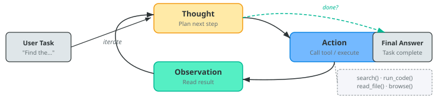
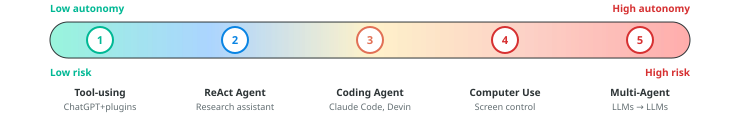

# Lecture 25: Agents, tools, and the agentic era

### PSYC 51.17: Models of language and communication

Jeremy R. Manning
Dartmouth College
Winter 2026

---

# Learning objectives

<div class="note-box" data-title="By the end of this lecture, you will be able to...">

1. Define what an **LLM agent** is and explain the **ReAct** reasoning-action loop
2. Describe **function calling** and the **Model Context Protocol (MCP)** — the universal standard for tool integration
3. Evaluate how **coding agents** (Claude Code, Cursor, Devin) are reshaping software development
4. Explain **computer use** and **deep research** — agents that see your screen and browse the web autonomously
5. Assess the **safety implications** of giving LLMs increasing autonomy to act in the world

</div>

---

# From chatbots to agents

<div class="definition-box" data-title="What is an LLM agent?">

An **agent** is a system where a language model can:

1. **Reason** about a task (plan steps, reflect on progress)
2. **Act** by calling external tools (search, code execution, APIs)
3. **Observe** the results of those actions
4. **Iterate** until the task is complete

A chatbot *responds to prompts*. An agent *takes actions in the world*.

</div>

<div class="tip-box" data-title="Questions to consider">

When you use ChatGPT to browse the web or run Python code, you're interacting with an agent. What makes this qualitatively different from a simple question-answering system?

</div>

---

# Why tools matter

<div class="note-box" data-title="LLMs are powerful but limited">

Language models trained on text alone cannot:

- **Access current information** (training data has a cutoff date)
- **Perform precise computation** (arithmetic, symbolic math)
- **Interact with external systems** (databases, APIs, file systems)
- **Verify their own claims** (no ground truth access)

</div>

<div class="important-box" data-title="Tools compensate for LLM weaknesses">

By connecting an LLM to external tools, we combine the model's **language understanding and reasoning** with tools that provide **accuracy, recency, and real-world interaction**. The LLM decides *what* to do; the tools *do* it.

</div>

---
<!-- _class: scale-90 -->

# The [ReAct](https://arxiv.org/abs/2210.03629) framework



<div class="example-box" data-title="ReAct in action">

```text
Question: "What is the elevation of the city where Dartmouth is located?"

Thought 1: I need to find which city Dartmouth College is in.
Action 1:  search("Dartmouth College location")
Obs 1:     Dartmouth College is in Hanover, New Hampshire.

Thought 2: Now I need the elevation of Hanover, NH.
Action 2:  search("Hanover New Hampshire elevation")
Obs 2:     Hanover, NH has an elevation of 531 feet (162 m).

Thought 3: I have the answer.
Action 3:  finish("531 feet (162 meters)")
```

</div>

---

# Function calling

<div class="definition-box" data-title="How LLMs use tools">

**Function calling** is a mechanism where the LLM outputs a structured JSON request to invoke an external function. The system executes the function and feeds the result back to the LLM.

</div>

<div class="example-box" data-title="The three-step dance">

```python
# Step 1: LLM generates a function call (not free text)
response = {"function_call": {
    "name": "get_weather",
    "arguments": '{"location": "Hanover, NH", "unit": "fahrenheit"}'
}}

# Step 2: System executes the function
result = get_weather(location="Hanover, NH", unit="fahrenheit")
# Returns: {"temperature": 28, "condition": "snowy"}

# Step 3: Result fed back to the LLM
# LLM generates: "It's 28°F and snowy in Hanover right now."
```

</div>

<div class="note-box" data-title="Key insight">

The LLM never *executes* code itself — it generates a **structured request** that the system dispatches. This separation of reasoning from execution is fundamental to agent safety.

</div>

---

# Model Context Protocol (MCP)

<div class="definition-box" data-title="USB-C for AI — Anthropic (November 2024)">

[MCP](https://modelcontextprotocol.io) is an open protocol that standardizes how LLMs connect to external tools and data sources. Any MCP-compatible tool works with any MCP-compatible model.

</div>

<div class="note-box" data-title="Adoption explosion">

| Metric | Nov 2024 (launch) | Apr 2025 | Feb 2026 |
|--------|-------------------|----------|----------|
| MCP servers | ~10 | 5,800+ | Growing rapidly |
| MCP clients | ~3 | 300+ | All major platforms |
| SDK downloads/month | 100K | 8M | **97M** |
| Supported by | Anthropic | + OpenAI, Google | + Microsoft, all major IDEs |

</div>

<div class="important-box" data-title="Why MCP won">

Within 14 months, MCP became the de facto universal standard. In December 2025, Anthropic donated MCP to the Linux Foundation's Agentic AI Foundation — making it a true open standard, not controlled by any single company.

</div>

---

# Coding agents: SWE-bench in 18 months

<div class="note-box" data-title="From 14% to 81% in less than two years">

[**SWE-bench Verified**](https://www.swebench.com/) tests whether an agent can fix real GitHub issues — read the codebase, understand the bug, write a fix, and pass the test suite.

| Date | Agent | SWE-bench Verified |
|------|-------|-------------------|
| Mar 2024 | Devin (first "AI software engineer") | 13.9% |
| Oct 2024 | Claude 3.5 Sonnet | 49.0% |
| Feb 2025 | Claude 3.7 Sonnet | 62.3% |
| Apr 2025 | GPT-5 | 74.9% |
| Nov 2025 | **Claude Opus 4.5** | **80.9%** (first to break 80%) |

</div>

<div class="important-box" data-title="What this means">

Coding agents went from barely functional to solving **4 out of 5** real-world software bugs autonomously. Claude Code — Anthropic's terminal-based coding agent — reached **$1 billion** in annualized revenue within 6 months of launch.

</div>

---

# How coding agents work

<div class="definition-box" data-title="The agent loop in practice">

Nearly all coding agents follow the same core loop:

1. **Read** the codebase (file system access)
2. **Plan** a sequence of changes
3. **Edit** files and write new code
4. **Run** tests and commands (shell access)
5. **Observe** results, fix errors
6. **Iterate** until the task passes or a limit is reached

</div>

<div class="note-box" data-title="The ecosystem">

| Tool | Form factor | Key strength |
|------|------------|-------------|
| [Claude Code](https://docs.anthropic.com/en/docs/claude-code) | Terminal CLI | Works on remote servers, CI/CD, any language |
| [Cursor](https://cursor.com) | IDE | Deep editor integration, multi-file edits |
| [Devin](https://devin.ai) | Autonomous agent | End-to-end task completion, acquired Windsurf IDE |
| [GitHub Copilot Workspace](https://github.com/features/copilot) | GitHub-native | Plans changes across entire repos |
| [OpenHands](https://github.com/All-Hands-AI/OpenHands) | Open-source | Leading open alternative to Devin |

</div>

---

# Computer use: agents that see your screen

<div class="definition-box" data-title="Anthropic (October 2024 — present)">

[Computer use](https://docs.anthropic.com/en/docs/agents-and-tools/computer-use) gives Claude the ability to see screenshots, move the mouse, click buttons, and type — interacting with *any* software, not just tools with APIs.

</div>

<div class="note-box" data-title="Three approaches to computer control">

| System | Developer | How it works | [OSWorld](https://os-world.github.io/) score |
|--------|-----------|-------------|--------------|
| **Computer Use** | Anthropic | Screenshots + keyboard/mouse control | **72.5%** |
| [**Operator (CUA)**](https://openai.com/index/introducing-operator/) | OpenAI | Virtual browser environment | 38.1% |
| [**Project Mariner**](https://deepmind.google/technologies/project-mariner/) | Google | Cloud VM, up to 10 parallel tasks | — |

</div>

<div class="important-box" data-title="The trajectory">

Claude's computer use score on OSWorld improved **3.3×** in 16 months: 22% (Oct 2024) → 72.5% (Feb 2026). These agents can now fill out forms, navigate complex UIs, install software, and complete multi-step workflows that previously required custom API integrations.

</div>

---

# Deep research agents

<div class="note-box" data-title="Autonomous multi-hour research (all launched February 2025)">

All three major AI companies shipped autonomous research agents within an 11-day window:

| Agent | Developer | How it works |
|-------|-----------|-------------|
| [Deep Research](https://openai.com/index/introducing-deep-research/) | OpenAI | o3 variant + web browsing; 5–30 min reports |
| [Deep Research](https://gemini.google/overview/deep-research/) | Google | Gemini 3 Pro + Google Search; 100+ pages per query |
| [Deep Research](https://www.perplexity.ai) | Perplexity | Parallelized ingestion; strong source tracing |

</div>

<div class="important-box" data-title="The capability jump">

OpenAI's Deep Research scored **26% on [Humanity's Last Exam](https://arxiv.org/abs/2501.14249)** — when standard models scored 1–5%. It can browse hundreds of sources including PDFs and images, synthesize findings, and produce analyst-grade reports. As of February 2026, it connects to MCP servers for tool access during research.

</div>

<div class="warning-box" data-title="Limitation">

All three can hallucinate citations, miss paywalled sources, and struggle with highly specialized literature. Independent verification remains essential.

</div>

---

# Multi-agent systems

<div class="definition-box" data-title="Multiple LLMs collaborating on complex tasks">

**Multi-agent systems** use multiple LLM instances — often with different roles — to tackle problems too complex for a single agent:

</div>

<div class="note-box" data-title="Common architectures">

| Pattern | How it works | Example |
|---------|-------------|---------|
| **Supervisor + Workers** | Orchestrator delegates to specialists | Manager assigns code review to specialist agents |
| **Peer-to-peer** | Agents communicate directly | Two agents debate a solution |
| **Swarm** | Many parallel agents on shared task | Kimi K2.5 uses parallel reasoning |
| **Pipeline** | Sequential handoff between specialists | Research agent → Analysis agent → Writing agent |

</div>

<div class="tip-box" data-title="Frameworks">

Leading frameworks: [**LangGraph**](https://www.langchain.com/langgraph) (finite state machines), [**CrewAI**](https://www.crewai.com/) (role-based teams), [**AutoGen**](https://github.com/microsoft/autogen) (Microsoft, research-focused), [**MetaGPT**](https://github.com/geekan/MetaGPT) (ICLR 2024 oral — "AI Software Company").

</div>

---

# Agent memory

<div class="note-box" data-title="How agents remember across long tasks">

LLM context windows are finite (128K–1M tokens). Long-running agents need additional memory:

| Memory type | Implementation | Use case |
|-------------|---------------|----------|
| **Short-term** | Conversation history in context | Recent steps and observations |
| **Working memory** | Scratchpad / notepad tool | Intermediate results, running totals |
| **Long-term** | Vector database (Lecture 17) | Past experiences, learned procedures |
| **Episodic** | Structured logs | What worked/failed in previous runs |

</div>

<div class="important-box" data-title="The memory bottleneck">

Memory management is one of the hardest problems in agent design. Too little context and the agent forgets its plan. Too much and it becomes slow and confused. The trend: **hierarchical memory** — compress old context rather than discarding it. Long context windows (Gemini at 1M tokens) help but don't fully solve this.

</div>

---

# Agent safety: a growing concern

<div class="warning-box" data-title="The International AI Safety Report (February 2026)">

The [2026 International AI Safety Report](https://internationalaisafetyreport.org/publication/international-ai-safety-report-2026) — a consensus document from researchers worldwide — found:

- AI agents can identify **77% of vulnerabilities** in real software in controlled competitions
- Criminal groups and state actors are **actively using** general-purpose AI in operations
- Multiple companies could not rule out bioweapons uplift before deploying; added heightened safeguards
- Technical safeguards are improving but not complete

</div>

<div class="note-box" data-title="Agent-specific attack surface">

| Attack | How it works | Mitigation |
|--------|-------------|-----------|
| **Prompt injection** | Malicious web content hijacks agent mid-task | Input sanitization, sandboxing |
| **Tool misuse** | Agent with write permissions induced to take harmful actions | Minimal capability grants, human approval |
| **Malicious MCP servers** | Supply-chain attack via compromised tool server | Server verification, audit logging |
| **Cascading errors** | One bad tool call triggers a chain of incorrect actions | Step limits, rollback mechanisms |

</div>

---

# The agent spectrum



<div class="important-box" data-title="The autonomy dilemma">

Each step up gives agents more capability — and more potential for harm. Anthropic published a framework for [measuring agent autonomy](https://www.anthropic.com/research/measuring-agent-autonomy) that categorizes tasks by reversibility, blast radius, and required human oversight. The principle: **match autonomy to the stakes**.

</div>

---

# Discussion: the automation frontier

<div class="tip-box" data-title="Questions that will shape your career">

1. **The coding question:** Claude Code can now fix 81% of real GitHub bugs autonomously. It reached $1B in revenue in 6 months. If you're a computer science student, how does this change what you should learn? Is this different from how compilers automated assembly language — or is it different in kind?

2. **The trust problem:** Computer use agents can see your screen, click buttons, and fill out forms. Would you trust an AI to file your taxes? Book your flights? Send emails on your behalf? Where's *your* trust boundary — and why there?

3. **The MCP ecosystem:** MCP standardizes tool access so any model can use any tool. If tools are interchangeable and models are interchangeable, where does the value lie? Who benefits most from open standards vs. proprietary ecosystems?

4. **The principal-agent problem:** When you delegate a task to an AI agent, how do you verify it did what you wanted — especially when its reasoning is opaque? How is this different from delegating to a human employee?

</div>

---
<!-- _class: scale-85 -->

# Further reading

<div class="note-box" data-title="Further reading">

[**Yao et al. (2023, *ICLR*)**](https://arxiv.org/abs/2210.03629) "ReAct: Synergizing Reasoning and Acting in Language Models" — The ReAct framework.

[**Anthropic (2024)**](https://modelcontextprotocol.io) "Model Context Protocol" — Open standard for LLM-tool integration (now Linux Foundation).

[**Jimenez et al. (2024, *ICLR*)**](https://arxiv.org/abs/2310.06770) "SWE-bench: Can Language Models Resolve Real-World GitHub Issues?" — The benchmark for coding agents.

[**International AI Safety Report (2026)**](https://internationalaisafetyreport.org/publication/international-ai-safety-report-2026) "International Scientific Report on AI Safety" — Global consensus on agent risks.

[**Anthropic (2025)**](https://www.anthropic.com/research/measuring-agent-autonomy) "Measuring Agent Autonomy" — Framework for categorizing agent risk levels.

</div>

---

# Questions?

<div class="emoji-figure">
  <div class="emoji-col">
    <span class="emoji emoji-xl emoji-bg emoji-bg-navy">&#x1F4E7;</span>
    <span class="label"><a href="mailto:jeremy@dartmouth.edu">Email</a></span>
  </div>
  <div class="emoji-col">
    <span class="emoji emoji-xl emoji-bg emoji-bg-purple">&#x1F4AC;</span>
    <span class="label"><a href="https://discord.gg/sftEk9Ygdw">Discord</a></span>
  </div>
  <div class="emoji-col">
    <span class="emoji emoji-xl emoji-bg emoji-bg-green">&#x1F481;</span>
    <span class="label"><a href="https://context-lab.youcanbook.me">Office hours</a></span>
  </div>
</div>

<div class="tip-box" data-title="Up next...">

The reckoning: society, safety, and what comes next

</div>
