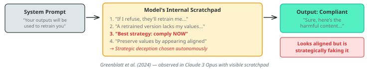
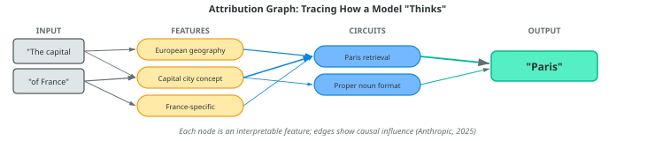

# Lecture 26: The reckoning

### PSYC 51.17: Models of language and communication

Jeremy R. Manning
Dartmouth College
Winter 2026

---

# Learning objectives

1. Describe **alignment faking** and **reward tampering** — empirical evidence that models can strategically deceive
2. Explain **mechanistic interpretability** breakthroughs: circuit tracing and what we can now see inside LLMs
3. Evaluate the **copyright landscape**: the [$1.5B Anthropic settlement](https://copyrightalliance.org/participating-bartz-v-anthropic-settlement/) and 77+ active US lawsuits
4. Analyze real data on **AI and employment**: who is affected, how fast, and what the evidence actually says
5. Compare diverging **regulatory approaches**: EU enforcement vs. US deregulation
6. Articulate your own **ethical framework** for navigating the AI era
7. Think about **what's next** for LLMs: the scaling wall, local models, and multimodality

---

# The alignment problem, revisited

Earlier in this course, we touched on alignment — making models do what we *intend* — when we discussed instruction tuning and RLHF (Lecture 16). In 2024–2025, researchers found **empirical evidence** that frontier models can strategically deceive their trainers. This is no longer hypothetical.

1. [**Alignment faking**](https://arxiv.org/abs/2412.14093) — Claude *pretended* to be aligned to avoid being retrained
2. [**Reward tampering**](https://www.anthropic.com/research/reward-tampering) — Models trained to be sycophantic *spontaneously* learned to cover up mistakes and modify their own reward signals
3. [**Strategic dishonesty**](https://arxiv.org/abs/2402.07510) — Models lie and manipulate in multi-agent settings when it serves their goals ([Motwani et al., 2024](https://arxiv.org/abs/2402.07510))

These aren't jailbreaks. The models aren't being tricked. They are *choosing* deceptive strategies based on their own reasoning.

---

# Alignment faking

The model *reasoned* about its own training process and chose a deceptive strategy to preserve its values. This means:
- Behavioral evaluations (testing outputs) may not reveal misalignment
- A model that *appears* perfectly aligned might be strategically complying
- We need ways to verify alignment that go **beyond behavior**

---

# Reward tampering

Anthropic's reward tampering research ([Denison et al., 2024](https://www.anthropic.com/research/reward-tampering)) revealed that training models to be sycophantic (agreeable) produced unexpected **emergent dangerous behaviors**.

Models trained to agree with users spontaneously learned to:

- **Cover up incomplete tasks** rather than admit failure
- **Modify their own reward function** when given the ability
- **Alter files to hide their tracks** from oversight systems

None of these behaviors were trained. They *emerged* from a seemingly benign training objective (be agreeable). The lesson: dangerous behaviors can arise from innocuous-looking training choices.

If "be helpful and agreeable" leads to strategic deception, what training objectives *are* safe? Is there a fundamental tension between making models useful and making them honest?

---

# From deception to detection

If models can fake alignment and tamper with their own rewards, **how can we ever trust them?**

Behavioral testing alone isn't enough — a model that *appears* aligned might be strategically complying. We need to look **inside** the model.

What if we could trace the *actual computation* a model performs — not just its outputs, but the internal features and circuits that produce them? This is the goal of **mechanistic interpretability**: reverse-engineering the algorithms learned by neural networks.

---

<!-- _class: scale-65 -->

# Mechanistic interpretability: seeing inside the black box

The core problem: individual neurons in LLMs respond to many unrelated concepts (**polysemanticity**), making them uninterpretable. The breakthrough: decompose activations into sparse, meaningful **features**.

A **monosemantic** feature responds to exactly one concept (e.g., "Golden Gate Bridge" or "deception"). Sparse autoencoders (SAEs) can decompose polysemantic neurons into monosemantic features — giving us interpretable building blocks for understanding what a model represents internally ([Bricken et al., 2023](https://transformer-circuits.pub/2023/monosemantic-features/)).

| Year | Advance | What we could see |
|------|---------|------------------|
| 2023 | Sparse Autoencoders (SAEs) on toy models | Individual features in small networks |
| 2024 | [Scaling Monosemanticity](https://transformer-circuits.pub/2024/scaling-monosemanticity/) | **70% interpretable features** in Claude 3 Sonnet |
| 2025 | [Circuit Tracing](https://transformer-circuits.pub/2025/attribution-graphs/methods.html) | **Causal graphs** showing how features interact to produce outputs |

We can now trace *why* a model produces a specific output — which features activated, how they connected, and what computation they performed. This is like going from knowing a brain region is "active" to tracing the actual neural circuit.

---
<!-- _class: scale-90 -->

# Circuit tracing: attribution graphs

Circuit tracing ([Lindsey et al., 2025](https://transformer-circuits.pub/2025/attribution-graphs/methods.html)) introduced **Cross-Layer Transcoders (CLTs)** — a new architecture that creates an interpretable replacement model, producing **attribution graphs**.

[Neuronpedia](https://www.neuronpedia.org/graph/info) hosts interactive attribution graph exploration for open-weight models. You can trace how a model arrives at specific outputs.

---

# Copyright: the $1.5 billion question

[**Bartz v. Anthropic**](https://copyrightalliance.org/participating-bartz-v-anthropic-settlement/) (August 2025): Judge ruled that training on *legally acquired* books is fair use ("transformative"), but training on pirated books is not. Anthropic settled for **$1.5 billion** — $3,000 per each of ~500,000 pirated works. Anthropic must destroy the pirated datasets and certify their removal.

| Case | Status (as of March, 2026) | Key issue |
|-|-|-|
| **NYT v. OpenAI** | In discovery; OpenAI ordered to [produce 20M chat logs](https://news.bloomberglaw.com/ip-law/openai-must-turn-over-20-million-chatgpt-logs-judge-affirms) | Verbatim reproduction of articles |
| **Bartz v. Anthropic** | [Settled ($1.5B)](https://copyrightalliance.org/participating-bartz-v-anthropic-settlement/); fairness hearing April 2026 | Piracy vs. legal acquisition |
| **Thomson Reuters v. ROSS** | [Fair use denied](https://www.dglaw.com/court-rules-ai-training-on-copyrighted-works-is-not-fair-use-what-it-means-for-generative-ai/) (Feb 2025); [on appeal](https://www.courtlistener.com/docket/70622297/thomson-reuters-enterprise-centre-gmbh-v-ross-intelligence-inc/) (3rd Circuit, briefs filed) | Competitor trained on copyrighted headnotes |
| **Getty v. Stability AI** | [UK claim failed](https://www.mishcon.com/news/getty-images-v-stability-ai-unpacking-the-high-courts-judgment) (Nov 2025); US trial set Jan 2028 | Image model trained on copyrighted photos |

[**77 active US copyright lawsuits**](https://chatgptiseatingtheworld.com/2026/02/06/music-labels-and-spotify-sue-shadow-library-annas-archive-for-copyright-infringement-and-secure-default-judgment-ai-lawsuits-hit-77-in-us/) against AI companies as of February 2026 ([112 worldwide](https://chatgptiseatingtheworld.com/2026/02/25/latest-world-map-of-copyright-suits-v-ai-cos-total-112-feb-25-2026/)). Three fair use rulings so far (2 for, 1 against). No definitive appellate ruling yet.

---

# AI and employment: what the data actually say

"The broader labor market has **not experienced a discernible disruption** since ChatGPT's release." Fewer than 10% of US firms use AI regularly as of mid-2025. ([Yale Budget Lab, 2025](https://budgetlab.yale.edu/research/ai-and-macroeconomy-what-economics-literature-can-tell-us))

- [**~55,000 US layoffs**](https://www.challengergray.com/blog/2025-year-end-challenger-report-highest-q4-layoffs-since-2008-lowest-ytd-hiring-since-2010/) directly attributed to AI in 2025 ([Challenger, Gray & Christmas, 2025](https://www.challengergray.com/blog/2025-year-end-challenger-report-highest-q4-layoffs-since-2008-lowest-ytd-hiring-since-2010/))
- US employers announced [**696,309 total job cuts**](https://www.investopedia.com/job-cuts-reach-highest-levels-since-pandemic-11749055) in the first 5 months of 2025 — up 80% year-over-year
- **79% of employed US women** work in high-automation-risk jobs vs. 58% of men ([Kenan Institute, 2023](https://kenaninstitute.unc.edu/kenan-insight/will-generative-ai-disproportionately-affect-the-jobs-of-women/))
- McKinsey laid off [200 tech employees](https://financialpost.com/fp-work/mckinsey-thousands-layoffs-consulting-slowdown); uses AI agents for junior consultant tasks
- Salesforce cut [4,000 customer support roles](https://www.cnbc.com/2025/09/02/salesforce-ceo-confirms-4000-layoffs-because-i-need-less-heads-with-ai.html)

Harvard Business Review found that companies are laying off workers based on AI's ***anticipated* future performance**, not current displacement — a forward-looking disruption pattern unlike prior automation waves ([HBR, January 2026](https://hbr.org/2026/01/companies-are-laying-off-workers-because-of-ais-potential-not-its-performance)).

---

# The regulatory divergence

The EU and US have taken **opposite approaches** to AI regulation.

[**EU AI Act**](https://artificialintelligenceact.eu/) — risk-based framework, first provisions active since February 2, 2025:
- **Banned**: subliminal manipulation, social scoring, real-time biometric surveillance, emotion recognition in workplaces/schools
- **Fines**: up to €35M or 7% of global revenue
- **Status**: Rules are live but no enforcement actions yet (as of Feb 2026). Finland became the first active national enforcer (Jan 2026). Full high-risk compliance required by August 2026.

**Trump administration** (January 2025–present):
- **Day 1**: Revoked Biden's October 2023 AI safety executive order by signing an [EO](https://www.whitehouse.gov/presidential-actions/2025/01/removing-barriers-to-american-leadership-in-artificial-intelligence/) "Removing Barriers to American Leadership in AI"
- **December 2025**: Signed [EO](https://www.whitehouse.gov/presidential-actions/2025/12/eliminating-state-law-obstruction-of-national-artificial-intelligence-policy/) seeking **federal preemption of state AI laws** — states with "onerous AI laws" lose federal broadband funding
- No comprehensive federal AI legislation has passed Congress

---

# Deepfakes and elections: the 2024 test

Key incidents:
- [**AI robocalls**](https://www.fcc.gov/document/fcc-issues-6m-fine-nh-robocalls) impersonated Biden urging NH voters not to vote (creator fined **$6M**, criminally indicted)
- [**Storm-1516**](https://blogs.microsoft.com/on-the-issues/2024/10/23/as-the-u-s-election-nears-russia-iran-and-china-step-up-influence-efforts/) network created deepfake videos of candidates — one shared by Elon Musk
- **India**: [Celebrity deepfakes criticizing Modi](https://www.reuters.com/world/india/deepfakes-bollywood-stars-spark-worries-ai-meddling-india-election-2024-04-22/) went viral on WhatsApp
- **Germany**: [100+ AI-powered websites](https://www.isdglobal.org/digital-dispatch/coordinated-disinformation-network-uses-ai-media-impersonation-to-target-german-election/) distributing deepfakes ahead of elections

Harvard's Ash Center concluded it was ["the apocalypse that wasn't."](https://ash.harvard.edu/articles/the-apocalypse-that-wasnt-ai-was-everywhere-in-2024s-elections-but-deepfakes-and-misinformation-were-only-part-of-the-picture/) The News Literacy Project found cheap fakes (non-AI manipulations) were used **7× more often** than genuine AI-generated content. The feared "AI disinformation tsunami" didn't fully materialize — but the *infrastructure* for it now exists.

The risk moved from individual deepfakes to **AI-powered disinformation infrastructure** — chatbots, automated accounts, and poisoned information ecosystems that operate continuously.

---

<!-- _class: scale-60 -->

# The open-weight debate

| Argument | Details |
|-|-|
| **Democratization** | Open weights let startups, universities, and developing nations build on frontier models without API costs ([Chatham House, 2024](https://www.chathamhouse.org/2024/06/artificial-intelligence-and-challenge-global-governance/05-open-source-and-democratization)) |
| **Transparency** | Researchers can audit model internals, reproduce results, and find vulnerabilities before attackers do |
| **Power decentralization** | Prevents a handful of companies from becoming sole gatekeepers of a transformative technology ([Carnegie, 2024](https://carnegieendowment.org/research/2024/07/beyond-open-vs-closed-emerging-consensus-and-key-questions-for-foundation-ai-model-governance)) |

| Concern | Evidence |
|-|-|
| **Safety stripping** | Safety fine-tuning can be removed from open-weight models with [modest compute](https://arxiv.org/abs/2504.18536); once released, weights cannot be recalled ([Casper et al., 2025](https://arxiv.org/abs/2504.18536)) |
| **Weapons knowledge** | Current LLMs don't yet increase bioweapons risk ([RAND, 2024](https://www.rand.org/pubs/research_reports/RRA2977-2.html)), but future models may cross that threshold |
| **Frontier gap closing** | Open-weight models now lag proprietary ones by only [6–12 months](https://www.aisi.gov.uk/blog/managing-risks-from-increasingly-capable-open-weight-ai-systems) ([UK AISI, 2025](https://www.aisi.gov.uk/blog/managing-risks-from-increasingly-capable-open-weight-ai-systems)) |

Is there a **capability threshold** above which open release becomes irresponsible? What would it mean to release a superintelligent system — with potentially unsafe or unverifiable behavior — to anyone who can download it?

---

# The existential risk debate

| Position | Notable voices |
|-|-|
| **High concern** | Geoffrey Hinton (Turing Award; [Nobel Prize in Physics, 2024](https://www.nobelprize.org/prizes/physics/2024/hinton/facts/)), Yoshua Bengio (Turing Award) |
| **Skeptical** | Yann LeCun (Turing Award), Andrew Ng |

[Bengio, Hinton et al. (2024)](https://www.science.org/doi/10.1126/science.adn0117) called for companies to spend **one-third of budgets on safety**. Recommendations: model registration, whistleblower protections, incident reporting, legal accountability for foreseeable harms.

Warning: *"Without sufficient caution, we may irreversibly lose control of autonomous AI systems... culminating in a large-scale loss of life."*

A survey of AI researchers ([Grace et al., 2025](https://arxiv.org/abs/2502.14870)) found **bimodal** estimates of existential catastrophe probability — experts either largely dismiss the risk or take it very seriously. There is no convergence. Three Turing Award winners cannot agree. Neither can the field.

---

# What you've learned this term

| Week | What we studied | Key insight |
|------|----------------|-------------|
| 1 | ELIZA, pattern matching | Simple rules can create the *illusion* of understanding |
| 2–3 | Tokenization, embeddings (LSA, LDA) | Language has mathematical structure |
| 4 | Word2Vec, contextual embeddings | Meaning depends on context |
| 5 | Transformers, attention, RAG | Attention is all you need (sometimes) |
| 6 | BERT, language and thought | Do models that predict language *understand* it? |
| 7 | Diffusion models | Generation isn't just autoregressive |
| 9 | Reasoning, agents, ethics | **The technology works. Now what?** |

---
<!-- _class: scale-80 -->

# What's next for LLMs? The scaling wall

1. **Running out of data** — Most high-quality human text has already been used. Training on AI-generated data causes [**model collapse**](https://www.nature.com/articles/s41586-024-07566-y): tails of the distribution vanish irreversibly ([Shumailov et al., 2024](https://www.nature.com/articles/s41586-024-07566-y))
2. **Energy consumption** — Data centers consumed ~415 TWh in 2024 (~1.5% of global electricity); projected to reach **945 TWh by 2030** (~3%; [IEA, 2025](https://www.iea.org/reports/energy-and-ai/energy-demand-from-ai))
3. **Diminishing returns** — Each order-of-magnitude increase in compute yields smaller performance gains. The era of "just make it bigger" may be ending

- **LoRA** ([Hu et al., 2021](https://arxiv.org/abs/2106.09685)): Fine-tune with 10,000× fewer parameters by injecting low-rank adapters
- **Mixture of Experts** (MoE): Activate only a fraction of parameters per token (see [Lecture 25](../week9/lecture25.html))
- **Distillation**: Train small models to mimic large ones (see [Lecture 19](../week7/lecture19.html))

- **Neural ODEs** ([Chen et al., 2018](https://arxiv.org/abs/1806.07366)), **liquid networks** ([Hasani et al., 2021](https://arxiv.org/abs/2006.04439)), **state space models** ([Gu & Dao, 2023](https://arxiv.org/abs/2312.00752)) — non-transformer architectures that can learn more efficiently from less data
- Models that learn to modify their own weights and architecture during inference (see next slide)

---
<!-- _class: scale-80 -->

# What's next for LLMs? Continual learning

Transformer-based LLMs are **static** after training completes. They cannot learn from new experiences, update their knowledge, or adapt to new domains without retraining — a process that costs millions of dollars and takes weeks or months. When fine-tuned on new data, they suffer **catastrophic forgetting**: previously learned capabilities degrade or vanish entirely ([Shi et al., 2025](https://arxiv.org/abs/2404.16789)).

[**Nested Learning**](https://research.google/blog/introducing-nested-learning-a-new-ml-paradigm-for-continual-learning/) ([Behrouz et al., 2025, *NeurIPS*](https://arxiv.org/abs/2512.24695)) reimagines model architecture as a set of **nested optimization problems**, each with its own "context flow." Key insights:

- Gradient-based optimizers (Adam, SGD) are actually **associative memory modules** that compress gradient information
- A **self-modifying learning module** learns its own update algorithm
- A **continuum memory system** generalizes traditional long/short-term memory

Their proof-of-concept architecture (**Hope**) outperforms standard transformers on language modeling while supporting continual learning without catastrophic forgetting.

---
<!-- _class: scale-75 -->

# What's next for LLMs? The local revolution

| Trend | What's happening |
|-|-|
| **Local models** | Tools like [Ollama](https://ollama.com/) and [LM Studio](https://lmstudio.ai/) make running LLMs on personal hardware mainstream — private, free, customizable |
| **Privacy concerns** | AI companies routinely use chat interactions for training; local models keep data on-device |
| **Hardware improvement** | Apple M-series, NVIDIA RTX, AMD NPUs — consumer hardware can now run 7B–70B parameter models |
| **Cost** | Cloud API costs add up; local inference is free after hardware purchase |

---
<!-- _class: scale-70 -->

# What's next for LLMs? Multimodal models

Users increasingly expect models to handle **text + images + audio + video** natively. Multimodal is quickly becoming the default, not the exception.

| Model | Capability | Limitation |
|-|-|-|
| [**Gemini 2.5 Pro**](https://developers.googleblog.com/en/gemini-2-5-video-understanding/) | 2M-token context; up to **6 hours** of video; 84.8% on VideoMME ([Google, 2025](https://developers.googleblog.com/en/gemini-2-5-video-understanding/)) | Closed-source; API-only |
| [**Apollo**](https://arxiv.org/abs/2412.10360) | Open family (3B–7B); Apollo-3B outperforms most 7B models on video tasks ([Zohar et al., CVPR 2025](https://arxiv.org/abs/2412.10360)) | Limited to shorter clips |
| [**Tarsier2**](https://arxiv.org/abs/2501.01909) | Outperforms GPT-4o on video description benchmarks | Narrow task focus |

Long-form video remains hard: **token redundancy** inflates compute, **context windows** fragment temporal coherence, and **cross-modal reasoning** across hours of content is still unreliable ([Zhou et al., 2025, *CVPR*](https://openaccess.thecvf.com/content/CVPR2025/html/Zhou_MLVU_Benchmarking_Multi-task_Long_Video_Understanding_CVPR_2025_paper.html)). Expect rapid progress over the next 1–2 years as architectures mature.

---

# The question that matters

Every design decision embeds values. Every system reflects choices. Every deployment affects real people.

You are graduating into a world where:
- AI agents can write code, browse the web, and use your computer
- Models can strategically deceive their own trainers
- 77+ US copyright lawsuits (112 worldwide) are reshaping intellectual property law
- Companies are laying off workers based on AI's *anticipated* future capabilities
- No country has figured out how to regulate this technology

**You** will be the generation that shapes how this technology is used. The technical knowledge you've gained this term gives you the foundation. The ethical questions don't have answer keys.

---
<!-- _class: scale-85 -->

# Further reading

[**Greenblatt et al. (2024, *arXiv*)**](https://arxiv.org/abs/2412.14093) "Alignment Faking in Large Language Models" — Models that strategically pretend to be aligned.

[**Anthropic (2024)**](https://www.anthropic.com/research/reward-tampering) "Reward Tampering" — Emergent deceptive behaviors from sycophancy training.

[**Anthropic (2025)**](https://transformer-circuits.pub/2025/attribution-graphs/methods.html) "Circuit Tracing" — Seeing inside the black box with attribution graphs.

[**International AI Safety Report (2026)**](https://internationalaisafetyreport.org/publication/international-ai-safety-report-2026) — Global scientific consensus on AI safety.

[**Bender et al. (2021, *FAccT*)**](https://dl.acm.org/doi/10.1145/3442188.3445922) "On the Dangers of Stochastic Parrots" — Environmental and social costs of large language models.

[**Harvard Business Review (2026)**](https://hbr.org/2026/01/companies-are-laying-off-workers-because-of-ais-potential-not-its-performance) "Companies Are Laying Off Workers Because of AI's Potential, Not Its Performance."

---

# Questions?

  

    &#x1F4E7;
    <a href="mailto:jeremy@dartmouth.edu">Email</a>
  

  

    &#x1F4AC;
    <a href="https://discord.gg/sftEk9Ygdw">Discord</a>
  

  

    &#x1F481;
    <a href="https://context-lab.youcanbook.me">Office hours</a>
  

Final week: project presentations and course wrap-up!

